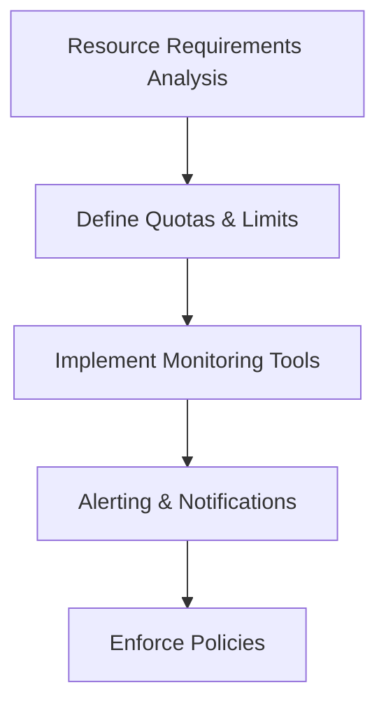

## Introduction
In cloud computing environments, managing resources efficiently is crucial to avoid resource depletion, system degradation, and excessive operational costs. The **Resource Quotas and Limits Enforcement** pattern provides a structured approach to applying restrictions on resource usage, ensuring that cloud resources are used efficiently and in line with organizational policies.

## Problem Statement
Cloud resources are shared among multiple users or applications, and without proper constraints, there's a risk of one or more entities consuming excess resources, leading to bottlenecks and reduced performance. Thus, it becomes imperative to enforce resource quotas and limits, ensuring that resource consumption remains within predefined boundaries.

## Solution
Implementing Resource Quotas and Limits involves setting up enforced boundaries within cloud environments. These boundaries dictate the maximum quantity of resources that an individual user, application, or service can utilize. Here are some steps and considerations:

1. **Assess Resource Requirements**: Identify and evaluate the typical resource usage patterns to define appropriate quotas.
2. **Set Quotas and Limits**: Utilize cloud provider tools to set these quotas at various levels such as organizational, project, or individual resource scope.
3. **Continuous Monitoring**: Deploy monitoring solutions to continuously track resource utilization against set limits.
4. **Alerting and Notifications**: Implement alerting mechanisms to notify stakeholders when usage approaches quota limits.
5. **Automatic Enforcement**: Use policies to automatically enforce limits by, for instance, throttling or capping activities when they hit set resource boundaries.

## Example Code

Here's an example of setting up a compute instance quota for Google Cloud Platform using Terraform:

```hcl
resource "google_project_iam_binding" "quota_admin" {
  project = var.project_id
  role    = "roles/compute.quotaAdmin"

  members = [
    "user:quota-admin@example.com"
  ]
}

resource "google_compute_quota" "compute_quota" {
  limit     = 10
  metric    = "INSTANCES"
  region    = "us-central1"
}
```

## Diagram



## Related Patterns
- **Auto-Scaling**: Dynamically adjust resource allocation based on current demand to ensure application performance without over-provisioning.
- **Rate Limiting**: Control the rate of requests to a system to prevent abuse and ensure fair usage.
- **Policy Enforcement Point**: An approach for making enforcement decisions for access policies and actions within the system infrastructure.

## Best Practices
- Regularly review and update resource quotas and limits based on changing usage patterns and requirements.
- Implement a robust alerting system to quickly address potential resource constraint issues.
- Ensure transparency in quota policies to provide predictability and fairness for users or departments within the organization.

## Additional Resources
- [Google Cloud Quota Management](https://cloud.google.com/docs/quota)
- [AWS Service Quotas](https://docs.aws.amazon.com/servicequotas/latest/userguide/intro.html)
- [Azure Resource Manager limits](https://learn.microsoft.com/en-us/azure/azure-resource-manager/management/azure-subscription-service-limits)

## Summary
Resource Quotas and Limits Enforcement forms a vital part of cloud infrastructure management by ensuring resources are efficiently allocated and used without excess. By implementing strict limits and continuous monitoring, organizations can avoid resource wastage, enhance system performance, and maintain operational costs effectively.
