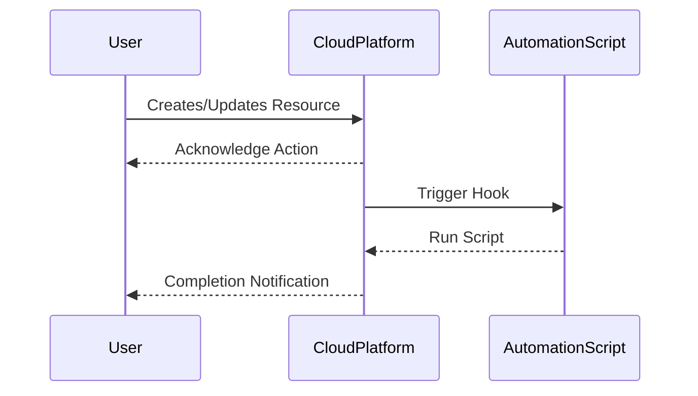

## Introduction

Lifecycle hooks and automation provide a systematic way to trigger custom actions at various stages in the lifecycle of cloud resources. These hooks enable cloud practitioners to automate processes like initialization, configuration, scaling, maintenance, and deprovisioning, thus optimizing operational efficiency and reducing manual intervention.

## Design Pattern Explanation

### Key Components

1. **Lifecycle Hooks**: These are customizable triggers that execute predefined actions when a cloud resource reaches a specific state. Common lifecycle events include creation, update, restore, and deletion.

2. **Automation Scripts**: Scripts or programs automatically executed in response to lifecycle hooks. These can be written in various scripting languages such as Python, JavaScript, or Bash.

3. **Event Listeners**: Setup within your cloud platform to listen for specific lifecycle events and invoke the corresponding automation scripts.

### Architectural Approaches

- **Event-Driven**: Utilizing an event-driven architecture where hooks serve as events that trigger various actions. This requires setting up listeners and handlers for the events.
  
- **Serverless**: Implementing function-based automation where serverless functions (e.g., AWS Lambda, Azure Functions) are triggered by hooks, reducing overhead and optimizing cost.

- **Containerized Automation**: Running automation scripts within containers that can be dynamically provisioned and destroyed in response to lifecycle events.

## Best Practices

1. **Granular Hooks**: Use fine-grained hooks to manage specific phases effectively, such as pre-creation validation or post-deletion cleanup.

2. **Modular Automation Scripts**: Write scripts that are modular and reusable across different resources and lifecycle stages.

3. **Idempotency**: Ensure scripts are idempotent; they should be able to handle repeated executions gracefully without causing side effects.

4. **Logging and Monitoring**: Implement logging and monitoring for all automation tasks to track and diagnose issues effectively.

5. **Security**: Ensure that automation scripts are secure, with limited access rights and thorough validation checks to prevent unauthorized actions.

## Example Code

### AWS Lambda Example

```javascript
exports.handler = async (event) => {
    console.log("Received event:", JSON.stringify(event, null, 2));

    if (event.detail.eventName === "CreateInstance") {
        // Perform initialization tasks
        initializeInstance(event);
    }

    return `Instance with ID ${event.detail.instanceId} processed.`;
};

function initializeInstance(event) {
    // Custom initialization logic
    console.log(`Initializing instance ${event.detail.instanceId}`);
}
```

### Terraform Lifecycle Hook Example

```hcl
resource "aws_autoscaling_group" "example" {
  lifecycle {
    create_before_destroy = true
  }

  launch_configuration = aws_launch_configuration.example.name
  min_size = 1
  max_size = 3
  desired_capacity = 2

  lifecycle_hook {
    name                   = "ExampleHook"
    lifecycle_transition   = "autoscaling:EC2_INSTANCE_TERMINATING"
    notification_target_arn = aws_sns_topic.example.arn
    role_arn                = aws_iam_role.example.arn
  }
}
```

## Diagrams

### UML Sequence Diagram



## Related Patterns

- **Event-Driven Architecture**: Using events to decouple components and ensure that systems remain responsive and scalable.

- **Infrastructure as Code (IaC)**: Managing and provisioning computing resources through machine-readable configuration files, integrating lifecycle automation.

## Additional Resources

- [AWS Lambda and CloudWatch Events](https://aws.amazon.com/lambda/)
- [Terraform Lifecycle Management](https://www.terraform.io/docs/configuration/resources.html)

## Summary

Lifecycle hooks and automation are indispensable in managing cloud resources efficiently. By leveraging hooks, we can enforce policies, improve responsiveness, and significantly reduce manual operational overhead. This pattern, combined with best practices like modular scripting and security considerations, ensures robust and scalable cloud infrastructure management solutions.
