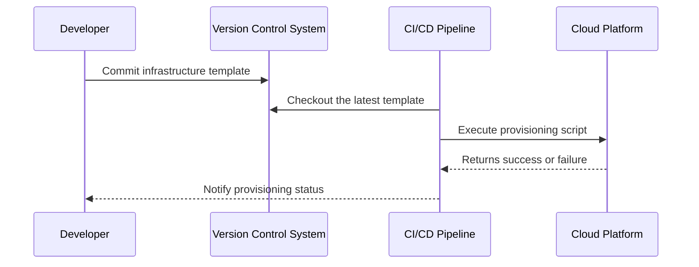

## Introduction

In cloud computing, the **Automated Provisioning** design pattern plays a pivotal role in streamlining the deployment and management of cloud resources. By using scripts and automation tools, this pattern facilitates the rapid and consistent provisioning of infrastructure components, thereby reducing the likelihood of human errors and ensuring a more reliable cloud environment. 

## Detailed Explanation

Automated provisioning involves using predefined templates, scripts, and tools to automatically deploy cloud resources such as virtual machines, storage, and networking components. This approach aligns with the Infrastructure-as-Code (IaC) paradigm, which treats infrastructure setup with the same rigor as application code development.

### Key Benefits:
- **Speed and Agility:** Automated provisioning allows for faster deployment cycles, enabling organizations to respond swiftly to business requirements.
- **Consistency and Reliability:** Automated scripts eliminate manual errors, ensuring that resource configuration is consistent across environments.
- **Scalability:** As demand changes, automated provisioning can quickly adjust the number and size of resources without manual intervention.
- **Cost-Efficiency:** Through automation, resources can be aligned more effectively with actual usage, optimizing cost management.

## Architectural Approach

1. **Template Definition:** Define infrastructure components and configurations in code templates. These might include YAML files for Azure Resource Manager (ARM), CloudFormation templates for AWS, or Terraform scripts that support multiple cloud providers.
   
2. **Version Control:** Store these templates in a version control system (like Git) to maintain changes and collaborate across teams effectively.

3. **Continuous Integration and Deployment (CI/CD):** Integrate automated provisioning scripts into CI/CD pipelines to automatically provision environments as part of the deployment process.

4. **Configuration Management:** Use tools like Ansible, Chef, or Puppet for configuring cloud resources and maintaining their state post-deployment.

5. **Monitoring and Alerts:** Incorporate monitoring services to track deployment success and alert teams of issues.

## Example Code

Here's a simple example using HashiCorp Terraform to provision an AWS EC2 instance:

```hcl
provider "aws" {
  region = "us-west-2"
}

resource "aws_instance" "example" {
  ami           = "ami-0c55b159cbfafe1f0"
  instance_type = "t2.micro"

  tags = {
    Name = "ExampleInstance"
  }
}

output "instance_id" {
  value = aws_instance.example.id
}
```

## Diagrams

### Automated Provisioning Sequence Diagram



## Related Patterns

- **Immutable Infrastructure:** Using automated provisioning to rebuild environments, ensuring configurations follow a consistent standard.
- **Self-Healing Deployment:** Leveraging automation tools to re-provision and replace failed resources automatically.

## Additional Resources

- [Terraform Documentation](https://www.terraform.io/docs)
- [Azure Resource Manager Templates](https://docs.microsoft.com/en-us/azure/azure-resource-manager/templates/overview)
- [AWS CloudFormation User Guide](https://aws.amazon.com/documentation/cloudformation/)

## Summary

The Automated Provisioning design pattern represents a cornerstone in modern cloud infrastructure management. By implementing automated procedures for provisioning resources, organizations can significantly boost their operational efficiency, maintain consistency, and achieve agile response capabilities. Advancing with tools like Terraform, Ansible, or native cloud services, automated provisioning lays a foundational framework for agile DevOps practices and robust cloud architectures.
