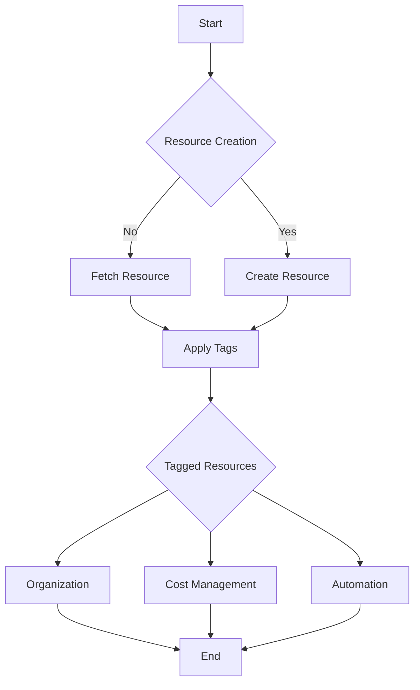

## Introduction

In cloud computing environments, **Resource Tagging and Labeling** is a vital pattern that involves assigning metadata to cloud resources. This strategy helps with better resource organization, facilitates cost tracking, and automates management tasks, leading to improved operational efficiency and governance.

## Detailed Explanation

### Definition

Resource tagging and labeling refers to the process of assigning metadata in the form of key-value pairs to cloud resources. These tags provide additional information about the resources, making it easier to manage and track them.

### Importance

- **Organization**: Tags help categorize and organize resources according to various criteria, such as environment, department, application, or project.
- **Cost Management**: By associating costs with specific tags, organizations can monitor and control their cloud spending effectively.
- **Automation**: Tags can be used in automation scripts and configurations, such as auto-scaling groups or backup policies, to apply specific rules to tagged resources.

### Best Practices

1. **Consistent Tagging Strategy**: Establish a standardized tagging policy across the organization to ensure consistency.
2. **Use Descriptive Tags**: Tags should be descriptive and self-explanatory to provide clear insights into resource purpose and ownership.
3. **Limit Tag Levels**: Avoid excessive nesting or overly complex tag structures to maintain clarity and simplicity.
4. **Regular Audit and Compliance Check**: Periodically review tags to ensure compliance with organizational policies and relevance.

## Example Code

Here's an example using AWS SDK for tagging an EC2 instance using JavaScript:

```javascript
// AWS SDK for tagging an EC2 instance in JavaScript
const AWS = require('aws-sdk');
const ec2 = new AWS.EC2({ region: 'us-west-2' });

const params = {
  Resources: ['i-12345abcd'], // The ID of the resource to tag
  Tags: [
    {
      Key: 'Project',
      Value: 'Alpha'
    },
    {
      Key: 'Environment',
      Value: 'Production'
    }
  ]
};

ec2.createTags(params, (err, data) => {
  if (err) console.log("Error", err);
  else console.log("Tags Created", data);
});
```

## Conceptual Diagram



## Related Patterns

- **Infrastructure as Code (IaC)**: Automating the deployment of tagged resources with configuration files.
- **Cost Allocation Tracking**: Leveraging tags to associate cloud costs with projects or departments.
- **Resource Automation**: Using tags in automation scripts to apply policy or scaling rules.

## Additional Resources

- AWS Resource Tagging Documentation
- Azure Tagging Best Practices
- Google Cloud Labels and Tagging Guide

## Final Summary

Resource Tagging and Labeling is a vital design pattern in cloud computing, empowering organizations to streamline their resource management strategies through improved organization, cost tracking, and automation possibilities. By leveraging this pattern, businesses can enhance their operational agility and governance, ensuring compliance with strategic objectives and policies in their cloud environments.
