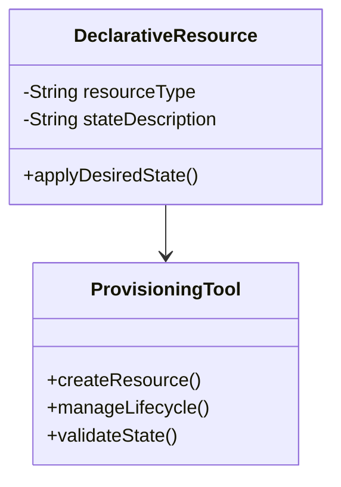
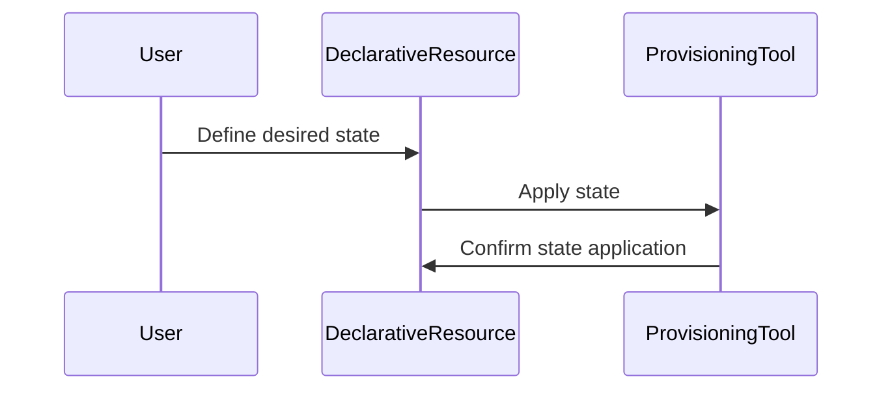

## Overview

Declarative Resource Definitions is a design pattern in cloud computing that allows you to define the desired state of your infrastructure using a declarative approach. This pattern is crucial for achieving efficient infrastructure management, as it enables provisioning tools to automatically manage the lifecycle of resources based on the defined desired state. It facilitates Infrastructure as Code (IaC) practices and is integral to modern DevOps and continuous delivery pipelines.

## Design Pattern Explanation

### Core Principles

**Declarative vs. Imperative Approaches**

- *Imperative Approaches:* Specify *how* to achieve the result with detailed step-by-step commands.
- *Declarative Approaches:* Specify *what* the outcome should be, allowing tools to decide *how* to achieve it.

**State Management**

Declarative Resource Definitions focus on defining the end state of resources, which provisioning tools use to ensure that the current state matches the desired state, automatically handling discrepancies.

### Key Characteristics

1. **Idempotency:** Ensure that multiple applications of the same configuration will not alter the result beyond the first application.
2. **Version Control:** Templates and definitions are text-based, allowing version tracking, peer review, and rollback capabilities.
3. **Scalability:** Facilitates the provisioning of resources across multiple environments consistently.

### Benefits

- **Consistency and Predictability:** Reduce configuration drift and ensure environments remain in the desired state over time.
- **Ease of Management:** Streamline changes and updates to infrastructure by modifying and reapplying declarative templates.
- **Collaborative Development:** Encourage collaboration via code reviews and version control practices.

## Example Code

Below is an example using Terraform, a popular tool for declarative infrastructure management.

```hcl
provider "aws" {
  region = "us-west-2"
}

resource "aws_instance" "example" {
  ami           = "ami-0c55b159cbfafe1f0"
  instance_type = "t2.micro"

  tags = {
    Name = "ExampleInstance"
  }
}
```

This Terraform script defines a single AWS EC2 instance using a declarative syntax. The `aws_instance` resource specifies the desired AMI ID and instance type, and Terraform handles the provisioning and lifecycle management.

## Diagrams

### Class Diagram



### Sequence Diagram



## Related Patterns and Practices

- **Infrastructure as Code (IaC):** The broader practice of managing and provisioning computing infrastructure via code.
- **Immutable Infrastructure:** Ensuring that infrastructure once provisioned is not changed but replaced with new versions.
- **Configuration Management Tools:** Software like Ansible, Puppet, and Chef also enable declarative resource definitions focusing primarily on configuration rather than infrastructure provisioning.

## Additional Resources

- [Terraform Official Documentation](https://www.terraform.io/docs/index.html)
- [AWS CloudFormation](https://aws.amazon.com/cloudformation/)
- [Google Cloud Deployment Manager](https://cloud.google.com/deployment-manager/docs/)

## Summary

Declarative Resource Definitions are a staple in modern cloud architecture, preferring a 'what' over 'how' approach. By defining the desired state of resources, engineers enable automated management, encouraging consistency and reducing manual intervention. Embracing this pattern is key to robust Infrastructure as Code strategies and is foundational for scalable and maintainable cloud environments.
