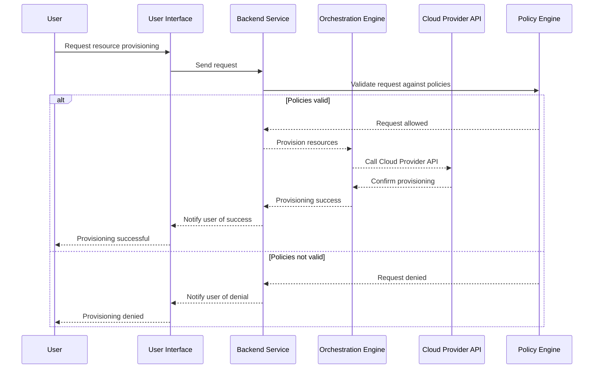

### Introduction

Self-Service Provisioning Portals are designed to enable users, typically developers and operations teams, to provision and manage cloud resources autonomously within the boundaries of organizational governance policies. By reducing the need for direct access to cloud provider consoles, they streamline operations and ensure compliance and efficient resource use.

### Design Pattern Explanation

Self-Service Provisioning Portals allow users to select from pre-defined resources and configurations set by IT or cloud architects, thus limiting potential misconfigurations and over-spending. This pattern relies heavily on a combination of APIs, user interfaces, and governance rules to provide a seamless yet controlled resource provisioning experience.

**Core Components:**

1. **User Interface (UI):** A web-based dashboard where users can request and manage resources.
2. **Orchestration Engine:** Automates the provisioning and configuration of requested resources.
3. **Governance and Policy Framework:** Enforces restrictions on resource types, sizes, regions, and spending limits.
4. **Integration Layer:** Connects with underlying cloud provider APIs and internal systems to fetch or enact resource management actions.

### Architectural Approach

The architecture of Self-Service Provisioning Portals typically includes:

- **Front-End Layer:** Built with modern web frameworks like React or Angular to provide a responsive and intuitive interface for end-users.
- **Backend/API Layer:** Composed of microservices or serverless functions to handle requests, invoke cloud services, and ensure transactions are secure and logged.
- **Policy Engine:** Implements business rules and compliance requirements, ensuring that all actions performed through the portal adhere to organizational standards.
- **Notification and Logging Services:** Inform users of the status of their requests and audit all operations for security purposes.



### Example Code

Here is a simplified example of a backend API endpoint in Node.js using Express.js to initiate resource provisioning:

```javascript
const express = require('express');
const app = express();
const bodyParser = require('body-parser');
const { validatePolicies, provisionResource } = require('./services');

app.use(bodyParser.json());

app.post('/provision', async (req, res) => {
  try {
    const request = req.body;
    const isValid = validatePolicies(request);

    if (!isValid) {
      return res.status(403).json({ message: 'Request does not comply with policies' });
    }

    const result = await provisionResource(request);
    return res.status(200).json({ message: 'Resource provisioned', details: result });
  } catch (error) {
    return res.status(500).json({ message: 'Internal Server Error', error });
  }
});

app.listen(3000, () => {
  console.log('Server running on port 3000');
});
```

### Related Patterns

1. **Policy Enforcement Point (PEP):** A service or layer that continuously checks and enforces organizational policies for cloud resources.
2. **Infrastructure as Code (IaC):** Define infrastructure through code to enable automated and repeatable resource management.
3. **Cost Management Dashboard:** Provides insights into cloud expenditure helping to manage costs effectively.

### Additional Resources

- [AWS Service Catalog](https://aws.amazon.com/servicecatalog/): A service that helps create and manage catalogs of IT services within AWS.
- [Terraform](https://www.terraform.io/): Open-source tool for building, changing, and versioning infrastructure safely and efficiently.
- [Azure Resource Manager](https://azure.microsoft.com/en-us/features/resource-manager/): Provides a consistent management layer enabling you to create, update, and delete resources in your Azure account.

### Summary

Self-Service Provisioning Portals facilitate a balance between operational agility and governance compliance. By empowering teams to provision resources quickly, they help accelerate development cycles, ensure adherence to governance policies, and optimize cloud resource utilization. This design pattern is essential for organizations looking to scale their cloud infrastructures efficiently while maintaining control and security.
