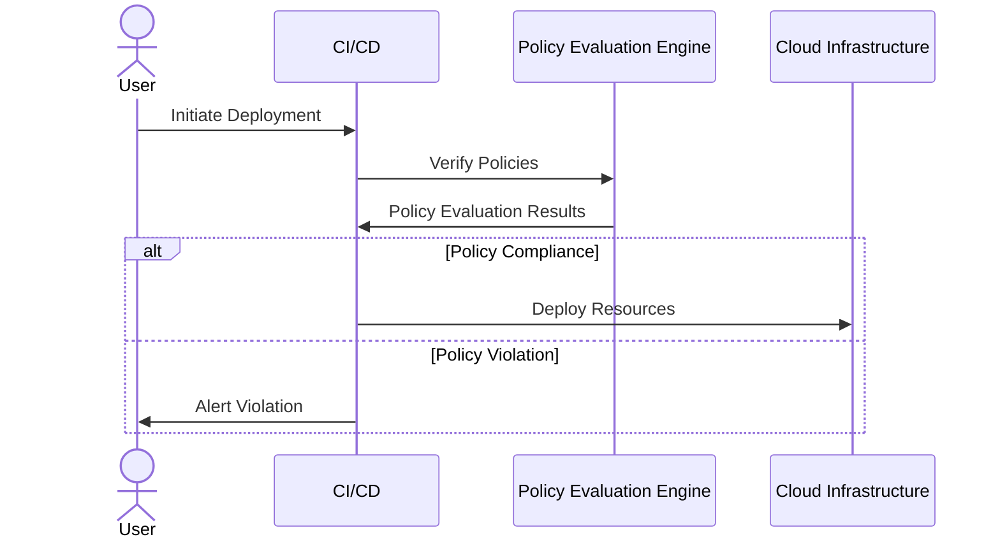

## Introduction

In the realm of cloud computing, **Policy as Code** is a design pattern that enables organizations to implement and enforce governance policies through code. This pattern ensures that infrastructure, applications, and services remain compliant with security and operational standards. By codifying policies, organizations can automate compliance checks, reduce risks, and respond swiftly to policy violations.

## Design Pattern Context

As cloud environments grow in complexity and scale, maintaining compliance with regulatory standards and organizational policies becomes increasingly challenging. Traditional approaches often involve manual audits, which are time-consuming and prone to human error. **Policy as Code** addresses these challenges by automating the enforcement of policies through scripted rules and validation mechanisms.

## Architectural Approach

### Key Components

1. **Policy Definition**: Policies are defined using a domain-specific language (DSL) or configuration files. These policies specify the rules and conditions for compliance and security.

2. **Policy Evaluation Engine**: A centralized component that evaluates the defined policies against infrastructure changes, configurations, and operating environments.

3. **Enforcement Mechanisms**: These are automated actions triggered when a policy violation is detected, which may include alerting, logging, blocking deployments, or automatic remediation.

4. **Monitoring and Reporting**: Continuous monitoring of infrastructure changes against policies, with reporting features to track compliance over time.

### Implementation Steps

1. **Define Policies**: Use a policy language like HashiCorp Sentinel, Open Policy Agent (OPA), or AWS IAM Policies to define the rules and constraints for the environment.

2. **Integrate Evaluation Engine**: Deploy a policy evaluation engine to monitor and enforce these policies across your cloud infrastructure.

3. **Automate Enforcement**: Implement automated responses to policy violations, integrating with CI/CD pipelines and operational workflows.

4. **Monitor Compliance**: Continuously monitor and log policy compliance using dashboard and alerting tools.

## Example Code

Here's a simple **Policy as Code** example using Open Policy Agent (OPA) to enforce that all AWS S3 buckets must be encrypted:

```rego
package example.aws.s3

default allow = false

allow {
  input.request.operation == "CreateBucket"
  input.request.region == "us-west-2"
  bucket_encrypted(input.request.resource)
}

bucket_encrypted(resource) {
  resource.properties.ServerSideEncryptionConfiguration.Rules[_].ApplyServerSideEncryptionByDefault.SSEAlgorithm == "AES256"
}
```

In this example, a policy is defined using Rego, the policy language for OPA, to enforce SSL encryption on newly created S3 buckets.

## Diagram



## Related Patterns

- **Infrastructure as Code (IaC)**: Using code to manage and provision infrastructure, which can integrate with Policy as Code for compliance checks.
  
- **Immutable Infrastructure**: Deploying non-mutable servers that replace rather than modify existing servers, complementing Policy as Code by ensuring controlled changes.

- **Continuous Compliance**: Continuously validating compliance throughout the development lifecycle, often using Policy as Code for automated checks.

## Additional Resources

- [Open Policy Agent Documentation](https://www.openpolicyagent.org/docs/latest/)
- [HashiCorp Sentinel](https://www.hashicorp.com/sentinel)
- [CNCF OPA Introduction](https://www.cncf.io/projects/opa/)

## Summary

By adopting **Policy as Code**, organizations can automate the governance of cloud infrastructures, ensuring compliance and security are maintained consistently and efficiently. This pattern provides a proactive approach to risk management, enabling quick response to policy violations, reducing the overhead of manual audits, and promoting a culture of compliance throughout the development and operational lifecycle.
