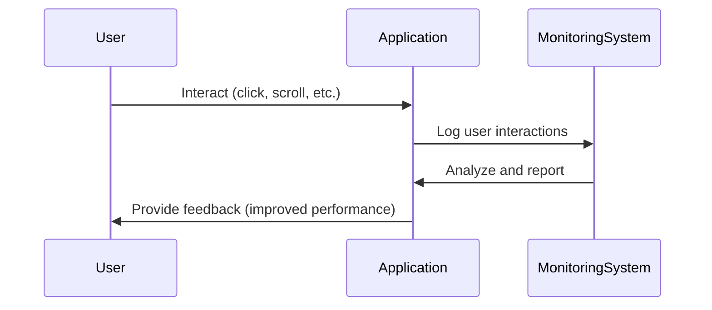

In the realm of cloud computing, the **User Experience Monitoring** design pattern plays a vital role in understanding and enhancing end-user interactions with applications. This pattern involves the systematic tracking and analysis of user behavior data to optimize application performance and ensure high levels of user satisfaction. By leveraging advanced monitoring tools and techniques, organizations can identify and address bottlenecks, leading to improved application experiences and business outcomes.

## Detailed Explanation

### Key Objectives
- **Track User Interactions:** Capture detailed insights into how users interact with applications across different platforms (web, mobile, etc.).
- **Monitor Performance Metrics:** Evaluate key performance indicators such as load times, response rates, and error occurrences.
- **Identify Bottlenecks:** Analyze data to locate and resolve performance bottlenecks or user interface issues.
- **Enhance User Satisfaction:** Use insights to drive improvements in application usability and user experience.

### Components
- **Data Collection Tools:** Use various tools like Google Analytics, New Relic, or Dynatrace to gather data on user interactions and application performance.
- **Dashboards and Reporting:** Implement dashboards for real-time analytics and reporting on user experience metrics.
- **Alerting Systems:** Set up alerting mechanisms to notify teams of critical performance issues that might impact the user experience.

## Architectural Approaches

### 1. Real User Monitoring (RUM)
RUM involves collecting data from actual users in real time by embedding tracking scripts within web applications. This approach allows for the capture of precise data related to user behaviors, such as mouse movements, clicks, and navigation paths.

### 2. Synthetic Monitoring
In contrast to RUM, synthetic monitoring uses simulated user interactions to test and measure application performance from various geographic locations. This technique is useful for proactively identifying potential performance issues before they affect real users.

### 3. Hybrid Monitoring
Combining RUM and synthetic monitoring, hybrid monitoring offers a comprehensive view of both real and potential performance issues, balancing real-time insights with predictive analytics.

## Best Practices

- **Implement Consistent Monitoring Across Platforms:** Ensure comprehensive monitoring of user interactions across web, mobile, and IoT platforms for a cohesive understanding of the user experience.
- **Use Machine Learning for Pattern Recognition:** Leverage machine learning algorithms to detect and classify user behavior patterns, providing deeper insights into performance anomalies and user journeys.
- **Integrate with CI/CD Pipelines:** Embed user experience monitoring within continuous integration and continuous deployment pipelines for automated feedback and resilience testing.

## Example Code

```javascript
// Sample JavaScript code snippet for Real User Monitoring (RUM)

(function() {
    window.addEventListener('load', function() {
        performance.mark('start_load');
        fetch('https://example.com/track', {
            method: 'POST',
            body: JSON.stringify({
                userAgent: navigator.userAgent,
                timestamp: performance.now(),
                path: window.location.pathname
            }),
            headers: {
                'Content-Type': 'application/json'
            }
        });
        performance.measure('load_time', 'start_load');
    });
})();
```

## Diagrams

Here is diagram illustrating the flow of user experience monitoring:



## Related Patterns

- **Performance Monitoring:** Focuses on monitoring resource usage and application performance metrics.
- **Alerting and Notification:** Provides mechanisms to send notifications for system and performance anomalies.
- **Continuous Delivery and Integration:** Ensures automated deployment and testing pipelines.

## Additional Resources

- [Google Analytics for Detailed User Insights](https://analytics.google.com/)
- [New Relic for Real-Time Monitoring](https://newrelic.com/)
- [Dynatrace for Full-stack Application Monitoring](https://dynatrace.com/)

## Summary

The **User Experience Monitoring** design pattern is crucial for maintaining high-quality experiences for end-users by continuously tracking, analyzing, and improving interactions with cloud-based applications. By adopting robust monitoring tools, implementing strategic architectural approaches, and following best practices, organizations can significantly enhance user satisfaction and application performance.


