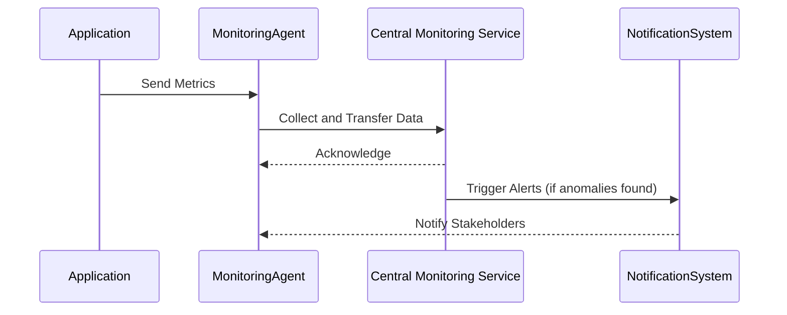

Infrastructure Monitoring is a crucial design pattern in the management of cloud environments, focusing on the continuous supervision of all components within the cloud infrastructure. This pattern ensures that the systems are performing optimally, provides visibility into system bottlenecks, detects failures ahead of time, and helps in resource optimization. Let's delve into the structure, significance, and implementation of this design pattern.

## Detailed Explanation

Infrastructure Monitoring involves:
- **Data Collection**: Gather metrics and logs from virtual machines, containers, networks, and applications.
- **Storage**: Efficiently store the collected data for immediate analysis and future reference.
- **Analysis**: Extract actionable insights using real-time analytics and historical data review.
- **Alerting**: Set up automated alerts to notify stakeholders of performance anomalies or failures.
- **Visualization**: Use dashboards and visual tools to present data intuitively for easier monitoring.

The aim is to maintain the health and performance of the infrastructure by enabling IT teams to:
- Quickly identify and resolve issues.
- Predict potential failures through trend analysis.
- Optimize resource utilization to control costs.

## Architectural Approaches

1. **Agent-Based Monitoring**: Deploy lightweight agents on each server or VM to collect metrics directly from the source.
   
2. **Agentless Monitoring**: Utilize APIs and protocols like SNMP or WMI to gather information without a direct presence on the monitored devices.
   
3. **Centralized Logging**: Implement a central system where all logs from servers, applications, and network devices are aggregated, using tools like the ELK stack or Splunk.
   
4. **Distributed Tracing**: For comprehensive monitoring across microservices, employ tracing tools like Jaeger or Zipkin to track requests across components.

## Best Practices

- **Automate Everything**: Use scripts and automation tools to set up and manage monitoring configurations and alerts.
- **Start Simple**: Begin with basic metrics and expand your monitoring footprint over time as necessary.
- **Consistent and Standard Metrics**: Define a set of standard metrics for monitoring across your infrastructure to ensure consistent data analysis.
- **Frequent Reporting and Review**: Prepare regular reports for internal review and future planning.
- **Anomaly Detection**: Leverage AI and ML tools to detect unexpected patterns indicative of potential issues.

## Example Code

Here's a basic example using Prometheus to collect metrics from a Node.js application:

```javascript
const express = require('express');
const client = require('prom-client');

const app = express();
const collectDefaultMetrics = client.collectDefaultMetrics;

// Probe every 5th second.
collectDefaultMetrics({ timeout: 5000 });

app.get('/metrics', async (req, res) => {
  try {
    res.set('Content-Type', client.register.contentType);
    res.end(await client.register.metrics());
  } catch (ex) {
    res.status(500).end(ex);
  }
});

app.listen(3000, () => {
  console.log('Metrics server listening on port 3000!');
});
```

This script sets up a simple endpoint that Prometheus can scrape to gather default metrics from a Node.js application.

## Diagrams

To conceptualize Infrastructure Monitoring, consider the following sequence diagram that illustrates the process of collecting and analyzing metrics.



## Related Patterns

- **Service Level Agreements (SLAs)**: Define and monitor specific, measurable commitments between service providers and clients.
- **Autoscaling**: Automatically adjusts the number of resources to maintain a stable performance level.
- **Disaster Recovery**: Plans and systems to ensure business continuity in case of significant failures or data loss.

## Additional Resources

- [Prometheus Documentation](https://prometheus.io/docs/introduction/overview/)
- [Grafana Tutorials](https://grafana.com/tutorials/)
- [ELK Stack Overview](https://www.elastic.co/what-is/elk-stack)

## Summary

Infrastructure Monitoring is more than just a reactive measure; it is about being proactive in managing your cloud infrastructure. By collecting detailed data, setting up efficient alerting systems, and continuously analyzing performance, businesses can ensure ongoing availability and stability of cloud services, ultimately enhancing user satisfaction and achieving cost-effectiveness. Implementing robust monitoring frameworks helps prevent downtime, enhances system efficiency, and empowers organizations with insights to make informed decisions.
