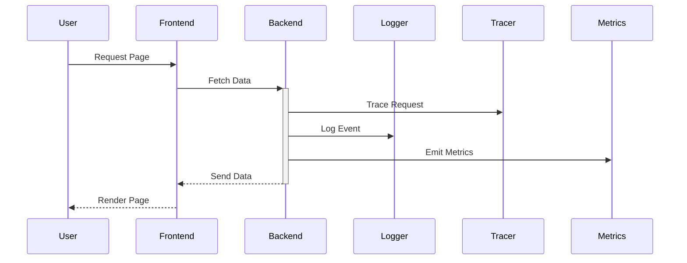

In the cloud computing realm, systems are often highly distributed and complex, making it indispensable to have a comprehensive observability strategy. End-to-End Observability provides the necessary mechanisms to gain full insight into each component and service within your architecture, enabling you to proactively monitor, debug, and enhance both performance and user experience.

## Design Pattern Overview

End-to-End Observability involves tracking and analyzing data from every component of a system—from user interfaces to backend services and everything in between. This pattern encompasses logging, monitoring, distributed tracing, and metrics collection to provide a holistic view of system performance and potential bottlenecks.

### Key Characteristics

- **Comprehensive Monitoring**: Captures logs, metrics, and traces across the entire application stack.
- **Unified Data Correlation**: Aggregates and correlates data from different sources for centralized analysis.
- **Proactive Alerting**: Automated alerts based on predefined thresholds to address issues before they impact the end-user.
- **Real-Time Data Processing**: Utilizes real-time data streams for instant insights and decision-making.
- **Scalability**: Designed to function effectively across varying loads and system scales.

## Architectural Approaches

1. **Centralized Logging Systems**:
   - Use tools like Elasticsearch, Logstash, and Kibana (ELK Stack) or Splunk to collect, index, and visualize log data.

2. **Distributed Tracing**:
   - Implement tracing tools such as Jaeger or OpenTelemetry to track requests flowing through microservices architectures.

3. **Metrics Monitoring**:
   - Employ Prometheus or Datadog for real-time metrics collection and visualization.

4. **Alerting and Incident Management**:
   - Integrate alerting systems like PagerDuty or OpsGenie for instant notifications and incident response workflows.

### Example Code

#### Distributed Tracing with OpenTelemetry in Java

Here's an example of implementing OpenTelemetry tracing in a Java application:

```java
import io.opentelemetry.sdk.OpenTelemetrySdk;
import io.opentelemetry.api.trace.Tracer;
import io.opentelemetry.api.trace.Span;
import io.opentelemetry.context.Scope;

public class TracingExample {

    private static final Tracer tracer = OpenTelemetrySdk.getTracerProvider().get("example-app");

    public static void main(String[] args) {
        Span span = tracer.spanBuilder("Main Request").startSpan();
        try (Scope scope = span.makeCurrent()) {
            // Application logic
            processRequest();
        } finally {
            span.end();
        }
    }

    private static void processRequest() {
        Span span = tracer.spanBuilder("Processing Request").startSpan();
        try (Scope scope = span.makeCurrent()) {
            // Simulate processing
        } finally {
            span.end();
        }
    }
}
```

## Diagrams

### UML Sequence Diagram for Request Handling with Observability



## Related Patterns

- **Microservices Architecture**:
  End-to-End Observability is especially crucial in microservices to visualize the complex interactions and dependencies.

- **Circuit Breaker**:
  Works alongside observability to detect failures and prevent cascading ones.

- **Centralized Logging**:
  Complements observability by ensuring logs from disparate sources are aggregated for analysis.

## Best Practices

- **Integrate Observability at the Start**: Embed observability protocols during the initial phases of development rather than as an afterthought.
- **Automate Metrics and Log Correlation**: Use AI-powered tools to correlate logs and metrics for faster diagnosis.
- **Performance Testing**: Regularly perform performance testing in varied environments to ensure observability setups function under load.
- **Security and Compliance**: Ensure observability tools comply with data protection regulations.

## Additional Resources

- [OpenTelemetry Documentation](https://opentelemetry.io/docs)
- [Prometheus Monitoring Guide](https://prometheus.io/docs/introduction/overview/)
- [Google Cloud Operations](https://cloud.google.com/products/operations)
- [AWS CloudWatch](https://aws.amazon.com/cloudwatch/)

## Summary

End-to-End Observability is a critical design pattern for managing complex and dynamic cloud environments. By ensuring comprehensive insight into all system components, it effectively enhances performance, reliability, and user experience. Whether you are troubleshooting intricate issues or optimizing system operations, integrating advanced observability mechanisms is indispensable for achieving resilient and responsive cloud architectures.
