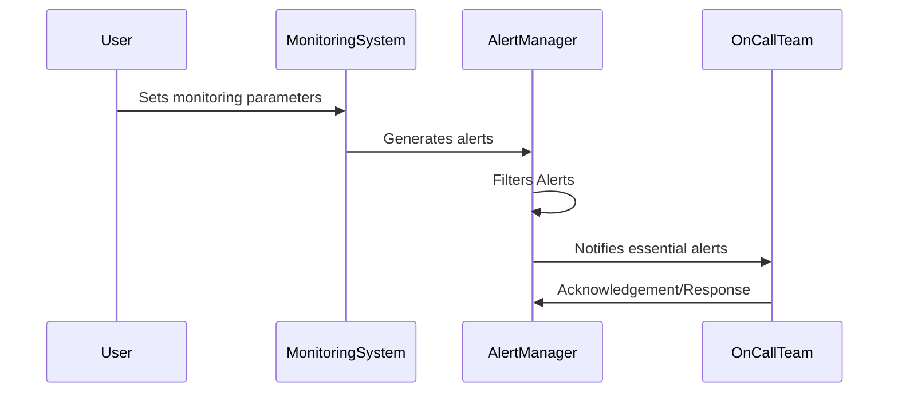

## Introduction

In cloud computing environments, effective monitoring and alerting are crucial for maintaining optimal system performance and availability. However, excessive alerts can overwhelm the operations team, leading to **alert fatigue**—a state where crucial alerts may be ignored due to the sheer volume of notifications. This article explores strategies to minimize alert fatigue by distinguishing essential alerts from noise, ensuring timely and efficient incident response.

## Design Pattern

### Problem

Cloud environments significantly utilize monitoring systems that generate alerts for various events to ensure system health and availability. The challenge lies in the excessive number of non-actionable alerts, which often mask truly critical issues and lead to alert fatigue.

### Solution

To prevent alert fatigue, it is essential to design a system that intelligently filters alerts based on multiple parameters, ensuring only actionable and relevant alerts reach the operations team. This can be achieved by employing the following strategies:

1. **Alert Thresholding**: Define and configure thresholds for alerts that align with business priorities, focusing on significant events that require urgent attention.

2. **Decoupled Alerting**: Separate alerts into categories (e.g., informational, warning, critical) and orchestrate them according to their priority and required response level.

3. **Dynamic Alert Configuration**: Use machine learning models to automatically adjust alert thresholds and priorities based on historical patterns and trends in system behavior.

4. **Correlation and Aggregation**: Implement alert correlation mechanisms that aggregate related alerts into a single notification, reducing noise and focusing on root causes.

5. **On-call Management**: Utilize intelligent routing and scheduling to ensure alerts are sent to the appropriate on-call personnel with the necessary expertise to handle specific incidents.

### Example Code

Here is a simple example in JavaScript that demonstrates how you might implement a basic alert filtering logic:

```javascript
class Alert {
  constructor(type, severity, message) {
    this.type = type;
    this.severity = severity;
    this.message = message;
  }
}

class AlertManager {
  constructor() {
    this.alerts = [];
  }

  addAlert(alert) {
    // Filter based on severity
    if (alert.severity >= 3) {
      this.alerts.push(alert);
      this.notify(alert);
    }
  }

  notify(alert) {
    console.log(`ALERT: [${alert.type}] ${alert.message}`);
    // Logic to notify the operations team
  }
}

// Usage
const alertManager = new AlertManager();
alertManager.addAlert(new Alert('CPU Usage', 5, 'CPU usage exceeded 80%'));
alertManager.addAlert(new Alert('Memory Usage', 2, 'Memory usage exceeded 70%'));
```

## Diagram



## Related Patterns

- **Elastic Monitoring**: Dynamically scale monitoring resources based on current demand to avoid excessive alerts.
- **Incident Management**: Incorporate structured processes for managing and responding to alerts to ensure they turn into actionable tasks.

## Additional Resources

- [Alert Fatigue: Understanding and Mitigating the Impact](https://example.com/alert-fatigue)
- [Efficient Monitoring in Cloud Systems](https://example.com/cloud-monitoring)
- [On-call Scheduling for Cloud Operations Teams](https://example.com/oncall-cloud)

## Summary

Alert fatigue poses a significant risk in cloud operations by diminishing the responsiveness to critical issues. By implementing effective alert fatigue prevention strategies—such as alert thresholding, dynamic configuration, and intelligent routing—cloud operations teams can enhance their ability to manage systems proactively, ensuring better system reliability and performance.
