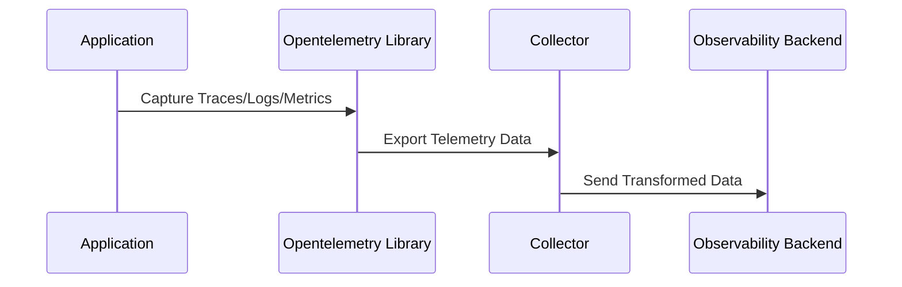

## Introduction

In today's cloud-native ecosystems, maintaining robust monitoring, observability, and logging is crucial for managing distributed applications efficiently. The **OpenTelemetry Integration** design pattern leverages the OpenTelemetry project to provide a standard approach to collect and export telemetry data. This pattern supports developers and operators in gaining insights into system performance and behavior by capturing metrics, logs, and traces across distributed systems.

## Detailed Explanation

OpenTelemetry is a collaborative project under the Cloud Native Computing Foundation (CNCF). It offers a set of APIs, libraries, and instrumentation tools that facilitate the collection of telemetry data. The **OpenTelemetry Integration** pattern provides a unified framework to implement observability, offering a holistic view of system operations and interactions.

### Components of the OpenTelemetry Integration

1. **Instrumentation Libraries**: Libraries used to automatically capture and generate telemetry data within your applications. They are available for various programming languages such as Java, JavaScript, Python, Go, etc.

2. **Collector**: An agent or gateway to process and export telemetry data to backend systems for storage and analysis. The collector can transform, sample, and buffer data, effectively acting as a central hub in your observability infrastructure.

3. **APIs and SDKs**: Developers use these to manually instrument code if automatic libraries are insufficient. They allow precise control over what data is captured and how it's structured.

4. **Exporters**: Connectors that enable sending telemetry data to observability platforms like Prometheus, Jaeger, Zipkin, Splunk, or custom backends.

### Benefits

- **Unified Observability**: Centralizes the management of metrics, logs, and traces under a single framework.
- **Vendor-Neutrality**: Breaks dependency on proprietary solutions, allowing easy transition between different observability tools.
- **Scalability**: Designed to handle the demands of modern, dynamic cloud environments.
- **Extensibility**: OpenTelemetry's modular architecture allows easy enhancement and customization to suit specific needs.

## Example Code

Here is a simple example of integrating OpenTelemetry with a Java application to capture traces.

```java
import io.opentelemetry.api.OpenTelemetry;
import io.opentelemetry.api.trace.Span;
import io.opentelemetry.api.trace.Tracer;
import io.opentelemetry.sdk.OpenTelemetrySdk;
import io.opentelemetry.sdk.trace.SdkTracerProvider;

public class OpenTelemetryExample {
    public static void main(String[] args) {
        // Set up a basic OpenTelemetry SDK with a simple span processor
        SdkTracerProvider tracerProvider = SdkTracerProvider.builder().build();
        OpenTelemetry openTelemetry = OpenTelemetrySdk.builder().setTracerProvider(tracerProvider).build();

        // Obtain a tracer from the SDK
        Tracer tracer = openTelemetry.getTracer("sample-tracer");

        // Create a span to capture a unit of work
        Span span = tracer.spanBuilder("sampleSpan").startSpan();
        
        try {
            // Simulate a business logic function
            System.out.println("Hello, OpenTelemetry!");
        } finally {
            // End the span
            span.end();
        }
    }
}
```

## Diagram

Here is a simple mermaid sequence diagram illustrating data flow in an OpenTelemetry setup:



## Related Patterns

- **Log Aggregation**: Focuses on collating logs from various sources for centralized analysis.
- **Metrics Aggregation**: Involves collecting and analyzing metrics data to monitor system health.
- **Distributed Tracing**: Tracks the flow of a request through distributed systems, providing insights into latencies and bottlenecks.

## Additional Resources

- [OpenTelemetry Official Documentation](https://opentelemetry.io/docs/)
- [CNCF OpenTelemetry Project Page](https://www.cncf.io/projects/opentelemetry/)
- [Prometheus Integration with OpenTelemetry](https://prometheus.io/docs/instrumenting/opentelemetry/)

## Summary

The **OpenTelemetry Integration** pattern empowers organizations to embed observability natively into their cloud applications. By unifying the instrumentation and telemetry process, OpenTelemetry facilitates rich insights into application performance and operational reliability. With its open standards and versatile tooling, it enables cloud providers and users to implement a scalable, flexible, and vendor-agnostic observability strategy, which is essential for maintaining high-performing cloud-native systems.
