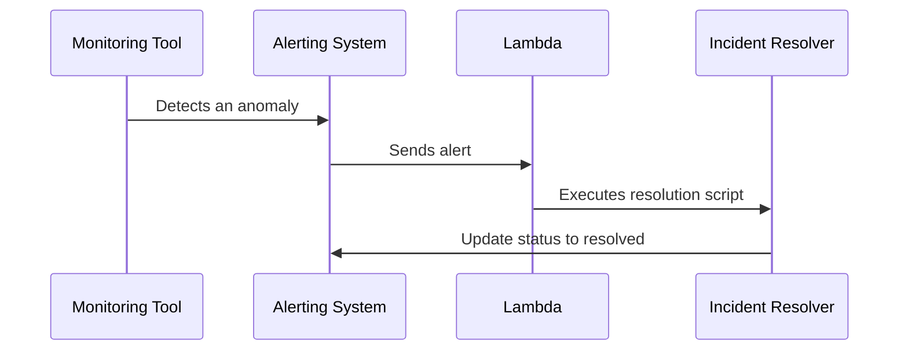

## Introduction

In today's fast-paced digital world, ensuring the reliability and performance of cloud-based systems is quintessential. Automated Incident Response (AIR) is a pivotal design pattern that empowers organizations to monitor, detect, and respond to incidents swiftly and effectively. This pattern harnesses modern cloud technologies to automate the incident lifecycle, thereby reducing manual intervention and minimizing downtime.

## Design Pattern Overview

Automated Incident Response revolves around the principle of integrating monitoring tools with automated processes to handle incidents as soon as they are detected. This is imperative in an era where cloud applications must operate 24/7 with minimal disruptions.

**Key Components:**

1. **Monitoring Tools:** Utilized to continuously observe cloud resources and applications for any anomalies.
2. **Alerting Systems:** Trigger notifications based upon predefined thresholds and conditions.
3. **Automation Scripts:** Executable programs designed to address specific types of incidents automatically.
4. **Incident Management Platforms:** Interfacing with alerting systems to manage and track incident resolutions.

## Architectural Approaches

### 1. Event-Driven Architecture

Event-driven architecture forms the backbone of AIR by triggering automated workflows in response to specific events (e.g., CPU spikes, unauthorized access attempts). Lambda functions in AWS or Azure Functions can be employed to execute automation scripts.

### 2. Integrating with Machine Learning

Machine learning models can be employed to identify patterns of incidents and predict potential failures before they occur, empowering more proactive response strategies.

### 3. Immutable Infrastructure

Using immutable infrastructure practices minimizes incidents by ensuring any infrastructure changes are verified and deployed in a consistent manner.

## Best Practices

- **Define Clear SLAs:** Establish well-defined Service Level Agreements to determine appropriate response times.
- **Use Unified Dashboards:** Utilize platforms like Grafana or Datadog for centralized monitoring of multi-cloud environments.
- **Conduct Regular Drills:** Simulate incidents to ensure systems and staff are ready to handle real emergencies.

## Example Code

```python
import boto3

def lambda_handler(event, context):
    ec2 = boto3.client('ec2')
    response = ec2.describe_instances(
        Filters=[{
            'Name': 'instance-state-name',
            'Values': ['stopped']
        }]
    )
    
    for reservation in response['Reservations']:
        for instance in reservation['Instances']:
            ec2.start_instances(InstanceIds=[instance['InstanceId']])
            print(f'Started instance: {instance["InstanceId"]}')
```

## Diagrams

Here’s a high-level sequence diagram using Mermaid to illustrate the automated incident response process:



## Related Patterns

- **Self-Healing Systems:** Builds upon Automated Incident Response by introducing remediation techniques for complete autonomy.
- **Resilient Architecture:** Focuses on designing systems to withstand and recover from unexpected failures.

## Additional Resources

- [AWS Documentation on Event-Driven Computing](https://docs.aws.amazon.com/event-driven/)
- [Azure Monitoring and Automation Overview](https://docs.microsoft.com/azure/automation/automation-intro)
- [Grafana Labs Observability Platform](https://grafana.com/)

## Summary

Automated Incident Response is a critical design pattern in ensuring optimal performance and uptime for cloud-based systems. By leveraging automation, event-driven architecture, and integration with machine learning capabilities, organizations can significantly reduce downtime and enhance the reliability of their IT services. Embracing this pattern equips enterprises to preemptively address and resolve incidents, ensuring continuity and customer satisfaction in a digital-first world.
