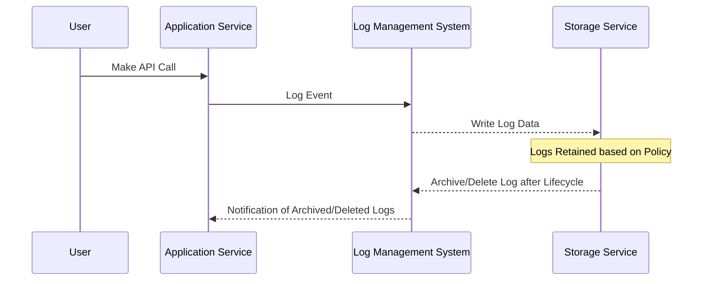

## Introduction

Log retention policies are a critical component of cloud infrastructure, providing the framework for storing and managing logs over a specified period. These policies help organizations comply with regulations, optimize storage costs, and maintain security.

## Design Pattern Explanation

A **Log Retention Policy** defines how long log data should be preserved in storage and when it can be safely deleted. This pattern is used to ensure compliance with industry regulations, audit requirements, and organizational policies, while also managing the costs associated with storing large volumes of log data.

### Architectural Approach

1. **Centralized Logging System**: Utilize tools such as Elasticsearch, Fluentd, and Kibana (EFK) or Splunk to collect and store logs from various services in a centralized location.

2. **Policy Definition**: Define clear policies based on:
   - **Compliance**: Logs may need to be retained for a specific period due to legal or regulatory requirements.
   - **Operational Needs**: Determine how long logs are required for monitoring and troubleshooting purposes.
   - **Cost Management**: Balance the cost of storage with the business value of retained logs.

3. **Automated Log Lifecycle Management**: Implement automated processes to manage the log lifecycle, including:
   - **Archiving**: Move older logs to cheaper storage solutions like AWS S3 or Glacier.
   - **Deletion**: Automatically delete logs beyond their retention period.

4. **Security Considerations**: Ensure logs are encrypted both in transit and at rest to maintain data confidentiality and integrity.

5. **Scalability**: Design the logging infrastructure to handle the growing volume of logs as services and users increase.

## Best Practices

- **Implement Tiered Storage**: Use a combination of high-performance storage for recent logs and cost-effective storage for archived logs.
- **Regular Review and Optimization**: Periodically review log retention policies to ensure they remain aligned with business and compliance needs.
- **Access Controls**: Restrict log access to authorized personnel to prevent unauthorized data exposure.
- **Monitoring and Alerts**: Set up monitoring and alerts for log storage utilization to prevent unexpected storage cost spikes.
- **Auditability**: Ensure logs and retention processes are auditable for compliance and security purposes.

## Example Code

Here is an example using AWS Lambda for a log retention policy:

```javascript
const AWS = require('aws-sdk');
const s3 = new AWS.S3();
const daysToRetain = 90; // Retention period in days

exports.handler = async (event) => {
    const logsBucket = 'your-logs-bucket';
    const params = {
        Bucket: logsBucket,
        LifecycleConfiguration: {
            Rules: [
                {
                    ID: 'Move to Glacier',
                    Prefix: '',
                    Status: 'Enabled',
                    Transitions: [
                        {
                            Days: daysToRetain,
                            StorageClass: 'GLACIER',
                        },
                    ],
                    Expiration: {
                        Days: daysToRetain + 365, // Retain in Glacier for 1 more year
                    },
                },
            ],
        },
    };

    await s3.putBucketLifecycleConfiguration(params).promise();
};
```

## Diagrams

Below is a sequence diagram illustrating the lifecycle of log data in a cloud environment:



## Related Patterns

- **Data Tiering**: Organizing data storage into multiple tiers to optimize cost and performance.
- **Centralized Log Processing**: Techniques for aggregating logs from multiple sources for unified analysis.
- **Immutable Logging**: Ensuring that log data cannot be altered post-creation for security and compliance purposes.

## Additional Resources

- [Centralized Logging with EFK Stack](https://www.elastic.co/what-is/elk-stack)
- [AWS S3 Lifecycle Management](https://docs.aws.amazon.com/AmazonS3/latest/dev/object-lifecycle-mgmt.html)
- [GDPR Logging Compliance](https://gdpr.eu/logging/)

## Summary

In summary, the **Log Retention Policies** design pattern plays a vitally important role in cloud computing environments by helping manage the lifecycle of logs. Properly implemented policies ensure compliance with regulations, improve security postures, and optimize costs. By leveraging automated tools and processes, organizations can maintain robust log management practices that scale with their operational needs.
