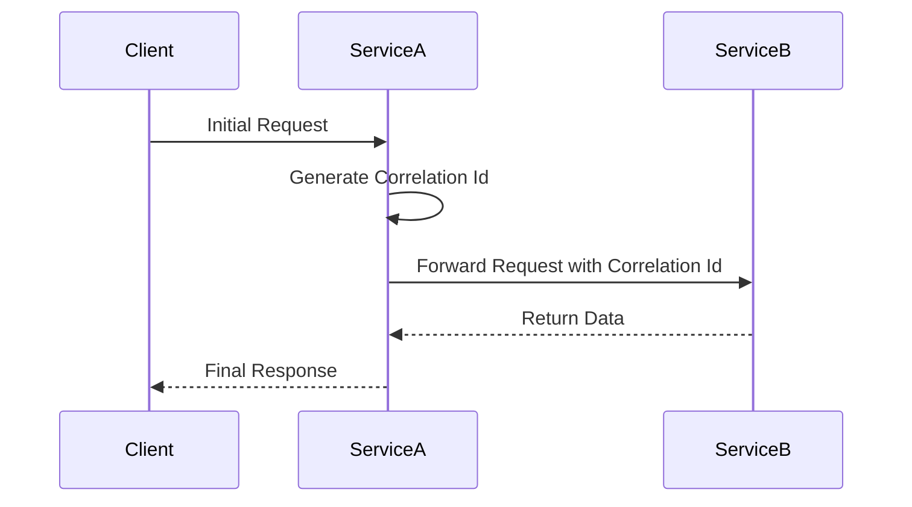

## Introduction

In distributed systems, where multiple services interact to fulfill a single user request, tracing the journey of a request becomes crucial for debugging and performance monitoring. This is where **Correlation Ids in Logging** come into play, enabling seamless traceability across disparate services by tagging all logs related to a particular request with a unique identifier.

## Design Pattern Overview

### What are Correlation Ids?

A **Correlation Id** is an identifier that is passed along with a user's request and travels through each service and component involved in processing that request. Ideally, this identifier is unique per request, such as a UUID, enhancing logs with valuable context.

### Core Idea

By assigning a unique Correlation Id to every distinct user request at entry, and maintaining it across each service call, developers can piece together the distributed logs into a single, cohesive narrative, making it much easier to understand what happened during the lifecycle of a request.

## Architectural Approaches

### Implementation Steps

1. **Generate a Correlation Id**: At the ingress point of your system (usually the client's first interaction point with your system), generate or retrieve a Correlation Id.
   
2. **Pass the Correlation Id**: Ensure that every service call, message, or event that occurs while processing the request includes the Correlation Id. This might involve HTTP headers, message payloads, or database operations.

3. **Log with the Correlation Id**: Each component, subsystem, or service logs the Correlation Id alongside the usual log information, allowing the logs to be linked together.

4. **Aggregate and Search**: Use log aggregation tools to collect logs from various services and query them based on the Correlation Id.

### Considerations

- Ensure that the Correlation Id is handled securely, avoiding exposure in logs that might lead to sensitive information leakage.
- Consider how Correlation Ids are propagated in asynchronous operations, where the context might not be directly passed as part of a service call.

## Best Practices

- **Consistency**: Ensure that the Correlation Id is consistently applied across all components and stages of request processing.
- **Transparency**: Implement a minimal footprint for passing Correlation Ids, ensuring that no significant changes to existing interfaces are required.
- **Security & Privacy**: Handle Correlation Ids securely to prevent unintended leakage.

## Example Code

Here's a simple illustration in Java using Spring Boot:

```java
import org.slf4j.MDC;
import org.springframework.web.filter.OncePerRequestFilter;

import javax.servlet.FilterChain;
import javax.servlet.ServletException;
import javax.servlet.http.HttpServletRequest;
import javax.servlet.http.HttpServletResponse;
import java.io.IOException;
import java.util.UUID;

public class CorrelationIdFilter extends OncePerRequestFilter {

    private static final String CORRELATION_ID_HEADER_NAME = "X-Correlation-ID";

    @Override
    protected void doFilterInternal(HttpServletRequest request,
                                    HttpServletResponse response,
                                    FilterChain filterChain)
            throws ServletException, IOException {

        String correlationId = request.getHeader(CORRELATION_ID_HEADER_NAME);
        if (correlationId == null) {
            correlationId = UUID.randomUUID().toString();
        }

        // Add correlation id to logging context
        MDC.put(CORRELATION_ID_HEADER_NAME, correlationId);

        try {
            response.setHeader(CORRELATION_ID_HEADER_NAME, correlationId);
            filterChain.doFilter(request, response);
        } finally {
            // Clean up after the request
            MDC.remove(CORRELATION_ID_HEADER_NAME);
        }
    }
}
```

## Diagrams

### Sequence Diagram



## Related Patterns

- **Request-Id Pattern**: Similar to correlation ids but focuses on uniquely identifying individual requests.
- **Log Aggregation**: Collect and manage logs from multiple sources, leveraging tools like ELK Stack or Splunk.

## Additional Resources

- **Book**: "Site Reliability Engineering" by Niall Richard Murphy et al.
- **Web Article**: [Distributed Tracing with Correlation IDs](https://www.example.com)
- **Tool**: Use Log Analysis Tools like Graylog, Splunk, or ELK for managing correlation ids across logs.

## Summary

The **Correlation Ids in Logging** design pattern is a powerful tool in the arsenal of any software architect dealing with complex distributed systems. By using this pattern, you establish a simple yet effective mechanism for tracking transactions across multiple services, significantly easing debugging and performance monitoring efforts.
