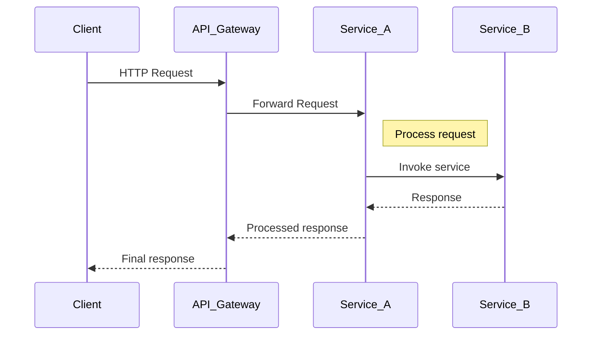

## Overview of Distributed Tracing

Distributed tracing is a method used to monitor and track requests as they flow through a distributed system. In a cloud-based infrastructure, applications often consist of multiple, interconnected microservices. Requests travel across these services, making it challenging to pinpoint where performance bottlenecks or errors occur. Distributed tracing addresses this challenge by providing a systematic way to track request paths, measure latency, and diagnose system health.

## Design Pattern Components

1. **Trace**: Represents a request as it travels through a distributed system. A trace is composed of multiple spans.
2. **Span**: The basic unit of work in a trace, representing a single operation within a service.
3. **Trace Context**: Involves metadata that carries trace information between services, usually including trace ID, span ID, and sampling data.
4. **Collector**: Aggregates tracing data for analysis and visualization.
5. **Instrumentation**: Code added to applications to capture tracing data, either manually or using libraries and frameworks.

## Architectural Approaches

- **Instrument Microservices**: Implement tracing code or use middleware/libraries that support distributed tracing, such as OpenTelemetry.
- **Centralized Collector**: Set up infrastructure to receive and store tracing data, like Jaeger or Zipkin.
- **Visualization Tools**: Utilize tools for interpreting tracing data, providing insights into latency, errors, and request paths.

## Best Practices

- **Consistent Trace Propagation**: Ensure that all services propagate trace context consistently. Consider adopting standards such as W3C Trace Context.
- **Sampling Strategies**: Implement efficient sampling techniques to limit overhead while capturing critical traces.
- **Logging Integration**: Combine logging with trace data to provide a richer context for troubleshooting.
- **Security and Privacy**: Be mindful of sensitive information included in traces, ensuring compliance with legal and regulatory requirements.

## Example Code

Below is a simple example in Java using OpenTelemetry for distributed tracing:

```java
import io.opentelemetry.api.GlobalOpenTelemetry;
import io.opentelemetry.api.trace.Span;
import io.opentelemetry.api.trace.Tracer;

public class TracingExample {
    public static void main(String[] args) {
        Tracer tracer = GlobalOpenTelemetry.getTracer("exampleTracer", "1.0.0");

        Span span = tracer.spanBuilder("myRequestSpan").startSpan();
        try {
            // Simulate some work
            performTask();
        } finally {
            span.end();
        }
    }

    private static void performTask() {
        // Task logic...
    }
}
```

## Diagrams

### Sequential Flow of Tracing



## Related Patterns

- **Service Mesh**: Integrates distributed tracing as part of its features, managing tracing propagation between services.
- **Logging Patterns**: Complement tracing by providing contextual logs, enhancing debug and monitoring capabilities.
- **Fault Tolerance Patterns**: Use insights from tracing to enhance system resilience.

## Additional Resources

- [OpenTelemetry Documentation](https://opentelemetry.io/docs/)
- [Jaeger Tracing](https://www.jaegertracing.io/)
- [Zipkin: A Distributed Tracing System](https://zipkin.io/)

## Summary

Distributed tracing is a crucial pattern for observability in cloud-based systems. By providing visibility into the flow of requests across multiple services, it empowers organizations to diagnose issues efficiently, optimize performance, and ensure system reliability. Implementing distributed tracing requires setting up instrumentation, collecting and analyzing trace data, and integrating with existing monitoring and logging setups. As systems continue to embrace microservices architectures, distributed tracing will remain a pivotal tool in the operations toolkit.
