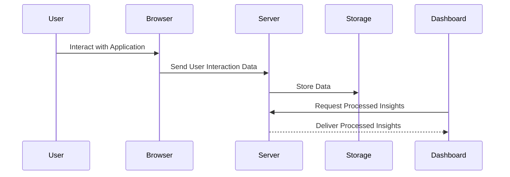

Real User Monitoring (RUM) is an essential practice for gaining insights into how users interact with cloud-based applications and services. It focuses on collecting data from real users in real-time, which helps in understanding their experiences, identifying performance bottlenecks, and optimizing the user interface and experience.

## Design Pattern: Real User Monitoring

### Detailed Explanation

Real User Monitoring involves capturing and analyzing the interactions of users with an application. This includes tracking page views, clicks, paths taken through the application, response times, and other performance metrics. By employing RUM, businesses can directly correlate user behavior with performance metrics and make data-driven decisions to enhance the user experience.

RUM can be implemented using JavaScript agents embedded within web pages. These agents collect data and send it to a server for analysis. This data provides a wealth of information about how the application performs under actual usage conditions, unlike synthetic monitoring, which uses simulated users.

### Architectural Approach

The architecture of RUM systems typically involves:

1. **JavaScript Agents**: Embedded in web pages to collect data.
2. **Data Collection Servers**: Aggregate, preprocess, and send data to storage.
3. **Storage**: Scalable databases (SQL/NoSQL) to store large volumes of user interaction data.
4. **Analysis Engines**: Tools for processing, analyzing, and visualizing data, often with AI and ML capabilities to detect anomalies and trends.
5. **Dashboards**: User interfaces for real-time monitoring and historical analysis of performance metrics.

### Paradigms and Best Practices

- **Data Privacy**: Ensure compliance with privacy laws (e.g., GDPR) by anonymizing or opting-out user data.
- **Scalability**: RUM systems must handle high volumes of data from potentially millions of users.
- **Integration**: RUM should integrate with other monitoring tools and platforms for comprehensive observability.
- **Anomaly Detection**: Use machine learning algorithms to detect unusual patterns and potential issues in real-time.

### Example Code

Here's a simple example of embedding a JavaScript-based RUM agent:

```html
<script>
  (function() {
    window.rumData = [];
    const trackEvent = (eventType, eventDetails) => {
      rumData.push({ type: eventType, details: eventDetails, timestamp: new Date().toISOString() });
      // Send data to server
      // fetch('https://your-collection-server.com/collect', {
      //   method: 'POST',
      //   body: JSON.stringify(rumData),
      //   headers: {'Content-Type': 'application/json'}
      // });
    };

    document.addEventListener('click', event => trackEvent('click', { target: event.target.tagName }));
    window.addEventListener('load', () => trackEvent('load', { url: window.location.href }));
  })();
</script>
```

### Diagrams

Here’s sequence diagram representing data flow in a RUM system:



### Related Patterns

- **Synthetic Monitoring**: Complements RUM by simulating user interactions.
- **Application Performance Management (APM)**: Broader scope including RUM, focusing on application performance.
- **Distributed Tracing**: Offers end-to-end tracing of requests across distributed systems.

### Additional Resources

- [Google Analytics for Traffic Analysis](https://analytics.google.com/)
- [New Relic Real User Monitoring](https://newrelic.com/platform/real-user-monitoring)
- [Dynatrace RUM](https://www.dynatrace.com/platform/real-user-monitoring/)
- [DataDog RUM Overview](https://www.datadoghq.com/real-user-monitoring/)

### Summary

Real User Monitoring is a critical pattern in the cloud, offering businesses deep insights into how their applications are used in real-world settings. By employing RUM, companies can enhance user satisfaction, optimize performance, and ensure robust, scalable cloud services. This comprehensive approach to monitoring not only improves application quality but also contributes to a superior user experience.
