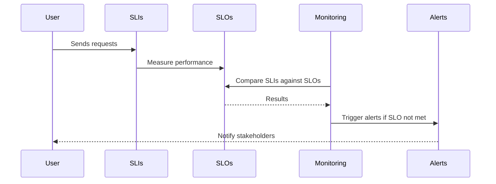

## Introduction

In the realm of cloud computing, maintaining reliable service performance and ensuring customer satisfaction are paramount. Service Level Objectives (SLOs) serve as a pivotal design pattern that enables organizations to quantify and manage service reliability expectations. They are a critical component of the broader Service Level Agreement (SLA) strategy, providing measurable and clear objectives for service performance.

## Detailed Explanation

### What are SLOs?

Service Level Objectives (SLOs) are specific, quantifiable goals defined for a service concerning its performance and availability. These objectives are typically derived from the business requirements and are used to guide operational practices, ensuring the service meets user expectations.

### Relationship with SLAs and SLIs

- **Service Level Agreements (SLAs):** SLAs are formal contracts between service providers and their clients that stipulate the expected level of service. SLAs encompass several SLOs, providing a comprehensive framework for service expectations.
  
- **Service Level Indicators (SLIs):** SLIs are metrics that provide actual performance data. They are used to measure the performance of a system, and they inform whether an SLO is being met.

### Key Components

1. **Availability:** This measures the uptime of a system. For instance, a 99.9% availability SLO allows for a total of 8.76 hours of downtime over a year.

2. **Latency:** The time it takes to process a request. An SLO might specify that 95% of requests must be served in under 300ms.

3. **Error Rate:** The percentage of requests that result in an error. A potential SLO could be that no more than 0.1% of all requests result in errors.

### Implementation Best Practices

- **Clear Definition:** Ensure SLOs are well-defined and align with customer and business priorities.
  
- **Measurable Metrics:** Choose SLIs that can be accurately measured and reported over time.

- **Continuous Monitoring:** Implement systems for real-time monitoring to evaluate SLIs against SLOs continuously.

- **Iterative Improvement:** Regularly review and refine SLOs to adapt to evolving business needs or customer expectations.

- **Stakeholder Communication:** Keep all relevant stakeholders informed about the implications of SLOs and any associated SLA commitments.

## Example Code

Here's an example using Prometheus for tracking a latency SLO.

```yaml
groups:
- name: example
  rules:
  - alert: HighRequestLatency
    expr: histogram_quantile(0.95, rate(http_request_duration_seconds_bucket[5m])) > 0.3
    for: 10m
    labels:
      severity: page
    annotations:
      summary: "High request latency detected"
      description: "Latency for 95% of requests is greater than 0.3 seconds."
```

## Diagrams

### SLO Monitoring Flow



## Related Patterns

- **Retry Pattern:** This pattern ensures requests are retried automatically in case of initial failure, which can help meet availability SLOs.
  
- **Circuit Breaker Pattern:** Protects services from a flood of failed requests that could impact SLO adherence.

## Additional Resources

- [SRE Workbook by Google](https://sre.google/workbook)
- [Prometheus Monitoring System](https://prometheus.io/docs/introduction/overview/)

## Summary

Service Level Objectives (SLOs) are essential tools in cloud environments for establishing clear expectations for service reliability and performance. By setting, monitoring, and managing SLOs, organizations can fine-tune their services to better meet user demands, ultimately leading to enhanced customer satisfaction and operational efficiency. In conjunction with SLAs and SLIs, SLOs form the backbone of modern service reliability practices, ensuring that organizations manage resources effectively and sustainably.
