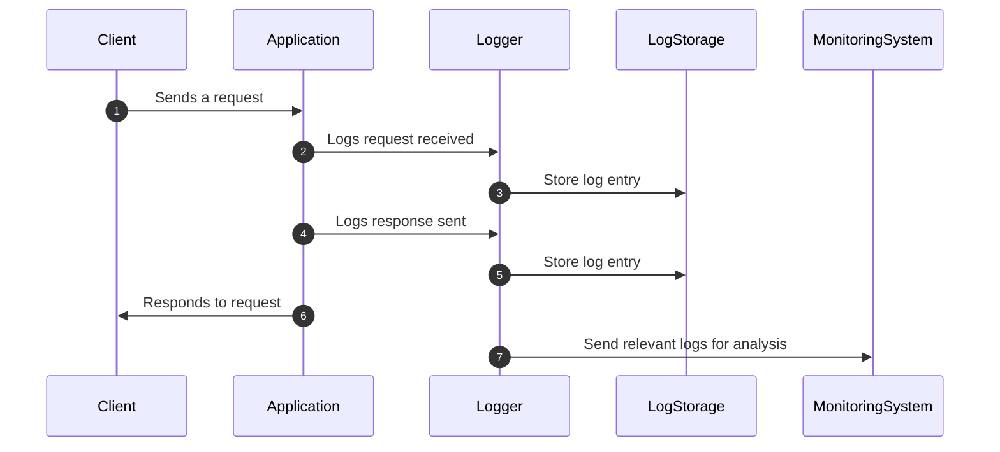

## Introduction to Event Logging Standards

In the fast-paced world of cloud computing, effective logging is quintessential for gaining insights into application performance, security events, and troubleshooting issues. Event Logging Standards refer to a set of best practices and guidelines that ensure consistent and structured logging across different components of a cloud-based system. These standards help harmonize log formats, prioritize log levels, and facilitate integration with monitoring and analytics tools.

## Key Components of Effective Logging

1. **Consistent Log Structure**: A well-defined log structure promotes ease of searching and indexing. Often, a JSON format is preferred due to its machine-readability and ease of integration with logging tools.

2. **Log Levels and Severity**: Establish clear guidelines for log levels such as DEBUG, INFO, WARN, ERROR, and FATAL. Each log message should be tagged appropriately to reflect its importance and urgency.

3. **Timestamping**: Every log entry should include a standardized timestamp, such as ISO 8601 format, to facilitate precise event ordering and correlation across distributed systems.

4. **Contextual Data**: Logs should carry enough context (e.g., request ID, user ID, service name) to correlate events from different services and trace transactions end-to-end.

5. **Security and Privacy Considerations**: Implement practices to mask or avoid logging sensitive information directly in logs to adhere to privacy laws and regulations.

6. **Integration with Monitoring and Alerting**: Ensure logs can be easily used by monitoring and alerting systems to detect anomalies and trigger alerts based on specific patterns or thresholds.

## Architectural Approaches

- **Centralized Logging**: Utilize a central logging repository (e.g., Elasticsearch, Google Cloud Logging, AWS CloudWatch) to aggregate logs from all services. Centralized logging simplifies searching and visualization with tools like Kibana or Grafana.

- **Immutable Logs**: Employ append-only mechanisms to prevent tampering and ensure auditability.

- **Log Rotation and Retention Policies**: Define policies for rotating logs and retaining historical data based on business needs and compliance requirements to optimize storage.

## Example Implementation

Here’s a simple logger implementation in Node.js using a JSON format and different log levels:

```javascript
const winston = require('winston');

const logger = winston.createLogger({
  level: 'info',
  format: winston.format.json(),
  defaultMeta: { service: 'user-service' },
  transports: [
    new winston.transports.Console({
      format: winston.format.combine(
        winston.format.colorize(),
        winston.format.simple()
      ),
    }),
    new winston.transports.File({ filename: 'combined.log' })
  ],
});

logger.info('User logged in', { username: 'john_doe', userId: 123 });
```

## Diagrams

### UML Sequence Diagram for Logging Flow



## Related Patterns

- **Distributed Tracing**: Helps in tracking and visualizing the flow of requests across microservices.
- **Exception Tracking**: Captures, logs, and analyzes exceptions and errors in applications.
- **Metrics Aggregation**: Aggregates metrics data for performance monitoring.

## Additional Resources

- [Cloud Logging on Google Cloud](https://cloud.google.com/logging)
- [AWS CloudWatch Logging](https://aws.amazon.com/cloudwatch/)
- [Introduction to Centralized Logging and Monitoring](https://www.elastic.co/what-is/elasticsearch)

## Summary

Establishing robust Event Logging Standards is critical for effective monitoring, observability, and troubleshooting in cloud environments. Adhering to structured logging practices improves system health visibility, facilitates forensic analysis, and accelerates issue resolution. By integrating logs with comprehensive monitoring tools, organizations can harness the full potential of their cloud infrastructure while ensuring compliance and security.
