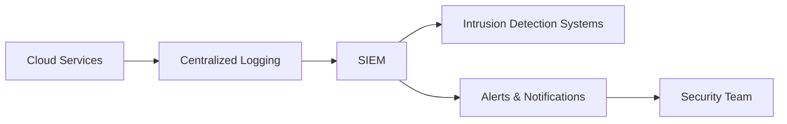

## Introduction

Security Monitoring in a cloud environment is a critical pattern designed to protect cloud infrastructure against various threats and vulnerabilities continually. It involves collecting, analyzing, and responding to logs and security data to provide real-time alerts and threat intelligence. This pattern ensures a proactive approach to security, facilitating the detection, analysis, and remediation of suspicious activities across cloud deployments.

## Design Pattern Details

### Definition

**Security Monitoring** in the cloud context refers to the practices and tools employed to continuously monitor cloud infrastructure for security threats and anomalies. This involves real-time analysis of logs and events produced by resources and services operating within the cloud to identify potential breaches or policy violations.

### Objectives

- **Timely Threat Detection:** Enable rapid identification of potential security threats to cloud resources.
- **Policy Compliance:** Ensure continuous adherence to internal and external security policies and regulatory requirements.
- **Proactive Threat Mitigation:** Automate alerts and responses to detected threats to prevent data breaches and minimize risk.
- **Comprehensive Visibility:** Offer extensive visibility into cloud activities to support auditing and security assessments.

## Architectural Approaches

### Centralized Logging

A centralized logging architecture is fundamental for effective security monitoring. By aggregating logs from various cloud services into a centralized repository, security teams can conduct in-depth analysis and correlation across diverse sources.

- **Example Technologies:** Amazon CloudWatch, Azure Monitor, Google Cloud Logging

### Intrusion Detection Systems (IDS)

Deploy IDS that are capable of monitoring and analyzing network traffic for suspicious patterns indicative of malicious activity. Cloud providers often offer native IDS solutions integrated into their platforms.

- **Example Technologies:** AWS GuardDuty, Azure Security Center

### Security Information and Event Management (SIEM)

Leverage SIEM platforms to aggregate security data, provide real-time analysis, and automate incident response. SIEM systems integrate with various data sources to provide a unified view of security events.

- **Example Technologies:** Splunk, IBM QRadar, Microsoft Sentinel

## Example Code

Here's a basic example using AWS CloudWatch to set up an alert if login attempts are above a certain threshold:

```json
{
  "Type" : "AWS::CloudWatch::Alarm",
  "Properties" : {
    "AlarmName" : "ExcessiveLoginAttempts",
    "MetricName" : "FailedLoginAttempts",
    "Namespace" : "AWS/CloudTrail",
    "Statistic" : "Sum",
    "Period" : 300,
    "EvaluationPeriods" : 1,
    "Threshold" : 5,
    "ComparisonOperator" : "GreaterThanOrEqualToThreshold",
    "AlarmActions" : [ "ARN of SNS Topic for alerting" ]
  }
}
```

This CloudWatch alarm will trigger if there are 5 or more failed login attempts within a 5-minute window.

## Diagrams

Here is an example of a basic Security Monitoring setup in a cloud environment using a centralized dashboard:



## Related Patterns

- **Incident Response Automation:** Automate security responses based on alerts to mitigate threats quickly.
- **Continuous Compliance Monitoring:** Ensure ongoing compliance with necessary regulations by monitoring for policy violations.
- **Application Performance Monitoring (APM):** Monitor applications' performance metrics to detect issues that might have security implications.

## Additional Resources

- [AWS Cloud Security Best Practices](https://docs.aws.amazon.com/general/latest/gr/aws-security-best-practices.html)
- [Google Cloud Security Overview](https://cloud.google.com/security)
- [Azure Security Documentation](https://docs.microsoft.com/en-us/azure/security/)

## Summary

Security Monitoring is an essential design pattern for maintaining robust security in cloud environments. By leveraging technologies such as centralized logging, IDS, and SIEM, organizations can gain comprehensive visibility, quickly detect threats, and ensure compliance with security policies. As cloud infrastructures become increasingly complex, adopting effective security monitoring practices becomes indispensable for protecting sensitive data and maintaining trust.
