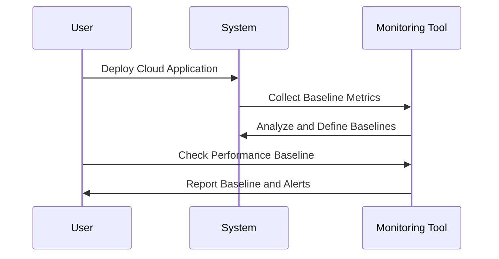

## Introduction

In cloud computing environments, understanding and managing the performance of applications and infrastructure is crucial for maintaining efficiency and reliability. The **Performance Baseline Establishment** pattern offers a guided methodology for establishing performance baselines which serve as reference points for evaluating the health and efficiency of cloud systems.

## Detailed Explanation

### Purpose

The main aim of establishing a performance baseline is to create a standard or reference that reflects normal operations of a cloud environment. This baseline aids in detecting anomalies, planning capacity, and pinpointing areas for performance optimization.

### Key Components

1. **Baseline Metrics Selection**: Determine which performance metrics are most crucial for your operations. Common metrics include CPU usage, memory consumption, request/response times, error rates, and throughput.

2. **Data Collection**: Collect performance data over a representative time period to capture different workloads and operational states, ensuring a comprehensive dataset.

3. **Analysis and Definition**: Analyze the collected data to identify patterns and define what constitutes normal performance. Utilize statistical methods to identify thresholds that signal deviations.

4. **Tool Integration**: Leverage monitoring and observability tools to automate the data collection and analysis processes. For example, using AWS CloudWatch, Google Cloud Monitoring, or Azure Monitor.

5. **Continuous Monitoring**: Set up continuous monitoring against the baseline to alert and log deviations. This enables proactive incident management and resource adjustments.

### Example Code

Consider using a tool like Prometheus for monitoring purposes. Below is an example configuration snippet:

```yaml
global:
  scrape_interval: 15s # Set the scraping interval

scrape_configs:
  - job_name: 'cloud_service'
    static_configs:
      - targets: ['localhost:9090'] # Your service targets
    metrics_path: /metrics
```

This YAML configuration instructs Prometheus to scrape performance data from your cloud service every 15 seconds.

### Diagrams

#### Performance Monitoring Workflow



## Related Patterns

- **Auto-Scaling**: Adjusts resources in real-time based on baseline analysis.
- **Fault Tolerance**: Uses baseline deviations to trigger fallback mechanisms.
- **Distributed Monitoring**: Extends baseline tracking across distributed components.
- **Adaptive Throttling**: Modifies request rates based on performance baselines.

## Best Practices

- **Regular Updates**: Maintain agility by regularly reviewing and updating baselines to account for new operational patterns.
- **Comprehensive Metrics**: Ensure a wide range of metrics are monitored to offer a holistic view of performance.
- **Threshold Adjustments**: Dynamically adjust thresholds as the system architecture and traffic evolve.

## Additional Resources

- [AWS CloudWatch Documentation](https://aws.amazon.com/cloudwatch/)
- [Google Cloud Monitoring Documentation](https://cloud.google.com/monitoring/docs/)
- [Azure Monitor Documentation](https://docs.microsoft.com/azure/azure-monitor/)

## Summary

The Performance Baseline Establishment pattern is critical in maintaining efficient, reliable, and scalable cloud operations. By systematically capturing and analyzing performance data, this pattern enables organizations to proactively manage and optimize their cloud resources, ensuring optimal functionality and cost-effectiveness. Establishing and maintaining baselines act as a cornerstone for effective cloud performance monitoring and management.
