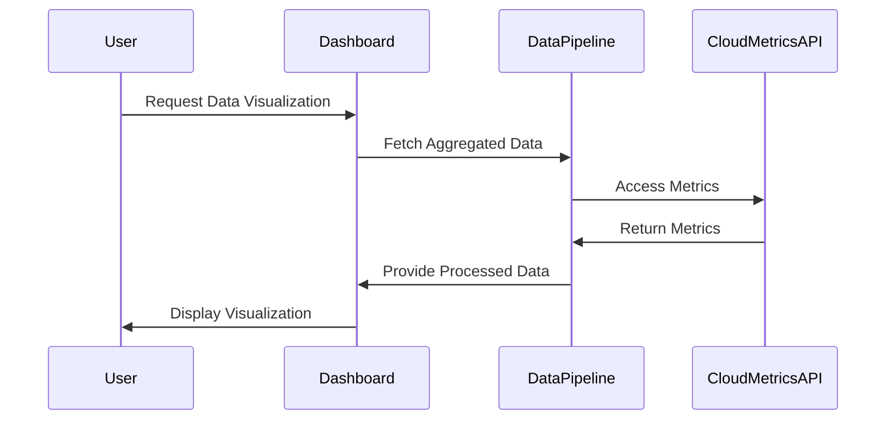

## Introduction

Data visualization plays a pivotal role in cloud computing by enhancing the monitoring and observability capabilities essential for maintaining and optimizing complex cloud environments. This article explores the best practices for effectively visualizing data to derive actionable insights, improve decision-making, and troubleshoot issues faster. By leveraging intuitive graphs, charts, and dashboards, organizations can translate vast amounts of data into understandable visuals that highlight key metrics and trends.

## Best Practices

1. **Define Clear Objectives**: Before creating visualizations, clarify the questions the visuals should answer. Visualizations should align with specific goals, whether for performance monitoring, anomaly detection, or capacity planning.

2. **Choose the Right Visualization Type**: Different data stories require different visualization types. Use line charts for trends, bar charts for comparisons, and pie charts for proportions. Complex datasets might benefit from heatmaps or scatter plots.

3. **Simplify and Focus**: Avoid overwhelming users with too much data in one visualization. Highlight the most important information and employ visual hierarchy to guide viewers through the data.

4. **Ensure Accessibility and Clarity**: Cater to a diverse audience by making visuals accessible, using high-contrast colors, and including descriptive titles and labels. Consistency across visualizations helps in understanding.

5. **Use Real-Time Data Wisely**: Real-time dashboards are crucial in cloud environments for quick responses. Focus on visualizing metrics that require immediate attention and action.

6. **Iterate and Evolve**: Visualization needs may change over time. Regularly review and update visualizations to ensure they stay relevant and effective in communicating the necessary information.

## Architectural Approach / Paradigm

Adopting a structured architectural approach in cloud environments enhances data visualization practices:

- **Micro-Dashboarding**: Implement microservice-based dashboards to provide modular, focused insights that cater to specific teams or objectives.
- **Event-Driven Architecture**: Stream real-time data for immediate processing and visualization, crucial for maintaining visibility in a dynamic cloud environment.
- **Serverless Visualization Platforms**: Leverage serverless technologies to dynamically scale visualization tools based on demand, ensuring performance and cost-efficiency.

## Example Code

Below is a basic example of creating a data visualization dashboard using JavaScript and a popular library like Chart.js:

```javascript
const ctx = document.getElementById('myChart').getContext('2d');
const myChart = new Chart(ctx, {
    type: 'line',
    data: {
        labels: ['January', 'February', 'March', 'April', 'May'],
        datasets: [{
            label: 'CPU Usage',
            data: [60, 70, 75, 80, 90],
            backgroundColor: 'rgba(54, 162, 235, 0.2)',
            borderColor: 'rgba(54, 162, 235, 1)',
            borderWidth: 1
        }]
    },
    options: {
        scales: {
            y: {
                beginAtZero: true
            }
        }
    }
});
```

## Diagrams

### Example of a Data Flow for Visualization



## Related Patterns

- **Real-Time Data Streaming**: Utilizes real-time data streams to provide up-to-date information, critical for responsive dashboards.
- **Serverless Architectures**: Employs serverless platforms to build scalable, cost-efficient visualization services.
- **Event Sourcing**: Keeps an accurate history of changes to cloud environments, aiding in retrospective analysis and visualization.

## Additional Resources

- [Chart.js Documentation](https://www.chartjs.org/docs/latest/)
- [The Data Visualisation Catalogue](https://datavizcatalogue.com)
- [D3.js Data-Driven Documents](https://d3js.org/)

## Summary

Effective data visualization is indispensable for cloud environments, enabling streamlined monitoring and accelerated decision-making. By adhering to best practices, choosing appropriate visualization types, and leveraging modern architectural paradigms, organizations can transform raw data into powerful visuals. This, in turn, helps improve performance, detect anomalies, and optimize resources in the cloud.
