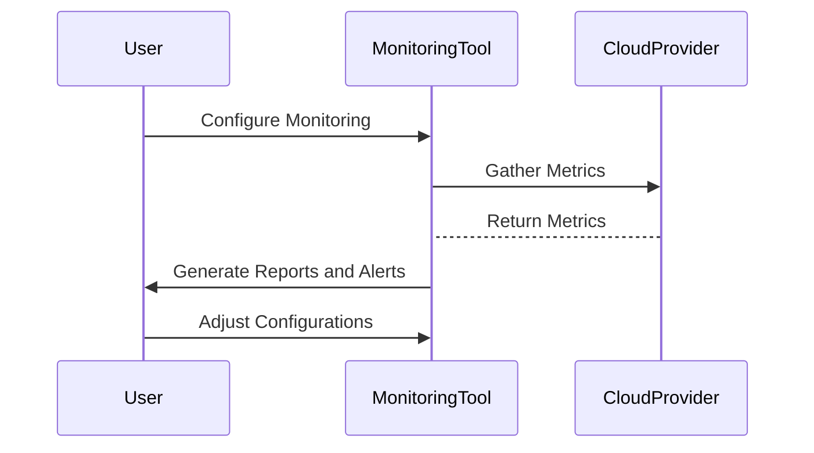

---

linkTitle: "Monitoring Cost Optimization"
title: "Monitoring Cost Optimization: Optimize Cloud Costs with Effective Monitoring"
category: "Monitoring, Observability, and Logging in Cloud"
series: "Cloud Computing: Essential Patterns & Practices"
description: "A detailed exploration of Monitoring Cost Optimization, a design pattern focused on reducing cloud costs through strategic monitoring and insightful observability practices."
categories:
- Cloud
- Monitoring
- Cost Optimization
tags:
- Cloud Computing
- Cost Efficiency
- Monitoring
- Observability
- Best Practices
date: 2024-07-07
type: docs

canonical: "https://softwarepatternslexicon.com/18/10/28"
license: "© 2024 Tokenizer Inc. CC BY-NC-SA 4.0"
---

## Introduction

The **Monitoring Cost Optimization** design pattern emphasizes the strategic use of monitoring solutions to optimize and reduce cloud operational costs. This pattern leverages observability tools to track and analyze resource usage meticulously, thereby driving insights into necessary optimizations.

## Design Pattern Category

This design pattern belongs to the "Monitoring, Observability, and Logging in Cloud" category. It provides a methodology for achieving cost savings by aligning monitoring activities with budget constraints and usage patterns.

## Architectural Overview

### Key Concepts

- **Monitoring Solutions**: Implementing tools like Prometheus, Grafana, AWS CloudWatch, Azure Monitor, and Google Cloud Operations Suite.
- **Resource Metrics**: Collection and analysis of metrics such as CPU load, memory usage, and network throughput.
- **Cost Analysis**: Translating gathered data into actionable insights for cost reduction.
- **Alerting Systems**: Setting thresholds and alerts to avoid overutilization and underutilization.

### Implementation Approach

1. **Assessment of Current Tools and Needs**: Begin by inventorying existing monitoring tools and understanding their cost structures and capabilities.

2. **Integration for Enhanced Visibility**: Integrate observability platforms like the ELK stack or Datadog to unify log, metric, and trace data.

3. **Automation of Alerting Mechanisms**: Configure automated alerts and anomaly detection to flag unusual spending or performance patterns.

4. **Data Analysis and Reporting**: Utilize dashboards and reporting features to generate insights on usage trends, helping to identify sluggish resource allocations or inefficiencies.

5. **Iterative Review and Optimization**: Continuously review metrics and logs to refine resource allocations based upon usage patterns.

## Example Code

Below is a simplified example using AWS CloudWatch to automate monitoring and cost management.

```javascript
import AWS from 'aws-sdk';
const cloudwatch = new AWS.CloudWatch();

const params = {
  AlarmName: 'High-CPU-Usage',
  MetricName: 'CPUUtilization',
  Namespace: 'AWS/EC2',
  Statistic: 'Average',
  Period: 300,
  EvaluationPeriods: 2,
  Threshold: 75.0,
  ComparisonOperator: 'GreaterThanThreshold',
  AlarmActions: ['arn:aws:sns:us-west-2:123456789012:notify'],
  Dimensions: [
    {
      Name: 'InstanceId',
      Value: 'i-1234567890abcdef0'
    },
  ],
};

cloudwatch.putMetricAlarm(params, function(err, data) {
  if (err) console.log(err, err.stack);
  else console.log(data);
});
```

## Diagrams

### Monitoring Cost Optimization Workflow



## Related Patterns

- **Autoscaling**: Automatically adjust resource levels based on current load, ensuring minimal cost without sacrificing performance.
- **Serverless Architectures**: Use lambda functions or equivalent to minimize always-on costs.
- **Cost Allocation Tags**: Label resources for granular visibility into which services incur costs.

## Additional Resources

- [AWS Cost Management](https://aws.amazon.com/aws-cost-management/)
- [Google Cloud Billing Reports](https://cloud.google.com/billing/docs/reports)
- [Azure Cost Management and Billing](https://azure.microsoft.com/en-us/services/cost-management/)

## Summary

The **Monitoring Cost Optimization** pattern is critical for enterprises leveraging cloud resources to ensure performant and cost-effective operations. By utilizing robust monitoring and analytics solutions, organizations can maintain control over their budgets, dynamically adjust resources, and capitalize on insights to prevent financial overages. This approach delivers a sustainable pathway to efficient cloud utilization aligning technological practices with financial strategies.

---
