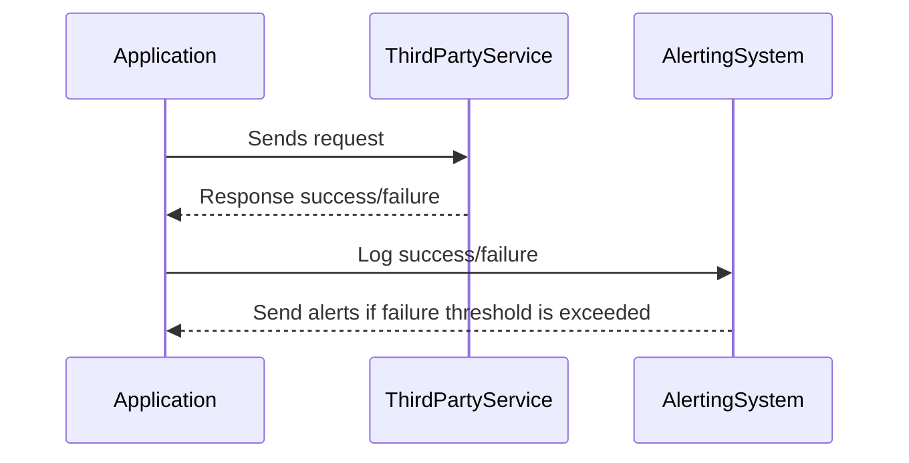

## Introduction

In cloud computing environments, applications frequently rely on third-party services for enhanced functionality, scalability, and performance. These third-party dependencies could range from payment gateways and authentication services to data analytics and storage solutions. Ensuring that these dependencies are reliable and performant is critical to maintaining the overall health and user experience of the application. The **Third-Party Services Monitoring** design pattern addresses this by providing strategies to observe, diagnose, and respond to issues that may arise from these third-party services.

## Architectural Approaches

Monitoring third-party services involves several architectural strategies:

1. **Service-Level Indicators (SLIs) and Service-Level Objectives (SLOs):** Establish SLIs like latency, error rate, and availability. Define SLOs to set acceptable performance thresholds for third-party services.

2. **Distributed Tracing:** Utilize distributed tracing tools like OpenTelemetry to track and visualize the interactions between your application and third-party services. This helps identify potential bottlenecks and failures.

3. **Health Checks and Heartbeats:** Implement regular health checks or heartbeat mechanisms to periodically verify the operational status of third-party services.

4. **Logging and Log Aggregation:** Capture logs from interactions with third-party services and aggregate them for analysis. Tools like ELK Stack or Splunk are effective for this purpose.

5. **Alerts and Notification Systems:** Set up alerts based on predefined thresholds or anomalies detected in SLIs to notify relevant teams of potential issues with third-party services.

6. **Circuit Breakers and Retry Mechanisms:** Implement patterns such as circuit breakers and retries to gracefully handle service failures and prevent cascading failures.

## Example Code

Let's demonstrate a simple implementation using a circuit breaker to monitor a third-party service in Scala:

```scala
import akka.actor.ActorSystem
import akka.pattern.CircuitBreaker
import scala.concurrent.duration._

object ThirdPartyServiceMonitor extends App {
  implicit val system: ActorSystem = ActorSystem("third-party-monitor")

  val breaker = new CircuitBreaker(
    system.scheduler,
    maxFailures = 5,
    callTimeout = 10.seconds,
    resetTimeout = 1.minute
  )

  def callThirdPartyService(): Unit = {
    // Simulated call to a third-party service
    println("Calling third-party service...")
    // Assume this throws an exception if the service call fails
  }

  breaker.onOpen {
    println("Circuit breaker opened, third-party service is unavailable.")
  }.onHalfOpen {
    println("Circuit breaker is half-open, testing third-party service...")
  }.onClose {
    println("Circuit breaker closed, third-party service is available.")
  }

  // Example usage
  breaker.withCircuitBreaker {
    callThirdPartyService()
  }
}
```

## Diagrams

### Sequence Diagram

Below is a sequence diagram illustrating the interaction between an application, an alerting system, and a third-party service:



## Related Patterns

- **Circuit Breaker Pattern:** A pattern used to detect failures and encapsulate the logic of preventing a failure from constantly recurring during maintenance, temporary external service failure, or unexpected system difficulties.

- **Retry Pattern:** It allows an application to handle transient failures when it attempts to connect to a service or network resource by retrying operations that fail due to these short-lived faults.

## Additional Resources

- [Google's Site Reliability Engineering (SRE) Handbook](https://sre.google/books/)
- [OpenTelemetry Documentation](https://opentelemetry.io/docs/)
- [AWS CloudWatch](https://aws.amazon.com/cloudwatch/)
- [Azure Monitor](https://azure.microsoft.com/en-us/services/monitor/)

## Summary

Monitoring third-party services is crucial for maintaining the reliability and performance of cloud-based applications relying on external dependencies. By implementing architectural strategies such as SLIs/SLOs, distributed tracing, health checks, and circuit breakers, you can proactively manage and mitigate issues with these services. Continuous monitoring and alerting further ensure that any disruptions in third-party services are promptly addressed to maintain seamless user experiences.
