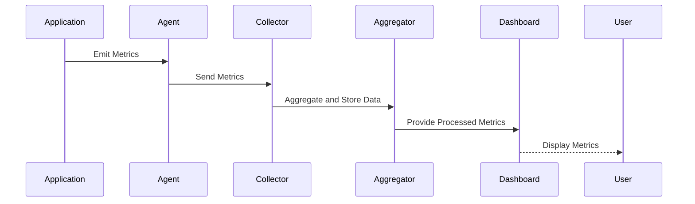

## Introduction

In the rapidly evolving domain of cloud computing, maintaining the operational health of applications is paramount. The **Metrics Collection and Aggregation** pattern serves as a critical mechanism to collect and aggregate performance metrics, enabling real-time insights into system behavior. This design pattern facilitates the monitoring of applications through comprehensive data, assisting in early detection of issues, performance bottlenecks, and providing a foundation for proactive system management.

## Design Pattern Description

Metrics Collection and Aggregation involves recording data points from various sources (applications, infrastructure, external services) and processing these metrics to derive actionable insights. The primary components of the pattern include:

- **Metrics Emitters**: Application components and infrastructure elements that generate metrics.
- **Collectors**: Solutions that gather metrics from emitters at regular intervals or upon specific events.
- **Aggregators**: Systems that process collected metrics, often performing tasks like rolling up, summarization, and storage.
- **Data Stores**: Databases designed for time-series data, optimized for query performance on metric data.
- **Visualizers**: Tools that render metrics into dashboards and reports, aiding in the interpretation of telemetry data.

## Architectural Approaches

The Metrics Collection and Aggregation pattern can be implemented via several architectural approaches, including:

1. **Agent-Based Collection**: Deploying lightweight agents that reside on the hosts to capture and transmit metrics.
2. **Intermediary Services**: Utilizing cloud-based services for metrics ingestion and processing, such as AWS CloudWatch or Azure Monitor.
3. **Custom Aggregation Pipelines**: Building bespoke solutions using tools like Prometheus and Grafana for flexible and scalable monitoring setups.

## Best Practices

- **Standardization**: Ensure consistency in metric naming conventions, units, and types across the system.
- **Sampling and Throttling**: Implement mechanisms to control data volume, selecting representative samples and reducing noise.
- **Redundancy and Reliability**: Establish redundant paths for metrics collection to prevent data loss.
- **Data Retention Policies**: Define policies for retention and archival of metrics to balance performance with cost.

## Example Code

Here's a basic example of using Prometheus to collect and aggregate metrics in a Go application:

```go
package main

import (
    "net/http"
    "github.com/prometheus/client_golang/prometheus"
    "github.com/prometheus/client_golang/prometheus/promhttp"
)

var (
    requestCount = prometheus.NewCounterVec(
        prometheus.CounterOpts{
            Name: "http_requests_total",
            Help: "Number of HTTP requests received",
        },
        []string{"path"},
    )
)

func init() {
    prometheus.MustRegister(requestCount)
}

func handler(w http.ResponseWriter, r *http.Request) {
    requestCount.With(prometheus.Labels{"path": r.URL.Path}).Inc()
    w.Write([]byte("Hello, World!"))
}

func main() {
    http.Handle("/metrics", promhttp.Handler())
    http.HandleFunc("/", handler)

    http.ListenAndServe(":8080", nil)
}
```

## Diagrams

Below is sequence diagram illustrating the flow in a metrics collection and aggregation setup:



## Related Patterns

- **Centralized Logging**: Complements Metrics Collection by focusing on aggregating log data for analysis.
- **Distributed Tracing**: Provides insights into system performance by tracing requests across services.
- **Circuit Breaker**: Improves system resilience and is often monitored using metrics.

## Additional Resources

- [Prometheus Documentation](https://prometheus.io/docs/introduction/overview/)
- [Grafana Documentation](https://grafana.com/docs/grafana/latest/)
- [AWS Monitoring and Observability Best Practices](https://docs.aws.amazon.com/whitepapers/latest/monitoring-best-practices/)

## Summary

The Metrics Collection and Aggregation pattern is fundamental for effective cloud application observability. By efficiently collecting, processing, and visualizing metrics, this pattern enables organizations to maintain operational health and optimize performance. Implementing this pattern requires a combination of standardization, automated systems, and robust tooling, ensuring scalability and reliability across cloud environments.
