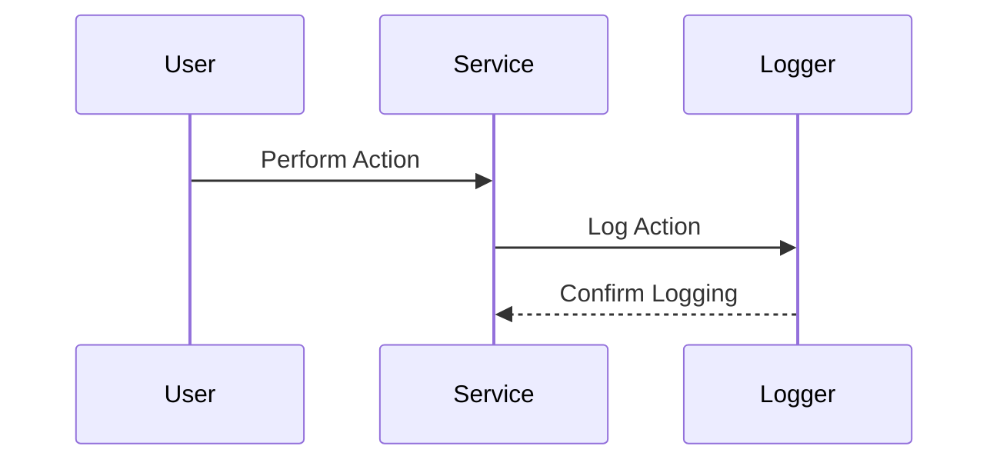

## Introduction

Compliance and Audit Logging is a critical design pattern in cloud computing, aimed at recording and retaining logs of all interactions within a cloud environment to ensure accountability and traceability. This pattern helps organizations comply with regulatory requirements and facilitates security auditing across distributed systems.

## Detailed Explanation

### Design Pattern Overview

Compliance and Audit Logging involves capturing detailed information about system events, user actions, and access to sensitive resources. These logs are then stored securely and must be easily retrievable for auditing purposes.

### Objectives

- **Regulatory Compliance**: Ensures that systems meet industry standards and legal requirements.
- **Security Auditing**: Provides detailed logs that help identify and analyze security breaches.
- **Traceability**: Maintains a complete record of interactions to support troubleshooting and forensic investigations.
- **Accountability**: Keeps users and systems accountable for their actions through transparent logging.

### Key Components

1. **Log Collection**: Use agents or built-in capabilities within cloud services to capture logs.
2. **Log Storage**: Store logs securely, using encryption and access controls to prevent unauthorized access.
3. **Log Analysis**: Implement tools to analyze logs for compliance and security analytics.
4. **Alerting and Reporting**: Set up alerts for anomalies and generate reports for audit reviews.

### Best Practices

- **Data Anonymization**: Protect sensitive information within logs through anonymization techniques.
- **Retention Policies**: Establish log retention policies based on compliance requirements and business needs.
- **Access Controls**: Restrict log access to only those who need it for their roles.
- **Automated Monitoring**: Use automated tools for real-time monitoring of logs to detect and respond to incidents.

### Example Code

```java
// Java implementation of a simplified logging setup
import java.util.logging.FileHandler;
import java.util.logging.Logger;
import java.util.logging.SimpleFormatter;

public class AuditLogger {

    private static final Logger logger = Logger.getLogger("AuditLogger");

    static {
        try {
            FileHandler fileHandler = new FileHandler("audit.log", true);
            logger.addHandler(fileHandler);
            SimpleFormatter formatter = new SimpleFormatter();
            fileHandler.setFormatter(formatter);
        } catch (Exception e) {
            logger.warning("Failed to initialize logger: " + e.getMessage());
        }
    }

    public static void logAction(String userId, String action, String details) {
        logger.info(String.format("User: %s, Action: %s, Details: %s", userId, action, details));
    }
}
```

### Diagrams



## Related Patterns

- **Centralized Logging**: Aggregate logs from various sources in one location for easier management and analysis.
- **Secure Log Management**: Focus on security aspects of log handling, such as encryption and integrity verification.
- **Event Sourcing**: Use events as a source of truth to consider when building systems that require a historical audit trail.

## Additional Resources

- [AWS CloudTrail](https://aws.amazon.com/cloudtrail/)
- [Azure Monitor Logs](https://docs.microsoft.com/en-us/azure/azure-monitor/insights/logger)
- [Google Cloud Logging](https://cloud.google.com/logging/)

## Summary

Compliance and Audit Logging is a fundamental pattern for ensuring transparency, accountability, and security in cloud applications. By systematically collecting, storing, and analyzing logs, organizations can meet regulatory requirements and protect their systems from unauthorized or malicious activities. This pattern encourages the implementation of thorough logging strategies supported by robust infrastructure and tools.
