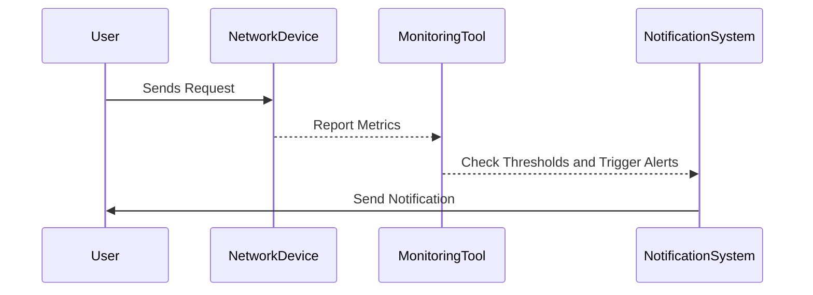

## Introduction

Network Monitoring is a critical design pattern aimed at ensuring the seamless functioning of network elements within cloud environments. It encompasses a variety of strategies and technologies employed to continuously observe and analyze the performance, availability, and security of network infrastructures, especially in distributed and hybrid cloud scenarios.

## Detailed Explanation

### Network Monitoring Features

- **Continuous Surveillance**: Utilize tools for real-time observation of network traffic to detect and address issues proactively.
- **Metrics Collection**: Gather various metrics such as packet loss, error rates, response times, and bandwidth utilization.
- **Alerts and Notifications**: Implement threshold-based alerts to inform administrators of potential issues before they escalate into critical outages.
- **Historic Data Analysis**: Use past data to predict potential system bottlenecks and understand network usage patterns.
- **Integration with Other Systems**: Link network monitoring tools with incident management and analytics systems for streamlined operations.

### Architectural Approaches

1. **Agent-Based Monitoring**: Deploy agents on network devices that periodically report status and performance metrics to a central server.
2. **Agentless Monitoring**: Use protocols like SNMP or WMI to remotely query and monitor devices without installing additional software.
3. **Flow-Based Monitoring**: Analyze NetFlow, sFlow, or JFlow data to gain insights into network traffic characteristics.
4. **Synthetic Monitoring**: Simulate network traffic to assess the performance and availability from an end-user perspective.

### Paradigms and Best Practices

- **Centralized Logging**: Consolidate logs for comprehensive visibility into network operations by employing tools like Elasticsearch, Logstash, and Kibana (ELK Stack).
- **Threshold Baselining**: Regularly update threshold values based on network patterns and usage trends to minimize false positives.
- **Automation**: Generate automated responses for common network issues to reduce the resolution time.
- **Security Considerations**: Ensure secure data transmission and compliance with standards such as ISO/IEC 27001 and GDPR.

### Example Code

Here's a simple script to monitor network performance using Python:

```python
import psutil
import time

def monitor_network(interval=1):
    old_value = psutil.net_io_counters()
    time.sleep(interval)
    new_value = psutil.net_io_counters()
    send_bps = (new_value.bytes_sent - old_value.bytes_sent) / interval
    recv_bps = (new_value.bytes_recv - old_value.bytes_recv) / interval
    return send_bps, recv_bps

print("Monitoring network traffic...")
while True:
    send_speed, receive_speed = monitor_network()
    print(f"Sent: {send_speed / 1024:.2f} KB/s, Received: {receive_speed / 1024:.2f} KB/s")
```

### Diagrams

Below is sequence diagram showcasing a typical network monitoring process:



### Related Patterns

- **Application Performance Monitoring (APM)**: Focuses on tracking the performance of the application's components.
- **Log Aggregation**: Collect and process logs from various sources to provide insights into network operations.
- **Event Streaming**: Use tools like Apache Kafka for real-time analysis and alerting based on network events.

### Additional Resources

- [Prometheus - Monitoring Systems and Services](https://prometheus.io/)
- [OpenTelemetry for Distributed Traces and Metrics](https://opentelemetry.io/)
- [AWS CloudWatch for Managing Cloud Infrastructure](https://aws.amazon.com/cloudwatch/)
- [ELK Stack for Log Management and Observability](https://www.elastic.co/elastic-stack)

## Summary

Network Monitoring plays a pivotal role in the maintenance and operational efficiency of cloud environments. By implementing strategic monitoring practices, organizations can ensure high availability, enhanced security, and superior performance of their network infrastructures. Through the combination of real-time analytics, historic trend analysis, and automated response mechanisms, network monitoring provides the foundational support essential for modern cloud-based applications.
