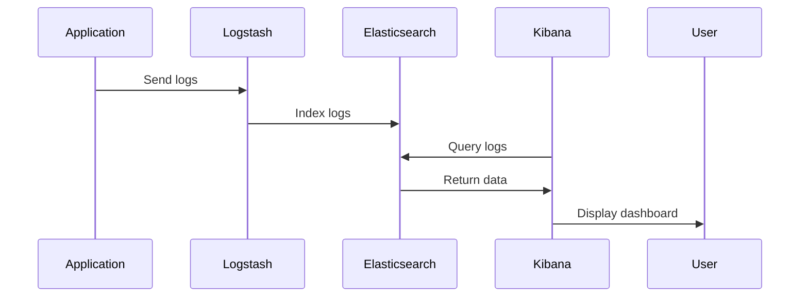

## Introduction

In the realm of cloud computing, ensuring that your monitoring systems scale effectively is crucial for maintaining robust observability and logging across dynamic and high-availability systems. Monitoring scalability involves designing systems that not only capture detailed metrics, logs, and traces but also handle increasing data volumes gracefully as your infrastructure grows. This pattern provides an in-depth look at the principles, architectures, and best practices for successfully implementing scalable monitoring strategies in cloud environments.

## Detailed Explanation

### Design Patterns and Architectural Approaches

1. **Distributed Monitoring Tools**: Utilize tools like Prometheus, Grafana, and ELK Stack (Elasticsearch, Logstash, Kibana) which are designed for horizontal scaling and can manage large datasets efficiently.

2. **Microservice Instrumentation**: Leverage service meshes and sidecar proxies like Istio and Envoy to provide out-of-the-box metrics collection and process streaming data without bottlenecking service performance.

3. **Event-Driven Architectures**: Implement event-driven systems using solutions like Apache Kafka or AWS Kinesis to decouple data collection from processing, allowing for scalable ingestion and downstream processing.

4. **Sampling Techniques**: Apply sampling techniques like probabilistic or tail-based sampling to reduce the data volume while preserving the diagnostic quality of the data.

5. **Adaptive Monitoring**: Use adaptive strategies that adjust monitoring granularity and frequency dynamically based on current system load, minimizing overhead during peak times.

### Best Practices

- **Centralize and Standardize Logging**: Ensure logs are standardized and centralized, preferably in a schema-less, distributed logging solution that can handle scale like Elasticsearch or Datadog.

- **Define Metrics Hierarchies**: Create hierarchies and dashboards that allow stakeholders to zoom in on specific metrics from high-level service health down to granular performance indicators.

- **Automate Alerting**: Use intelligent alerting systems that integrate with your CI/CD pipeline to automatically adjust alert thresholds based on deployments and infrastructure changes.

- **Retrospective Analysis and Learning**: Incorporate retrospective analysis to continually refine monitoring, using historical data to enhance predictive monitoring capabilities.

### Example Code

Here's an example of setting up a scalable logging system using ELK Stack:

```yaml
version: '3'
services:
  elasticsearch:
    image: docker.elastic.co/elasticsearch/elasticsearch:7.10.1
    environment:
      - discovery.type=single-node
    ports:
      - 9200:9200

  logstash:
    image: docker.elastic.co/logstash/logstash:7.10.1
    ports:
      - 5044:5044
    environment:
      - LS_JAVA_OPTS=-Xmx256m -Xms256m
    networks:
      - elk
    volumes:
      - ./logstash.conf:/usr/share/logstash/pipeline/logstash.conf

  kibana:
    image: docker.elastic.co/kibana/kibana:7.10.1
    ports:
      - 5601:5601
```

### Diagrams

#### Monitoring Flow Diagram



### Related Patterns

- **Containerized Services**: Running monitoring tools in containers helps to easily scale these components alongside their service counterparts.

- **Resilient Data Aggregation**: In environments with variable loads, employing data aggregation techniques ensures minimal data loss and consistent reporting.

- **Decoupled Data Pipelines**: Use this pattern to separate concerns within your data flow, allowing different teams to focus on different parts of the monitoring process while enhancing scalability.

## Additional Resources

- [Prometheus Documentation](https://prometheus.io/docs/introduction/overview/)
- [Kubernetes Monitoring Guide](https://kubernetes.io/docs/tasks/debug-application-cluster/resource-usage-monitoring/)
- [AWS CloudWatch](https://aws.amazon.com/cloudwatch/)

## Summary

Monitoring scalability is a fundamental pattern that addresses the challenges of observing complex systems in cloud environments, ensuring that as your systems grow, your monitoring capabilities keep pace without sacrificing performance or insight. By leveraging distributed architectures, adaptive strategies, and continuous improvement practices, you can maintain a robust understanding of your system's health and behavior, enabling proactive and timely responses to potential issues.
