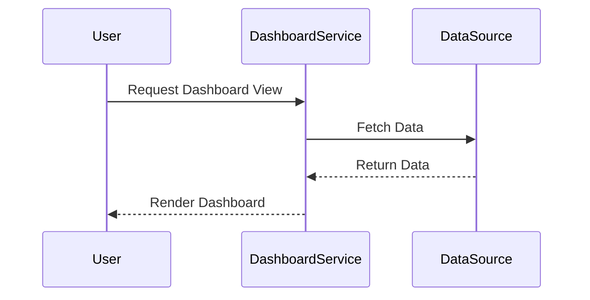

## Introduction

The **Dashboards and Visualization** pattern is integral to cloud computing environments. It provides mechanisms for displaying key metrics and visualizations that offer insights into system performance, application health, and user behavior. Dashboards help teams monitor the cloud infrastructure, services, and applications efficiently, empowering them to make informed decisions.

## Design Pattern Overview

Dashboards are the visual representations of data collected from various cloud resources and services. Visualization tools aggregate data from logs, metrics, and traces to present it in graphical formats such as charts, graphs, and tables. These visualizations make it easier to interpret complex datasets, identify trends, and detect anomalies.

### Key Characteristics

- **Real-time Monitoring:** Dashboards provide updated data status, allowing teams to respond quickly to changes in the environment.
- **Customization:** Users can tailor dashboards to fit their specific monitoring needs by selecting relevant metrics and designing custom views.
- **Interactivity:** Drill down into specific data points for detailed analytics or aggregate multiple datasets for comprehensive oversight.
- **Integration:** Compatible with multiple data sources and services, facilitating a unified view across cloud environments.

## Architectural Approaches

1. **Single Pane of Glass**: Integrating multiple dashboards into a unified interface, providing a holistic view of the entire cloud ecosystem.

2. **Drill-Down Capabilities**: Enable users to explore detailed views of specific components of the system for in-depth analysis.

3. **Data Aggregation and Correlation**: Merge data from disparate sources to identify patterns and correlations that might not be apparent from individual datasets.

## Best Practices

- **Choose the Right Metrics:** Ensure that the dashboards focus on the most critical metrics that align with business and operational goals.
- **Maintain Consistency:** Use standard graphical elements and color schemes to ensure dashboards are easily understandable.
- **Automate Alerts:** Establish threshold alerts to notify teams about potential issues detected in dashboard data in real-time.
- **Regular Updates:** Keep dashboards up-to-date with evolving business requirements and cloud service updates.

## Example Code

Below is a simplified example of using a common cloud monitoring service to create a dashboard.

```json
{
  "widgets": [
    {
      "type": "metric",
      "x": 0,
      "y": 0,
      "width": 6,
      "height": 6,
      "properties": {
        "metrics": [
          ["AWS/EC2", "CPUUtilization", "InstanceId", "i-1234567890abcdef0"]
        ],
        "period": 300,
        "stat": "Average",
        "region": "us-east-1",
        "title": "EC2 Instances CPU Utilization"
      }
    }
  ]
}
```

## Diagrams

### Diagram - Sequence of Dashboard Data Visualization


## Related Patterns

- **Log Aggregation**: Centralizes log data from different services for better accessibility and management.
- **Alerting and Notification Systems**: Complements dashboards by triggering alerts based on data patterns.
- **Continuous Monitoring**: Ensures that dashboards are populated with real-time data, offering continuous oversight.

## Additional Resources

- [AWS CloudWatch Dashboards](https://aws.amazon.com/cloudwatch/dashboards/)
- [Google Cloud Operations Suite](https://cloud.google.com/products/operations)
- [Azure Monitor Dashboards](https://azure.microsoft.com/en-us/services/monitor/)
- [Grafana Documentation](https://grafana.com/docs/)

## Summary

The **Dashboards and Visualization** pattern is a fundamental element for enhancing observability in cloud architectures. By leveraging this pattern, organizations can gain crucial insights into their cloud operations, optimize resource utilization, and improve performance. Implementing effective dashboards facilitates proactive management and troubleshooting, ultimately leading to more resilient and responsive cloud-based systems.
