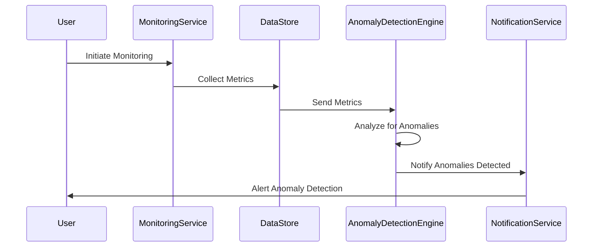
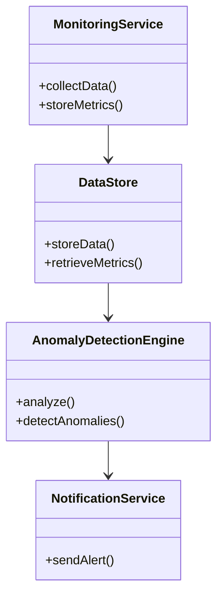

## Overview

Anomaly Detection is a cornerstone pattern in the domain of Monitoring, Observability, and Logging in Cloud environments. This pattern focuses on the identification of deviations from a baseline or expected behavior in datasets, which can correspond to potential issues or opportunities for improvement. It is an essential component for ensuring the health, safety, and security of cloud systems by providing early warnings about potential failures or intrusions.

## Architectural Approaches

1. **Statistical Methods**: This approach involves setting up thresholds or baselines derived from historical data to identify deviations. Common techniques include standard deviation, z-scores, and percentile-based methods.

2. **Machine Learning Models**: Apply unsupervised learning models like clustering (e.g., K-means) and autoencoders to learn the normal behavior and recognize anomalies. Supervised learning models can also be used but require labeled data.

3. **Time Series Analysis**: Use models such as ARIMA or LSTM (Long Short-Term Memory networks) specifically for detecting anomalies in time-dependent data.

4. **Ensemble Techniques**: Combine multiple models or methods to improve the accuracy and reliability of anomaly detection. Examples include stacking different algorithms or averaging their results.

## Best Practices

- **Data Normalization**: Pre-process data to normalize scales, ensuring consistent input for models and methods, which improves detection accuracy.

- **Continuous Updating**: Update models and baselines continuously to adapt to new patterns and reduce false positives.

- **Scale Integration**: Integrate anomaly detection processes that scale automatically with the data volume, leveraging cloud-native services.

- **Visualization**: Employ visual dashboards to easily identify and analyze anomalies, facilitating quick insights and actions.

## Example Code

Here's a simplistic example using Python with the `scikit-learn` library to perform anomaly detection using Isolation Forest:

```python
from sklearn.ensemble import IsolationForest
import numpy as np

data = np.random.rand(100, 2)

clf = IsolationForest(contamination=0.1)
clf.fit(data)

preds = clf.predict(data)

anomalies = data[preds == -1]

print(f"Identified anomalies: {anomalies}")
```

## Diagrams

### Sequence Diagram: Anomaly Detection Workflow



### Class Diagram: Anomaly Detection System



## Related Patterns

- **Threshold Alerting**: Simple anomaly detection using fixed thresholds.
- **Predictive Analysis**: Uses historical data to predict future anomalies.
- **Complex Event Processing (CEP)**: Real-time processing and detection of complex event patterns.

## Additional Resources

- [Hands-On Unsupervised Learning Using Python](https://www.oreilly.com/library/view/hands-on-unsupervised-learning/9781492035633/)
- [Anomaly Detection in Modern Applications (AWS Blog)](https://aws.amazon.com/blogs/machine-learning/)
- [Google Cloud's Operations Suite](https://cloud.google.com/products/operations)

## Summary

Anomaly Detection is a critical design pattern for sustaining reliable cloud infrastructure. By leveraging a range of techniques from statistical methods to machine learning, this pattern enables early identification of potential system degradation, security breaches, and performance bottlenecks. As cloud environments become more complex, integrating robust anomaly detection mechanisms ensures continuous monitoring, enabling proactive system management and optimization.
