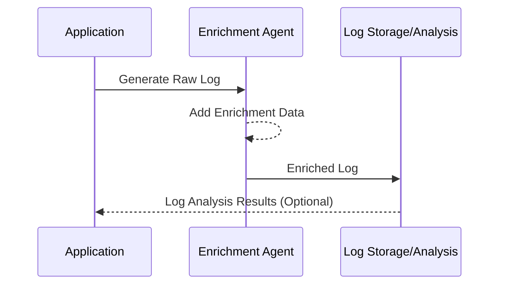

## Introduction

In cloud-native applications, systems are distributed and logs are one of the most effective tools for diagnosing issues, monitoring systems, and ensuring smooth operations. The **Log Enrichment** pattern enhances the quality and usefulness of logs by adding additional contextual information, such as metadata, to each log entry. This pattern is crucial for enabling efficient troubleshooting, performance monitoring, and compliance audits in complex cloud environments.

## Detailed Explanation

The **Log Enrichment** design pattern involves augmenting raw log data with additional information, transforming plain logs into rich, informative records. This additional data could include:

- **Metadata:** Information such as timestamps, request IDs, user information, or geographic locations.
- **System Context:** Application or service names, version numbers, and environment details.
- **Correlations:** Linking logs to particular transactions or sessions.

### Benefits

- **Enhanced Troubleshooting:** By adding context, logs become more useful for debugging and diagnosing issues.
- **Improved Observability:** Enriched logs provide a better understanding of the state and behavior of the application.
- **Compliance and Auditing:** More comprehensive logs are beneficial for regulatory compliance and audits.
- **Performance Metrics:** Contextual data can be used to monitor application performance and resource usage.

### Architecture Model

Incorporating Log Enrichment into a cloud application typically involves several components:

- **Log Generator:** Application components that generate logs.
- **Enrichment Agent:** Middleware or service that adds enrichment data to logs before they're stored.
- **Log Storage/Analysis Tools:** Systems like Elasticsearch, Splunk, or AWS CloudWatch that store and allow querying/analysis of logs.



## Example Code

Here's an example in Java using a hypothetical enrichment framework:

```java
import com.example.logging.EnrichmentAgent;
import com.example.logging.LogEntry;

public class LoggingExample {
    
    private static final EnrichmentAgent enrichmentAgent = new EnrichmentAgent();

    public static void main(String[] args) {
        LogEntry logEntry = new LogEntry("User login attempt");
        LogEntry enrichedLog = enrichmentAgent.enrich(logEntry);

        // Assuming a function to sendToLogStorage exists
        sendToLogStorage(enrichedLog);
    }
}
```

## Related Patterns

- **Centralized Log Management:** This pattern involves aggregating logs from various sources for centralized storage and analysis.
- **Log Correlation:** A technique to group related logs across services for a specific operation or user activity.
- **Distributed Tracing:** Provides end-to-end visibility into microservices transactions.

## Additional Resources

- [AWS Logging Best Practices](https://aws.amazon.com/blogs/mt/logging-best-practices/)
- [Google Cloud Logging](https://cloud.google.com/logging/docs)
- [OpenTelemetry Project](https://opentelemetry.io/)

## Summary

The **Log Enrichment** pattern transforms raw log data into valuable assets for cloud applications by providing enriched, contextual information. This pattern not only enhances system observability but also improves the ability to diagnose issues, ensure compliance, and optimize performance, making it an essential practice in complex, distributed cloud environments.
