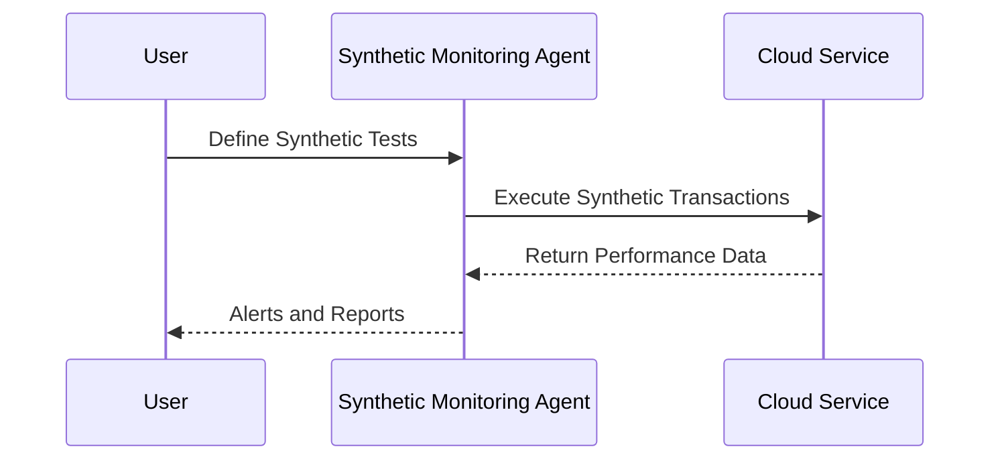

## Introduction to Synthetic Monitoring

Synthetic Monitoring, also known as active monitoring, is a design pattern utilized within cloud environments to simulate user transactions or interactions at regular intervals. This approach helps in identifying performance bottlenecks or failures before actual users encounter them. By predicting issues and resolving them proactively, organizations can ensure higher availability and performance of their services.

## Detailed Explanation

Synthetic Monitoring operates by deploying automated tools that can mimic the actions and interactions of a real user without any user involvement. These tools execute scripts that interact with an application in a pre-defined manner, providing continuous feedback on the application's availability and key performance metrics.

### Key Components:

1. **Synthetic Transactions**: Automated scripts that simulate user actions such as logging in, navigating through web pages, or executing a purchase workflow.
2. **Monitoring Agents**: Deployed across multiple geographic locations, they execute synthetic transactions to assess performance and reliability from various perspectives.
3. **Alerts and Notifications**: Configured to notify DevOps teams when performance metrics fall below expected thresholds, enabling quick response to issues.

### Benefits

- **Proactive Issue Resolution**: Reveals potential issues before end users are affected, allowing for timely intervention.
- **Consistent Performance Metrics**: Provides a standardized way to measure performance across various cloud components.
- **Multi-Region Insights**: Identifies region-specific issues by simulating access from different geographical areas.
- **Benchmarking**: Establishes performance baselines aiding in capacity planning and performance tuning.

## Example Code

Below is a basic example of a synthetic monitoring script using Selenium in Java. It simulates the process of launching a browser, navigating to a website, and checking the page title.

```java
import org.openqa.selenium.WebDriver;
import org.openqa.selenium.chrome.ChromeDriver;

public class SyntheticMonitoringExample {
    public static void main(String[] args) {
        // Set path for the ChromeDriver
        System.setProperty("webdriver.chrome.driver", "/path/to/chromedriver");

        // Instantiate a ChromeDriver class
        WebDriver driver = new ChromeDriver();

        // Navigate to desired web page
        driver.get("https://example.com");

        // Validate page title
        String expectedTitle = "Example Domain";
        if (driver.getTitle().equals(expectedTitle)) {
            System.out.println("Synthetic Transaction Successful");
        } else {
            System.out.println("Synthetic Transaction Failed");
        }

        // Close browser window
        driver.quit();
    }
}
```

## Diagram

To visualize how Synthetic Monitoring interacts with a cloud environment, consider the following diagram:



## Related Patterns

- **Real User Monitoring (RUM)**: Complements Synthetic Monitoring by capturing actual user interactions.
- **Performance Testing**: Often paired with Synthetic Monitoring in CI/CD pipelines to ensure application responsiveness.
- **Adaptive Monitoring**: Adjusts monitoring based on current load and capacity conditions.

## Additional Resources

- [AWS CloudWatch Synthetics](https://aws.amazon.com/cloudwatch/synthetics)
- [Google Cloud Synthetic Monitoring with Cloud Operations Suite](https://cloud.google.com/solutions/observability)
- [Microsoft Azure Application Insights](https://azure.microsoft.com/services/monitoring/)

## Summary

Synthetic Monitoring serves as an essential pattern in cloud computing to assure the availability and performance of applications. By simulating user interactions, it helps businesses identify and address potential issues in advance, ensuring a seamless experience for end-users. When used alongside other monitoring techniques, Synthetic Monitoring becomes a powerful tool in maintaining robust and reliable cloud services.
