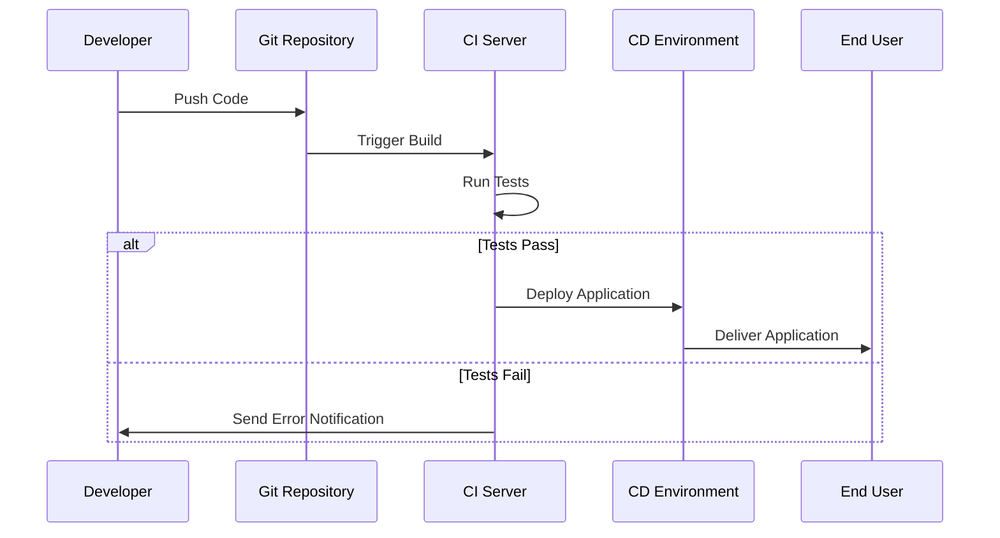

## Introduction

In modern software development, CI/CD (Continuous Integration and Continuous Deployment) pipelines are critical to delivering reliable and efficient software in a cloud-native environment. CI/CD Pipelines Automation involves streamlining the software delivery process, enhancing team productivity, and ensuring faster delivery cycles with minimal human intervention. By integrating automation into CI/CD processes, organizations leverage cloud resources more efficiently and promote consistency across development, testing, and deployment stages.

## Key Components

- **Source Code Management (SCM):** Centralized location for managing source code with version control systems like Git to enable collaboration and track changes.
  
- **Continuous Integration (CI):** Automatically integrate and test individual code contributions from developers to ensure new changes don't break the existing application. Engines like Jenkins, CircleCI, and Azure DevOps Services facilitate this integration.
  
- **Continuous Deployment (CD):** Automate the release of validated applications to production environments. Tools like Kubernetes, Docker, and Terraform handle deployment automation effectively.
  
- **Automation Scripts:** Collection of scripts to automate tasks like builds, tests, and deployments.

- **Monitoring and Logging:** Ensures that the deployed applications are monitored for performance and issues, utilizing tools such as Prometheus, Grafana, and ELK stack.

## Best Practices

- **Version Control Everything:** Ensure that all elements of your CI/CD pipeline are under version control, from source code to deployment scripts.
  
- **Automate Testing:** Incorporate various testing methods, like unit testing, integration testing, and security testing, into automated pipelines to catch issues early.
  
- **Incremental Deployments:** Utilize deployment strategies like blue-green deployments and canary releases to minimize risk and enhance rollback capabilities.

- **Infrastructure as Code (IaC):** Use IaC tools, such as Terraform and AWS CloudFormation, for reproducible and version-controlled infrastructure management.
  
- **Continuous Feedback:** Implement feedback loops throughout the process to provide stakeholders with insights into build status, test results, and potential faults.

## Example Code

Below is a simple Jenkins Pipeline script to automate a CI/CD pipeline in a cloud environment.

```groovy
pipeline {
    agent any
    
    stages {
        stage('Build') {
            steps {
                sh 'mvn clean install'
            }
        }
        stage('Test') {
            steps {
                sh 'mvn test'
            }
            post {
                always {
                    junit '**/target/surefire-reports/*.xml'
                }
            }
        }
        stage('Deploy') {
            steps {
                script {
                    def imageName = "myapp:${env.BUILD_ID}"
                    docker.build(imageName).push()
                    sh "kubectl set image deployment/myapp myapp=${imageName}"
                }
            }
        }
    }
}
```

## Diagrams

### UML Sequence Diagram for CI/CD Pipeline



## Related Patterns

- **Infrastructure as Code (IaC):** Manage infrastructure with code for consistency and repeatability.
- **Immutable Infrastructure:** Ensure that infrastructure is versioned and immutable, reducing configuration drift.
- **Blue-Green Deployment:** Minimize downtime and risk during application releases.

## Additional Resources

- [Continuous Integration and Continuous Delivery](https://martinfowler.com/articles/continuousIntegration.html) by Martin Fowler
- [Jenkins Documentation](https://www.jenkins.io/doc/)
- [Kubernetes Deployment Strategies & Patterns](https://kubernetes.io/docs/concepts/workloads/controllers/deployment/)

## Summary

CI/CD Pipelines Automation is an essential pattern in cloud computing and DevOps practices. By automating the processes of integration, testing, and deployment, organizations can significantly enhance their development efficiency, reduce time-to-market, and improve software quality. Incorporating tools and practices for automation, continuous feedback, and robust testing within the pipeline paves the way for a more resilient and agile software delivery framework.
