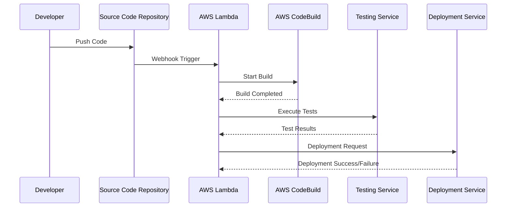

## Introduction to Serverless CI/CD

Continuous Integration and Continuous Deployment (CI/CD) are fundamental practices in modern software development, aimed at automating the build, test, and release processes. The Serverless CI/CD pattern extends these practices to use serverless services, capitalizing on their scalability, cost-effectiveness, and ease of maintenance.

In traditional CI/CD pipelines, dedicated servers or VMs might be involved in handling various tasks such as code compilation, testing, and deployment. However, serverless approaches leverage cloud provider services such as AWS Lambda, Azure Functions, or Google Cloud Functions, along with other specialized services, to perform these tasks without the need for infrastructure management.

## Architectural Approaches

### Key Components

1. **Source Code Repository**: Utilizes code hosting services like GitHub or Bitbucket where code changes trigger automated workflows.
   
2. **Build Automation**: Serverless functions handle the compilation processes. AWS CodeBuild, Azure DevOps Build Pipelines, or Google Cloud Build can orchestrate these tasks.

3. **Testing Automation**: Code quality checks and tests are executed automatically through serverless compute. These could be unit tests run in isolated functions or integration tests on a scalable, serverless environment.

4. **Deployment Orchestration**: Deployment services such as AWS CodePipeline or Google Cloud Deploy coordinate the delivery of build artifacts to various environments.

5. **Notification and Alerting**: Serverless functions generate alerts for build failures or deployment issues, often integrated with communication tools such as Slack or Microsoft Teams.

### Workflow

1. **Code Commit**: Developers push code changes to the repository triggering the CI/CD pipeline.
2. **Build Stage**: The pipeline initiates serverless build functions that compile code and create build artifacts.
3. **Test Stage**: The build artifacts undergo automated testing in isolated serverless environments.
4. **Approval and Deployment**: Upon passing tests, artifacts are deployed to production or staging environments.
5. **Monitoring and Feedback**: Post-deployment, serverless monitoring tools collect and analyze metrics, providing feedback to the development team.

## Best Practices

- **Modular Architecture**: Break down CI/CD processes into discrete serverless functions to enhance maintainability and scalability.
- **Security**: Employ environment variables, encrypted secrets, and least privilege IAM roles to secure CI/CD functions.
- **Cost Management**: Monitor invocation times and optimize function execution to manage costs effectively.
- **Logging and Monitoring**: Utilize cloud-native logging and monitoring tools to gain insights into pipeline performance and swiftly address issues.
  
## Example Code

Below is a simplified example of an AWS Lambda function that might be part of a larger serverless CI/CD pipeline, triggered by a code commit in a repository:

```javascript
const AWS = require('aws-sdk');
const codeBuild = new AWS.CodeBuild();

exports.handler = async (event) => {
    const params = {
        projectName: 'MyServerlessBuildProject'
    };
    try {
        const buildResponse = await codeBuild.startBuild(params).promise();
        console.log('Build started:', buildResponse);
        return buildResponse;
    } catch (error) {
        console.error('Failed to start build:', error);
        throw error;
    }
};
```

## Diagrams

### Sequence Diagram



## Related Patterns

- **Event-Driven Integration**: Leveraging serverless for event-driven architecture to respond in real-time to state changes.
- **Function as a Service (FaaS)**: The backbone of serverless CI/CD providing runtime environments to execute scripts.
- **Infrastructure as Code (IaC)**: Using tools like AWS CloudFormation or Terraform to manage CI/CD infrastructure declaratively.

## Additional Resources

- [AWS DevOps Blog](https://aws.amazon.com/devops/)
- [Azure DevOps Documentation](https://docs.microsoft.com/en-us/azure/devops/)
- [Google Cloud CI/CD Tools](https://cloud.google.com/solutions/ci-cd/)

## Summary

The Serverless CI/CD pattern revolutionizes software development pipelines by introducing automation, scalability, and cost-effectiveness through serverless architectures. By reducing the overhead of infrastructure management and adopting modular practices, development teams can focus on enhancing software quality and delivering faster releases. Embracing serverless CI/CD allows organizations to keep pace with the dynamic demands of cloud-native applications and environments.
