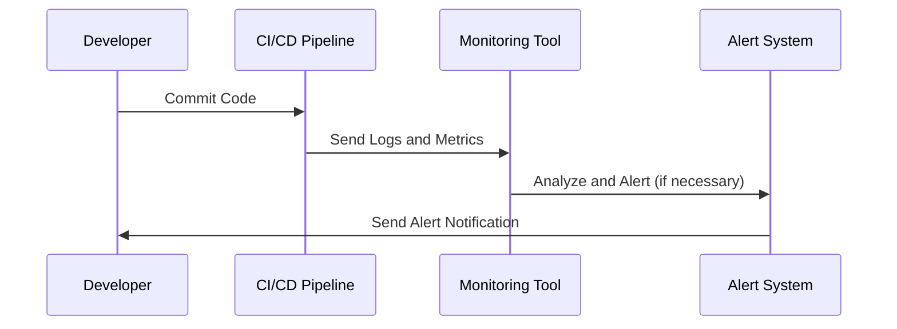

---

linkTitle: "Pipeline Monitoring"
title: "Pipeline Monitoring: Ensuring Reliable CI/CD Operations"
category: "DevOps and Continuous Integration/Continuous Deployment (CI/CD) in Cloud"
series: "Cloud Computing: Essential Patterns & Practices"
description: "Implementing robust monitoring strategies in CI/CD pipelines to ensure efficient, reliable, and effective software delivery in a cloud environment."
categories:
- DevOps
- CI/CD
- Cloud Computing
tags:
- pipeline-monitoring
- DevOps
- cloud-integration
- CI/CD-pipelines
- software-delivery
date: 2024-07-07
type: docs

canonical: "https://softwarepatternslexicon.com/18/11/11"
license: "© 2024 Tokenizer Inc. CC BY-NC-SA 4.0"
---

## Introduction

As the backbone of modern software delivery, Continuous Integration and Continuous Deployment (CI/CD) pipelines require constant monitoring to ensure reliability and efficiency. Pipeline Monitoring is an essential pattern in the DevOps toolkit, aimed at tracking the state of the pipeline and alerting teams to potential issues, bottlenecks, or failures. This design pattern is crucial for maintaining a smooth and streamlined software delivery process, particularly in cloud environments where resources are scalable and complex.

## Detailed Explanation

**Pipeline Monitoring** encompasses several key practices and technologies designed to oversee the health and performance of CI/CD pipelines. The main components of this pattern are:

1. **Monitoring Tools**: These include specialized tools such as Prometheus, Grafana, Jenkins, and Azure Monitor, which can be configured to track pipeline metrics like build times, failure rates, and deployment frequency.

2. **Alerting Mechanisms**: Alerts are configured based on predefined thresholds or anomalies in the pipeline's performance, ensuring that teams are notified immediately of issues requiring attention.

3. **Logging and Visualization**: Collecting logs from various stages of the pipeline and visualizing them in dashboards helps in identifying trends and potential areas for optimization.

4. **Integration with Cloud Services**: Leveraging cloud-native monitoring solutions aids in maintaining a coherent view of pipeline performance across distributed environments, making it easier to manage and analyze.

5. **Feedback Loops**: Establishing feedback loops for continuous improvement and learning. This involves implementing regular reviews of monitoring data to adapt and optimize the pipeline.

## Best Practices

- **Define Key Performance Indicators (KPIs)**: Establish clear metrics for monitoring, such as time to deploy, mean time to recovery, or test coverage.
  
- **Automation**: Automate the monitoring process as much as possible to reduce manual work and potential errors.
  
- **Centralize Logs and Metrics**: Use a centralized system to store and analyze logs and metrics from all stages of the pipeline.
  
- **Regular Reviews**: Conduct periodic reviews of the monitoring data to ensure that the pipeline evolves with the project's needs.
  
- **Security Considerations**: Ensure that monitoring tools are secure and that data privacy is maintained, especially when dealing with sensitive operations.

## Example Code

Below is an example of how you can configure a simple monitoring setup using Grafana and Prometheus with a Jenkins pipeline.

```yaml
pipeline {
    agent any
    stages {
        stage('Build') {
            steps {
                echo 'Building...'
                // Build logic here
            }
        }
        stage('Test') {
            steps {
                echo 'Testing...'
                // Test logic here
            }
        }
        stage('Deploy') {
            steps {
                echo 'Deploying...'
                // Deployment logic here
            }
        }
    }
    post {
        always {
            script {
                def prometheusData = [
                    jobName: env.JOB_NAME,
                    buildNumber: env.BUILD_NUMBER,
                    result: currentBuild.result
                ]
                // Send metrics to Prometheus or similar
                sendMetricsToPrometheus(prometheusData)
            }
        }
    }
}

def sendMetricsToPrometheus(data) {
    // Implementation for sending data to Prometheus
}
```

## Diagrams

Below is sequence diagram illustrating the flow of monitoring data through a CI/CD pipeline:



## Related Patterns

- **Log Aggregation**: Consolidating log data from multiple sources for easier analysis and monitoring.
- **Automated Testing**: Integrating testing stages in CI/CD pipelines to ensure early detection of defects.
- **Continuous Deployment**: Extending monitoring to automate deployment processes confidently.

## Additional Resources

- [Prometheus and Grafana Documentation](https://prometheus.io/docs/introduction/overview/)
- [Jenkins Monitoring](https://www.jenkins.io/doc/book/managing/system-logging/)
- [Azure Monitor](https://learn.microsoft.com/en-us/azure/azure-monitor/)

## Summary

Pipeline Monitoring is a critical component of the CI/CD process, ensuring that the entire pipeline runs smoothly, efficiently, and reliably. By leveraging robust tools and best practices, teams can quickly identify and address issues, improve their workflows, and deliver high-quality software swiftly and safely. The integration of monitoring solutions in cloud environments enhances the visibility and manageability of applications, contributing to superior software delivery performance.
