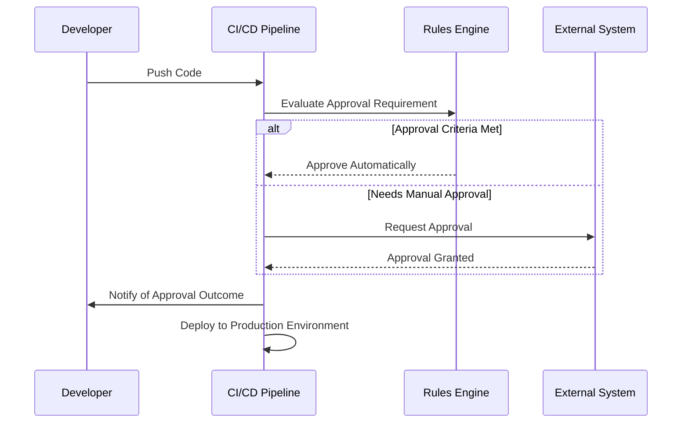

---

linkTitle: "Approval Processes Automation"
title: "Approval Processes Automation: Streamlining CI/CD Workflows in the Cloud"
category: "DevOps and Continuous Integration/Continuous Deployment (CI/CD) in Cloud"
series: "Cloud Computing: Essential Patterns & Practices"
description: "An in-depth overview of automating approval processes within CI/CD pipelines in cloud environments, ensuring efficiency and compliance in software delivery."
categories:
- DevOps
- CI/CD
- Cloud Computing
tags:
- Automation
- Approval Processes
- Cloud Services
- Continuous Deployment
- Workflow Management
date: 2024-07-07
type: docs
canonical: "https://softwarepatternslexicon.com/18/11/13"
license: "© 2024 Tokenizer Inc. CC BY-NC-SA 4.0"
---

## Introduction

In today's fast-paced software development landscape, continuous integration and continuous deployment (CI/CD) are essential for reducing time to market and maintaining competitive advantages. As part of these pipelines, approval processes can act as a bottleneck if not managed efficiently. **Approval Processes Automation** is a design pattern that aims to streamline and expedite these workflows while ensuring compliance with organizational and regulatory standards.

## Pattern Details

### Context

Organizations face the challenge of balancing efficient software delivery with maintaining control over changes that affect production environments. Manual approval processes often lead to delays, errors, and inconsistencies in deployment pipelines.

### Problem

Manual approval stages can slow down the deployment process, countering the benefits of automated CI/CD pipelines. The challenge is to implement an automated process that preserves the integrity, security, and compliance of applications being delivered.

### Solution

Implement an automated approval mechanism within the CI/CD pipeline using cloud-native tooling and infrastructure. This involves using rules-based engines, pre-defined criteria, and integrations with both internal and external approval systems to minimize human intervention while meeting necessary compliance and governance requirements.

### Architecture and Implementation

- **Integration with CI/CD Tools**: Incorporate approval steps directly into CI/CD tools like Jenkins, GitLab CI/CD, or GitHub Actions using custom actions, plugins, or scripts that trigger based on specified criteria.
  
- **Rules-Based Engine**: Develop or leverage existing rules engines that can automatically determine the approval path based on attributes such as risk level, application environment, or type of change.
  
- **Audit and Compliance**: Utilize logging and monitoring systems such as AWS CloudTrail, GCP Cloud Logging, or Azure Monitor to retain detailed records of approvals for compliance and auditing purposes.

- **Third-party System Integration**: Implement APIs or webhooks to communicate with external systems like JIRA, ServiceNow, or Slack for notification and manual overrides if needed.

### Example Code

For a simple implementation using GitHub Actions:

```yaml
name: CD Pipeline

on:
  push:
    branches: [ main ]

jobs:
  build-and-deploy:
    runs-on: ubuntu-latest
    
    steps:
    - name: Checkout code
      uses: actions/checkout@v2
    
    - name: Build application
      run: ./build.sh
    
    - name: Automatic Approval
      if: github.event.inputs.approval == 'auto'
      run: echo "Automatically Approved"
    
    - name: Deploy to Production
      if: always()
      run: ./deploy.sh
```

### Diagram

Below is sequence diagram illustrating an automated approval sequence within a CI/CD pipeline:



## Related Patterns

- **Continuous Integration**: Ensures code quality and readiness before deployment.
- **Infrastructure as Code (IaC)**: Manages infrastructure using automated scripts to ensure consistency and reduce manual errors.

## Additional Resources

- [AWS DevOps Blog](https://aws.amazon.com/devops/)
- [GitLab CI/CD Documentation](https://docs.gitlab.com/ee/ci/)
- [Jenkins Pipeline Documentation](https://www.jenkins.io/doc/book/pipeline/)

## Summary

Automating approval processes in CI/CD pipelines enhances the speed and consistency of software delivery. By utilizing rules-based decision engines, integrating with existing approval systems, and ensuring detailed auditing, organizations can achieve efficient, compliant, and transparent workflows. This pattern significantly reduces manual intervention while balancing regulatory requirements and organizational policies.
