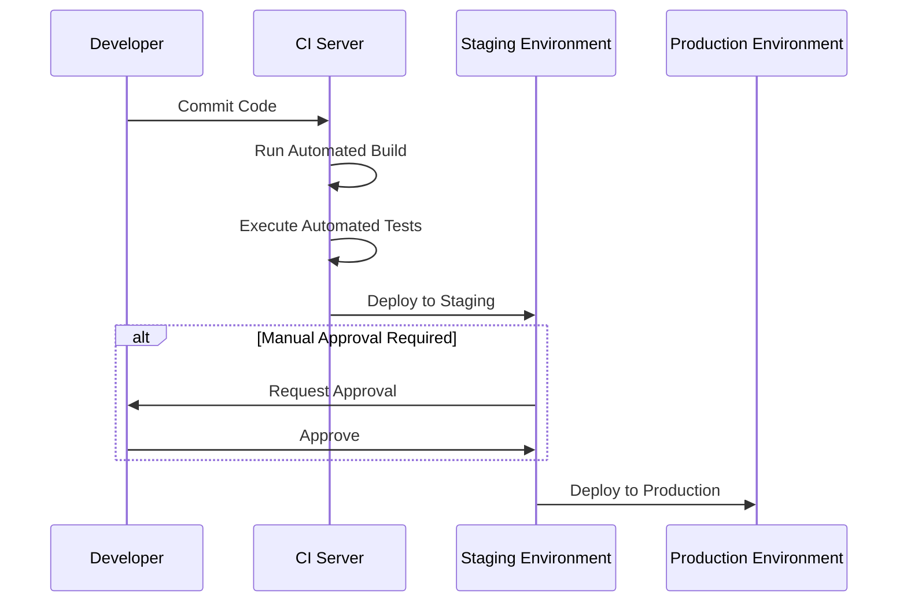
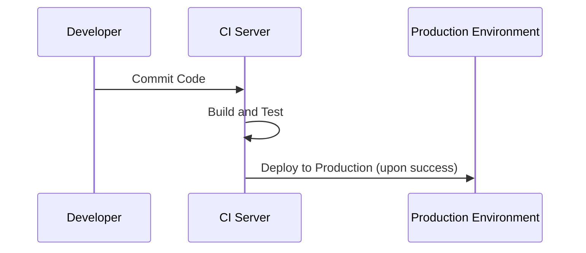

## Understanding Continuous Delivery and Continuous Deployment

Continuous Delivery (CD) and Continuous Deployment (CDp) are critical practices in modern software development and DevOps, streamlining the flow from code integration to production. While they are often mentioned interchangeably, there are distinct differences and applications for each. This article delves into these concepts, their architectures, and how they contribute to efficient development cycles.

### Continuous Delivery

**Continuous Delivery** is a software engineering approach where code changes are automatically prepared for a release to production. It ensures that the software can be reliably released at any time. Through automated testing, Continuous Delivery ensures that code is consistently in a deployable state, enabling teams to release new features, bug fixes, and infrastructure changes which are not only fast but with low risk.

#### Key Characteristics

- **Automated Testing**: Every change in code triggers a series of automated tests to ensure functionality and performance remain intact.
- **Build Automation**: Code changes automatically generate new builds for staging environments.
- **Release Readiness**: Every build is kept in a deployable state.

#### Example Architecture

A typical Continuous Delivery pipeline might include the following stages:
1. **Code Commit**: Developers commit code changes to a source repository.
2. **Build Automation**: Tools like Jenkins, CircleCI, or GitHub Actions compile the application.
3. **Automated Testing**: Unit, integration, and acceptance tests validate the build.
4. **Staging Deployment**: Successful builds are deployed to a staging environment for further testing.
5. **Manual Approval (Optional)**: If additional checks are required, then manual approval is incorporated before going live.

### Continuous Deployment

**Continuous Deployment** takes Continuous Delivery a step further by automatically deploying every change that passes the complete pipeline into production, eliminating any manual approval. It emphasizes automation and monitoring to ensure production releases are seamlessly integrated without external interruption.

#### Key Characteristics

- **Full Automation**: The pipeline is completely automated, with no manual steps.
- **Rapid Feedback & Iteration**: Faster feedback loops from users as changes reach the production environment swiftly.
- **Increased Productivity**: Developers can focus on creating value by reducing the overhead of deployment decision-making.

#### Example Architecture

In a Continuous Deployment setup:
1. **Code Changes**: Trigger the pipeline immediately after every code commit.
2. **CI/CD Tools**: Compile, test, and validate the code using tools like AWS CodePipeline or Azure DevOps.
3. **Production Deployment**: Automatically push changes to production if they pass all pipeline stages.

### Best Practices

- **Impose Strong Test Suites**: Whether using Continuous Delivery or Deployment, maintain robust automated tests to catch bugs early.
- **Monitor Performance**: Integrate monitoring tools to observe behavior post-deployment.
- **Implement Feature Flags**: Use feature flags to control the availability of new features after deployment.
- **Consider Rollback Strategies**: Having rollback plans is crucial, especially in Continuous Deployment scenarios.

### Related Patterns

- **Blue-Green Deployment**: Minimizes downtime and risk by maintaining two environments, one live and one idle, to switch between for releases.
- **Canary Release**: Gradually rolling new changes to a small subset of users before a full-scale rollout.

### Additional Resources

- [Continuous Delivery: Reliable Software Releases – Jez Humble and David Farley](https://www.amazon.com/Continuous-Delivery-Deployment-Automation-Addison-Wesley/dp/0321601912)
- [The Phoenix Project: DevOps Best Practices – Gene Kim, Kevin Behr, and George Spafford](https://www.amazon.com/Phoenix-Project-DevOps-Helping-Business/dp/1942788290)

### Summary

Understanding the nuances between Continuous Delivery and Deployment can significantly impact your team's efficiency and agility. By leveraging these practices, organizations can reduce time-to-market, enhance software quality, and improve customer satisfaction, all while maintaining operational resilience. These methodologies provide potent strategies for staying competitive in an ever-evolving tech landscape, especially in cloud computing environments.
