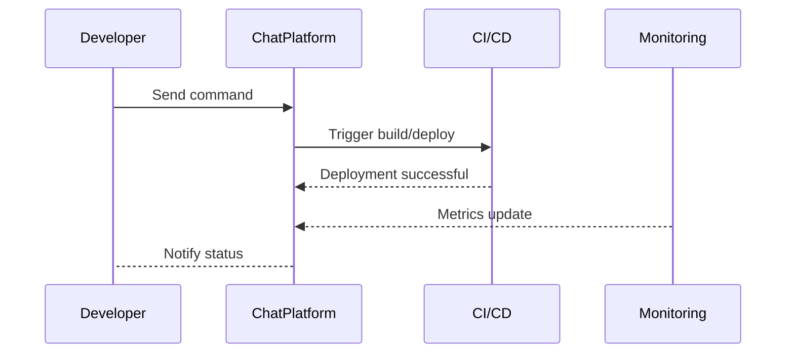

## Introduction to ChatOps

Incorporating ChatOps into your DevOps and CI/CD workflow leverages chat platforms as the central hub of operations. ChatOps enables a collaborative approach to development and operational workflows by integrating chat environments with external tools and services. The central idea is to move conversations into a collaborative model that allows teams to manage operational tasks within a chat platform, effectively enhancing project visibility, improving communication, and accelerating task completion.

## Benefits of ChatOps

1. **Improved Collaboration**: With centralized communication, teams can collaborate more effectively, sharing context and insights seamlessly.
   
2. **Increased Agility**: By enabling automation directly from chat platforms, teams can quickly act on decisions without leaving their chat environment.
   
3. **Enhanced Transparency**: All actions taken from the chat platform are logged and visible to the entire team, reducing silos and misunderstandings.
   
4. **Continuous Feedback**: Immediate notifications and updates from integrated services provide continuous feedback loops, crucial in CI/CD cycles.

## Architectural Structure

ChatOps involves integrating chat platforms (like Slack, Microsoft Teams) with operational and development tools, including:

- Cloud services (AWS, GCP, Azure)
- CI/CD pipelines (Jenkins, GitHub Actions)
- Monitoring tools (Prometheus, Grafana)
- Issue tracking (Jira, Trello)



## Example Code: Integrating Slack with GitHub Actions

Below is a simple way to integrate Slack into GitHub Actions using a webhook to send deployment notifications:

```yaml
name: CI/CD Pipeline

on:
  push:
    branches:
      - main

jobs:
  build:
    runs-on: ubuntu-latest

    steps:
    - name: Checkout code
      uses: actions/checkout@v2

    - name: Set up JDK 11
      uses: actions/setup-java@v2
      with:
        java-version: '11'

    - name: Build with Gradle
      run: ./gradlew build

    - name: Notify Slack
      if: success()
      uses: 8398a7/action-slack@v3
      with:
        status: success
        webhook_url: ${{ secrets.SLACK_WEBHOOK_URL }}
```

## Best Practices

- **Bot Modularity**: Design your ChatOps bots to perform small, discrete tasks that can be composed together.
  
- **Security**: Ensure that bot commands are secure, only accessible to authorized users, and handle secrets carefully.
  
- **Standardized Commands**: Use intuitive and consistent command structures to improve usability.
  
- **Regular Updates**: Keep integrated systems and bots updated to fit evolving workflows and security standards.

## Related Patterns

- **Infrastructure as Code (IaC)**: Automating infrastructure management complements ChatOps by enabling rapid and repeatable deployment processes.
  
- **Continuous Deployment**: ChatOps can provide intuitive controls and feedback loops for CD processes.

- **Monitoring and Logging**: Efficiently route alerts and logs into the chat for real-time monitoring across DevOps operations.

## Additional Resources

- [ChatOps: Operating efficiently with real-time collaboration](https://www.atlassian.com/ops/it-service-management/chatops)
- [Slack Bots: Development guide](https://api.slack.com/bot-users)

## Final Summary

ChatOps Implementation is a transformative pattern for Cloud CI/CD and DevOps strategies, integrating collaboration platforms with vital operational tools. By doing so, it enhances team collaboration, increases workflow efficiency, and builds a transparent development environment. This pattern leverages automation, streamlines communication, and provides the agility needed for resilient cloud operations.
