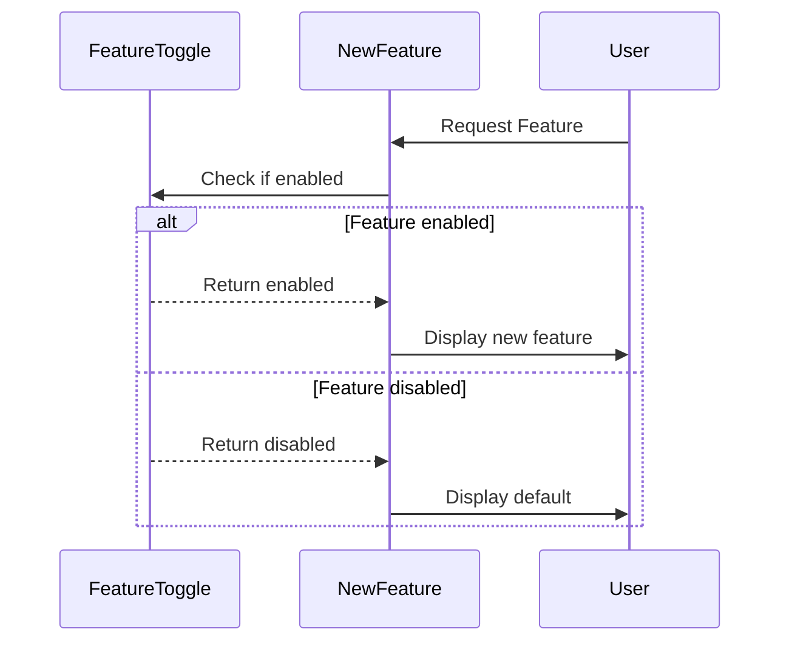

## Introduction

Feature toggles, also known as feature flags, are a powerful technique in development and deployment strategies that allow new functionalities to be conditionally turned on or off. This approach enables smoother releases, helps manage risks associated with deploying new features, and enhances the ability to perform A/B testing and canary releases.

## Detailed Explanation

### What are Feature Toggles?

Feature toggles are mechanisms used in software development to enable or disable functionality without deploying new code. They are implemented via conditional statements that check whether a toggle is active and then execute or skip specific code paths accordingly.

### Types of Feature Toggles

1. **Release Toggles:** 
   - Used to manage long-lived features typically undergoing incremental development.
   - Facilitates continuous integration by allowing partially completed work to reside in production without user exposure.

2. **Experiment Toggles:**
   - Enable one to conduct A/B testing or other user-based experiments.
   - Helps in deciding which features benefit the users more based on collected metrics.

3. **Ops Toggles:**
   - Give operational control over certain features, enabling quick deactivation in case of system stress or failure.

4. **Permission Toggles:**
   - Differentiate between users or user groups, providing advanced feature access to specific entities.

### Best Practices for Implementing Feature Toggles

- **Lifecycle Management:** 
  - Implement processes for the addition, maintenance, and removal of toggles to prevent technical debt accumulation.

- **Visibility and Control:** 
  - Use dashboards or management tools to visualize and manage active toggles across environments.

- **Contextual Naming:** 
  - Name toggles descriptively to convey what feature or behavior the toggle controls.

- **Documentation:** 
  - Maintain comprehensive documentation specifying the reasons, durations, and owning teams of each feature toggle.

## Example Code

Here's a basic example using a feature toggle in a Java-based web application:

```java
public class FeatureToggle {

    private static final Map<String, Boolean> featureToggles = new HashMap<>();

    static {
        featureToggles.put("newUserInterface", true);
        featureToggles.put("betaFeatureX", false);
    }

    public static boolean isFeatureEnabled(String featureName) {
        return featureToggles.getOrDefault(featureName, false);
    }
}

// Usage
public void displayUserInterface() {
    if (FeatureToggle.isFeatureEnabled("newUserInterface")) {
        renderNewUI();
    } else {
        renderOldUI();
    }
}
```

## Diagram



## Related Patterns

- **Blue-Green Deployment:** Manage environment-specific feature rolls outs by maintaining identical production environments.
  
- **Canary Releases:** Gradually roll out features to segments of users to manage risk.

## Additional Resources

- [Feature Toggles Explained](https://link-to-resource.com)
- [Managing Feature Flags at Scale](https://link-to-another-resource.com)
- [FeatureFlags.io Best Practices](https://featureflags.io)

## Summary

Feature toggles are an essential element in agile development environments, particularly in cloud-based deployments. They allow teams to safely deploy incomplete or experimental features, make rollouts safer, and enhance the overall release flexibility. By adhering to best practices and managing the lifecycle of feature toggles effectively, teams can mitigate risks and unleash the full potential of continuous delivery in modern cloud applications.
