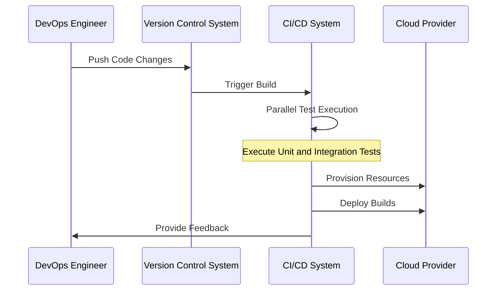

## Introduction to Pipeline Optimization

In the realm of cloud computing, Continuous Integration and Continuous Deployment (CI/CD) pipelines are instrumental in automating and streamlining the process of integrating code changes and deploying applications. The **Pipeline Optimization** pattern focuses on enhancing these pipelines to maximize their efficiency, reliability, and speed. This optimization is crucial in ensuring that cloud-based systems can handle complex, distributed applications and frequent code changes seamlessly.

## Detailed Explanation

Pipeline Optimization targets several key areas to improve the performance of CI/CD processes:

1. **Parallel Execution**: Implementing parallel execution of tests and deployment steps can significantly reduce pipeline runtime. By leveraging containerization and orchestration tools like Docker and Kubernetes, various components of the application can be built and tested simultaneously.

2. **Caching Mechanisms**: Utilizing cache to store previously built artifacts or downloaded dependencies minimizes repetitive tasks. This is often achieved using build tools and dependency managers that support caching, such as Gradle or Maven.

3. **Incremental Builds**: Only building components that have changed can save significant time during the build process. Tools like Bazel can monitor file changes and intelligently decide which parts of the codebase require rebuilding.

4. **Optimized Resource Allocation**: Dynamic resource scaling provided by cloud platforms allows CI/CD pipelines to adapt to varying loads, allocating compute resources as needed to reduce bottlenecks and avoid over-provisioning.

5. **Feedback Loops**: Fast feedback is critical. Implementing automated checks and early alert systems helps in quickly identifying and addressing errors, reducing downtime and enhancing developer productivity.

6. **Security Integrations**: Incorporating automated security testing within the pipeline ensures vulnerabilities are caught early, preventing security flaws from reaching production.

## Architectural Approaches

- **Microservices Architecture**: Adopting a microservices architecture can aid in optimizing pipelines by breaking down monolithic applications into smaller, manageable services. Each service can be independently developed, tested, and deployed, enhancing agility and scalability.

- **Serverless CI/CD**: Leveraging serverless architectures can further optimize pipelines by enabling on-demand execution of pipeline tasks, which minimizes costs and maximizes resource utilization.

- **Event-Driven Pipelines**: Transitioning to event-driven CI/CD pipelines allows for more responsive changes, triggering builds or deployments based on specific events such as code pushes or merge requests.

## Best Practices

- **Automate Everything**: Automation reduces human error and increases the reproducibility of processes. Automate tests, builds, deployments, and even infrastructure provisioning whenever possible.

- **Monitor and Analyze**: Implement robust monitoring and logging to track the pipeline's performance and health. Use this data to identify bottlenecks and continuously refine processes.

- **Fail Fast Techniques**: Design pipelines to detect failures early and stop further execution. This saves time and resources by preventing erroneous changes from propagating through the system.

- **Regular Audits and Refinement**: Periodically review and update the pipeline to match evolving project needs, tooling advancements, and best practices.

## Example Code

Here’s an example using Jenkins and Docker for parallel test execution:

```groovy
pipeline {
    agent any
    stages {
        stage('Build') {
            steps {
                script {
                    docker.image('maven').inside {
                        sh 'mvn clean package'
                    }
                }
            }
        }
        stage('Test') {
            parallel {
                stage('Unit Tests') {
                    steps {
                        sh 'mvn test -Dtest=UnitTests'
                    }
                }
                stage('Integration Tests') {
                    steps {
                        sh 'mvn test -Dtest=IntegrationTests'
                    }
                }
            }
        }
        stage('Deploy') {
            steps {
                script {
                    docker.image('deployImage').inside {
                        sh 'deploy.sh'
                    }
                }
            }
        }
    }
}
```

## Diagrams

### UML Sequence Diagram of an Optimized Pipeline



## Related Patterns

- **Immutable Infrastructure**: This pattern complements pipeline optimization by ensuring environments are consistent, reducing configuration drift and associated pipeline failures.

- **Blue-Green Deployment**: Provides a mechanism for reducing downtime during deployments by having two environments—one active and one for testing. This can be an integral part of release stages in an optimized pipeline.

- **Circuit Breaker Pattern**: Useful in managing failures gracefully in complex systems, integrating with pipelines to ensure resilient deployments.

## Additional Resources

- [Jenkins Official Documentation](https://www.jenkins.io/doc/)
- [Kubernetes CI/CD Best Practices](https://kubernetes.io/docs/setup/production-environment/best-practices/)
- [AWS CodePipeline](https://aws.amazon.com/codepipeline/)

## Summary

**Pipeline Optimization** is essential for modern DevOps practices in cloud environments. By enhancing parallelism, caching, incremental builds, and resource allocation, organizations can achieve more efficient CI/CD processes. These optimizations contribute to faster deployment cycles, more reliable software releases, and improved resource management, leading to a more seamless transition from code changes to production deployments.
