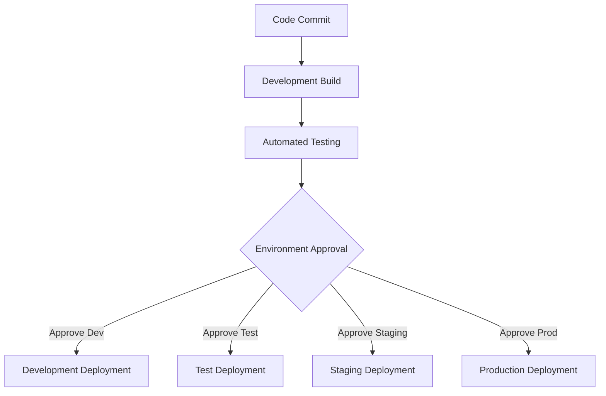

## Introduction

Multi-Environment Deployment is a critical design pattern in DevOps, especially within cloud computing landscapes. It enables teams to maintain distinct environments for various stages of the application lifecycle, such as development, testing, staging, and production. This approach supports continuous integration and continuous deployment (CI/CD), facilitating rapid and reliable software delivery.

## Design Pattern Explanation

### Architectural Overview

In Multi-Environment Deployment, the application deployments are orchestrated across different environments with consistency and reliability. Each environment mimics the production setup as closely as possible, ensuring that changes behave predictably when moved to production.

Key elements include:

- **Environment Configuration Management**: Each environment is isolated with unique configurations managed through infrastructure as code (IaC) or configuration management tools.
- **Automated Deployment Pipelines**: Continuous Deployment pipelines automate the application flow from development through to production.
- **Version Control Integration**: Code changes are integrated into version control systems that trigger pipeline processes.
- **Environment Parity**: Maintaining parity between environments minimizes discrepancies, thus reducing "it works on my machine" issues.

### Best Practices

- **Infrastructure as Code (IaC)**: Utilize IaC tools like Terraform or AWS CloudFormation to manage environment configurations.
- **Consistent Tooling Across Environments**: Use the same tools and versions across environments to avoid discrepancies.
- **Environment-Specific Configuration Management**: Employ secrets management and configuration files for environment-specific settings.
- **Automated Testing**: Integrate automated testing in the deployment pipeline to catch issues early.
- **Immutable Infrastructure**: Deploy applications using immutable infrastructure principles to reduce configuration drift over time.

## Example Code

Here's a simple example of a Terraform script for creating separate environments in AWS:

```hcl
provider "aws" {
  region = var.region
}

resource "aws_vpc" "dev" {
  cidr_block = "10.0.0.0/16"
  tags = {
    Name = "development-env"
  }
}

resource "aws_vpc" "prod" {
  cidr_block = "10.1.0.0/16"
  tags = {
    Name = "production-env"
  }
}
```

## Diagrams

### Multi-Environment Deployment Pipeline



## Related Patterns

- **Blue-Green Deployment**: Reduces downtime and risk by running two identical production environments.
- **Canary Release**: Allows for incremental rollout of changes to a subset of users.
- **Feature Toggles**: Enable or disable features without deploying new code.

## Additional Resources

- [AWS Continuous Integration and Continuous Deployment](https://aws.amazon.com/devops/continuous-integration/)
- [Google Cloud DevOps Solutions](https://cloud.google.com/devops)
- [Azure DevOps Documentation](https://docs.microsoft.com/en-us/azure/devops/)

## Summary

The Multi-Environment Deployment pattern plays a crucial role in modern cloud-based DevOps strategies, ensuring that applications can be developed, tested, and deployed reliably across diverse environments. By adopting this pattern, organizations enhance their ability to rapidly deliver features while maintaining high stability and reliability of their software systems.
