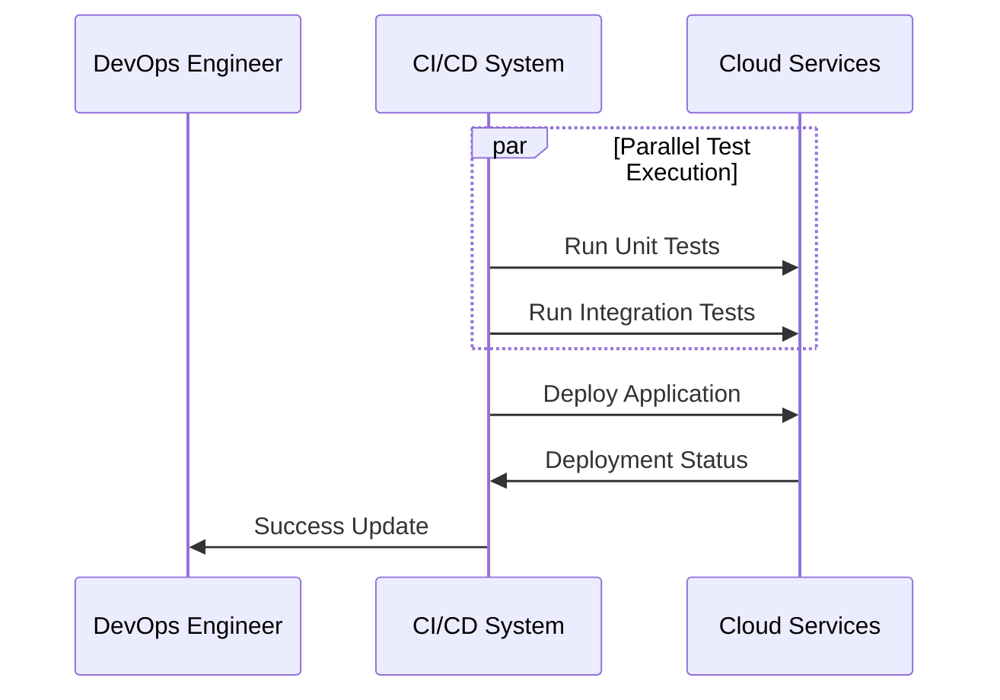

In the constantly evolving landscape of software development, the ability to quickly and efficiently deliver high-quality software is paramount. Parallel testing and deployment patterns are critical in achieving this goal, especially within cloud environments where resources can be provisioned and scaled dynamically. This design pattern involves running multiple testing and deployment processes simultaneously, leading to drastic reductions in release cycles and faster feedback loops.

## Design Pattern Overview

### Definition
Parallel testing and deployment is a method where different parts of the testing and deployment process are executed concurrently rather than sequentially. This approach takes advantage of the cloud's scalability and resource availability to perform multiple tasks at the same time, thereby optimizing the CI/CD pipeline workflow.

### Objectives
- **Speed**: Decrease time-to-market by reducing the duration of lengthy testing and deployment processes.
- **Efficiency**: Make full use of available resources by executing parallel processes.
- **Quality**: Maintain software quality by running comprehensive tests near-simultaneously.

## Architectural Approaches

1. **Pipeline Orchestration**: Use tools like Jenkins, GitLab CI, or AWS CodePipeline to define and manage your CI/CD processes. These tools support parallel builds and test executions.

2. **Cloud Resource Scaling**: Leverage cloud computing platforms such as AWS, GCP, or Azure to dynamically allocate resources. Services like AWS Elastic Beanstalk, Google Cloud Build, or Azure DevOps can handle multiple builds and deployment tasks concurrently.

3. **Microservices Architecture**: Break down applications into microservices, allowing for parallel deployment and testing of individual components, thus isolating issues and speeding up processes.

4. **Containerization**: Utilize Docker and Kubernetes to encapsulate applications, providing consistency across multiple environments and facilitating parallel testing and deployments.

## Best Practices

- **Automate Everything**: From code integration to testing and deployment, automate all processes to prevent human error and increase speed.
  
- **Use of Feature Flags**: Deploy different versions by toggling features on or off without code changes, supporting quicker testing cycles and iterative deployments.

- **Robust Monitoring**: Implement strong monitoring and logging systems to quickly identify and resolve issues in parallel processes.

- **Integration Testing**: Ensure each component can integrate well with others by running parallel integration tests.

## Example Code

Below is a simplified example of a CI/CD pipeline script using Jenkinsfile with parallel stages.

```groovy
pipeline {
    agent any
    stages {
        stage('Build') {
            steps {
                echo 'Building...'
                // Your build commands here
            }
        }
        stage('Parallel Testing') {
            parallel {
                stage('Unit Tests') {
                    steps {
                        echo 'Running Unit Tests...'
                        // Run unit tests
                    }
                }
                stage('Integration Tests') {
                    steps {
                        echo 'Running Integration Tests...'
                        // Run integration tests
                    }
                }
            }
        }
        stage('Deploy') {
            steps {
                echo 'Deploying to Cloud...'
                // Deployment steps
            }
        }
    }
}
```

## Diagrams

### Parallel Testing and Deployment Sequence Diagram



## Related Patterns

- **Blue-Green Deployment**: A strategy for reducing downtime by having identical production environments (blue and green) and switching between them.
  
- **Canary Deployment**: Gradual release of a new software version to a small subset of users to mitigate risks.
  
- **Feature Toggling**: Enables switching features on or off in a live environment to test different functionalities without redeploying.

## Additional Resources

- [Continuous Integration and Continuous Delivery (CI/CD)](https://aws.amazon.com/devops/continuous-integration/)
- [Docker and Kubernetes for Microservices](https://www.docker.com/kubernetes)
- [Cloud Resource Management in GCP](https://cloud.google.com/resource-manager)

## Summary

Parallel testing and deployment emerge as a potent design pattern in the CI/CD paradigm, especially valuable in cloud computing environments. This approach not only accelerates software delivery but also ensures high-quality releases by leveraging the inherent scalability and elasticity of the cloud. By integrating parallelization in testing and deployment processes, organizations can effectively reduce time-to-market, improve quality, and enhance overall productivity in their software development lifecycle.
