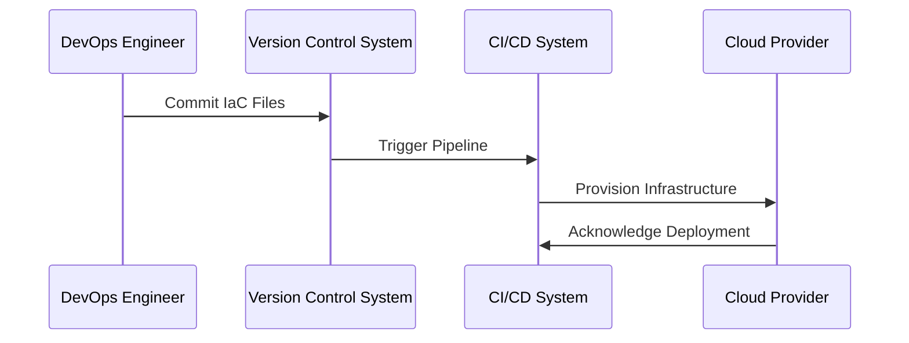

## Introduction
Infrastructure as Code (IaC) is a key DevOps practice that facilitates the automation of cloud infrastructure management within Continuous Integration and Continuous Deployment (CI/CD) pipelines. By using descriptive coding, teams can manage and provision infrastructure through code rather than manual processes.

## Design Pattern Overview

### Key Concepts
- **Declarative Definition**: Infrastructure is defined using a high-level descriptive syntax that specifies what resources are required.
- **Version Control**: Infrastructure code is stored in version control systems, allowing for versioning, tracking changes, and rollback capabilities.
- **Automated Testing**: Infrastructure changes are automatically tested within CI/CD pipelines to ensure that modifications are safe and stable before deployment.

### Benefits
- **Consistency and Reproducibility**: Ensures environments are consistent across development, testing, and production.
- **Scalability and Flexibility**: Easily scale and manage changes across multiple environments.
- **Collaboration and Speed**: Enhances collaboration across teams and speeds up the deployment process by automating routines.

## Architectural Approaches

### Tooling
- **Terraform**: Infrastructure provisioning tool that uses configuration files for reproducible infrastructure deployments.
- **AWS CloudFormation**: Service to model and automate AWS infrastructure setup.
- **Google Cloud Deployment Manager**: Manages Google Cloud resources using YAML configuration files.
- **Ansible**: Uses playbooks to automate configuration, deployment, and management tasks.

### Workflow Integration
Integrate IaC into CI/CD workflows to enable:
- **Continuous Delivery**: Automate the deployment of infrastructure changes at any stage of the pipeline.
- **Configuration Management**: Keep infrastructure configurations synchronized with application versions.
- **Environment Validation**: Automatically validate and test infrastructure configurations before deploying.

## Best Practices
- Use **modular configuration files** to reuse and manage pieces of infrastructure easily.
- Implement **security and compliance** checks within the code pipelines.
- Regularly perform **audits** and **reviews** of infrastructure code.
- **Parameterize** configurations to support different environments from the same code base.

## Example Code

### Terraform Configuration
```hcl
provider "aws" {
  region = "us-west-2"
}

resource "aws_instance" "example" {
  ami           = "ami-0c55b159cbfafe1f0"
  instance_type = "t2.micro"

  tags = {
    Name = "ExampleInstance"
  }
}
```

### Integrating IaC in CI/CD Pipeline
```yaml
stages:
  - test
  - deploy

test:
  stage: test
  script:
    - terraform init
    - terraform validate

deploy:
  stage: deploy
  script:
    - terraform apply -auto-approve
```

## Diagrams

### Infrastructure as Code Process


## Related Patterns
- **Immutable Infrastructure**: Emphasizes creating immutable artifacts that can be versioned and replaced instead of changed.
- **Configuration Management**: Managing system configurations across distributed environments.
- **Continuous Delivery**: Deploying all changes in a pipeline to every environment automatically.

## Additional Resources
- [Terraform Documentation](https://www.terraform.io/docs/index.html)
- [AWS CloudFormation User Guide](https://docs.aws.amazon.com/cloudformation/index.html)
- [Google Cloud Deployment Manager Documentation](https://cloud.google.com/deployment-manager/docs)
- [Ansible Documentation](https://docs.ansible.com/ansible/latest/index.html)

## Summary
Infrastructure as Code within CI/CD pipelines enhances the DevOps process by ensuring consistent, repeatable, and automated infrastructure setups. It bridges the gap between development and operational teams, improves deployment accuracy, and significantly shortens the development cycle time. Adopting IaC practices is pivotal for organizations aiming to effectively manage their cloud infrastructure amidst rapidly changing development environments.
