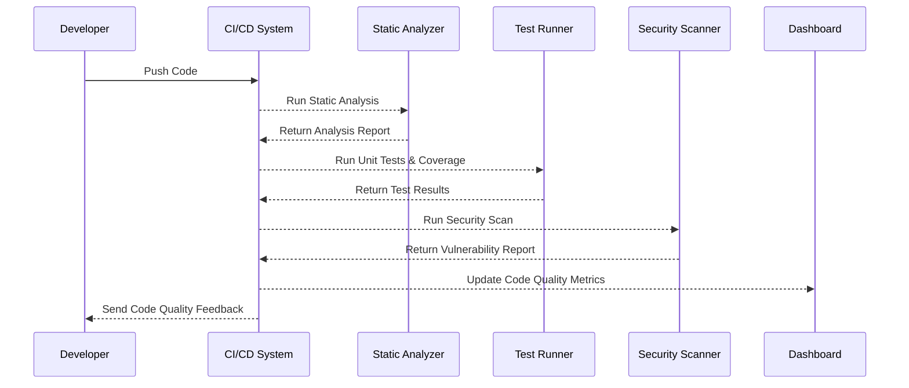

In today's fast-paced software development world, maintaining high code quality is crucial for delivering robust applications and ensuring seamless user experiences. This document delves into the Code Quality Assessments pattern, which provides a systematic approach to evaluating and enhancing software quality throughout the DevOps lifecycle, particularly within Continuous Integration/Continuous Deployment (CI/CD) pipelines in cloud environments.

## Design Pattern Explanation

The Code Quality Assessments pattern involves incorporating various practices, tools, and methodologies to evaluate code quality, identify defects early, and ensure that the codebase adheres to defined standards. These assessments are executed within the CI/CD pipeline to provide immediate feedback to developers and prevent flawed code from progressing to production.

### Key Components

1. **Static Code Analysis:** Tools like SonarQube and ESLint analyze code without execution, detecting issues such as code smells, styling errors, and potential bugs.
   
2. **Unit Testing:** Automatically validated tests help ensure that individual parts of the application work as intended, using tools like JUnit or PyTest.

3. **Code Coverage Analysis:** Measures the percentage of code covered by tests, aiming for comprehensive testing efforts using tools like Jacoco or Istanbul.

4. **Security Scanning:** Tools like OWASP Dependency-Check identify known vulnerabilities in third-party libraries or custom code.

5. **Code Review Automation:** Platforms such as GitHub Actions or Bitbucket Pipelines can automate parts of the code review process, ensuring that guidelines are consistently applied.

### Architectural Approach

Integrating Code Quality Assessments into a CI/CD pipeline can be achieved using:

1. **Pipeline Orchestration Tools:** Jenkins, GitLab CI/CD, or Azure DevOps to define and manage pipelines.
   
2. **Cloud Services:** Utilize cloud-native services like AWS CodePipeline or GCP Cloud Build to leverage built-in tools for extensibility and scalability.

3. **Feedback Loops:** Real-time feedback mechanisms communicate code quality results to developers immediately, allowing rapid correction of issues.

4. **Metrics and Dashboards:** Use platforms like Grafana to display metrics and dashboards that track code quality trends over time.

### Example Code

Here's an example of integrating code quality checks in a Jenkinsfile:

```groovy
pipeline {
    agent any

    stages {
        stage('Checkout') {
            steps {
                git 'https://github.com/your-repo.git'
            }
        }
        stage('Static Code Analysis') {
            steps {
                sh 'sonar-scanner'
            }
        }
        stage('Test with Coverage') {
            steps {
                sh './gradlew test jacocoTestReport'
                jacoco execPattern: '**/build/jacoco/*.exec'
            }
        }
        stage('Security Scan') {
            steps {
                sh 'owasp-dependency-check.sh --project your-app --scan ./'
            }
        }
    }

    post {
        always {
            junit '**/build/test-results/**/*.xml'
            archiveArtifacts artifacts: '**/build/libs/*.jar', fingerprint: true
        }
    }
}
```

### Diagrams

#### CI/CD Pipeline with Code Quality Assessments



### Related Patterns

- **Automated Testing**: Ensures comprehensive testing across different levels (unit, integration, E2E) within the CI/CD pipeline.
  
- **Continuous Deployment**: Extends CI/CD by automatically deploying successful builds to production environments.
  
- **Infrastructure as Code (IaC)**: Version control for infrastructure setup, supports testing and quality assessments by providing consistent environments.

### Additional Resources

- [SonarQube Documentation](https://docs.sonarqube.org/latest/)
- [OWASP Dependency-Check](https://owasp.org/www-project-dependency-check/)
- [Jenkins Pipeline](https://www.jenkins.io/doc/book/pipeline/)

## Summary

Integrating Code Quality Assessments into CI/CD pipelines is essential for maintaining high software standards. This design pattern facilitates early detection of issues, enhances collaboration among team members, and ensures that developed software complies with best practices. By incorporating tools and practices such as static analysis, unit testing, security scanning, and automated reports, teams can deliver more reliable and secure applications while seamlessly adapting to dynamic cloud environments.
