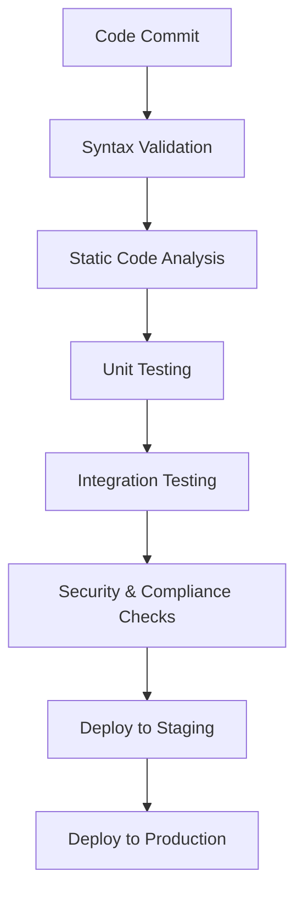

## Introduction
Infrastructure testing in CI/CD pipelines is a critical practice that ensures the cloud environment's components are configured and managed correctly before application deployment. By integrating automated tests into the pipeline, organizations can detect configuration errors, security vulnerabilities, and compliance issues early, reducing deployment risks and enhancing system reliability.

## Detailed Explanation

### Design Pattern Overview
Infrastructure testing involves validating infrastructure code and resources to ensure they meet predefined standards and can operate as expected in production environments. This practice emphasizes "test-driven infrastructure" and often employs infrastructure-as-code (IaC) tools like Terraform, AWS CloudFormation, or Azure Resource Manager.

### Architectural Approaches
1. **Integration with Version Control**: Infrastructure code should reside in a version control system, alongside application code, enabling collaboration and versioning.
2. **Stages of Testing**:
   - **Syntax Validation**: Ensure that infrastructure code is syntactically correct.
   - **Static Code Analysis**: Use tools to enforce coding standards and best practices.
   - **Unit Testing**: Simulate resource creation and validate expected properties.
   - **Integration Testing**: Deploy infrastructure in a test environment and validate interactions and configurations.
   - **Security and Compliance Checks**: Automated security scans to detect vulnerabilities and ensure compliance with policies.
3. **Pipeline Integration**: Incorporate infrastructure tests as stages in CI/CD pipelines, ensuring that changes are validated continuously.

### Best Practices
- Implement **Infrastructure as Code (IaC)** to provide declarative configurations and automation.
- Use **Containers** for isolated and reproducible test environments.
- Leverage cloud-native **CI/CD services** for scalability and integration with cloud providers.
- Monitor after deployments and roll back when tests indicate potential issues.

### Example Code
Here’s an example using Terraform to test infrastructure code:

```hcl
resource "aws_instance" "example" {
  ami           = "ami-123456"
  instance_type = "t2.micro"
}

terraform {
  required_providers {
    aws = {
      source  = "hashicorp/aws"
      version = "~> 3.0"
    }
  }
}

terraform init
terraform validate
terraform plan

kitchen test
```

### Toolchain and Frameworks
- **Terraform**: Open-source tool for building, changing, and versioning infrastructure safely and efficiently.
- **Kitchen-Terraform**: Test Kitchen plugin for testing Terraform configuration.
- **AWS CloudFormation**: Manage AWS infrastructure using code.
- **Azure DevOps**: CI/CD service by Microsoft that automates and manages deployment on Azure.
- **Google Cloud Build**: Automated CI/CD pipelines on Google Cloud Platform.

### Diagrams


## Related Patterns
- **Continuous Integration (CI)**: The practice of integrating developers' work frequently, automating builds and testing.
- **Continuous Deployment (CD)**: Automatically deploying applications after testing and validation.
- **Immutable Infrastructure**: Practice of creating systems as complete units instead of updating existing ones in place.

## Additional Resources
- [Terraform Documentation](https://www.terraform.io/docs/index.html)
- [AWS CloudFormation](https://aws.amazon.com/cloudformation/)
- [Azure DevOps Documentation](https://docs.microsoft.com/en-us/azure/devops/)
- [Google Cloud Build](https://cloud.google.com/cloud-build)

## Summary
Incorporating infrastructure testing into CI/CD pipelines is essential in modern cloud environments, promoting automation, reliability, and agile practices. This pattern provides a robust framework for detecting issues early, ensuring secure, compliant, and efficient cloud services. By leveraging practices like IaC and automated testing, organizations can achieve high levels of operational readiness and agility.
