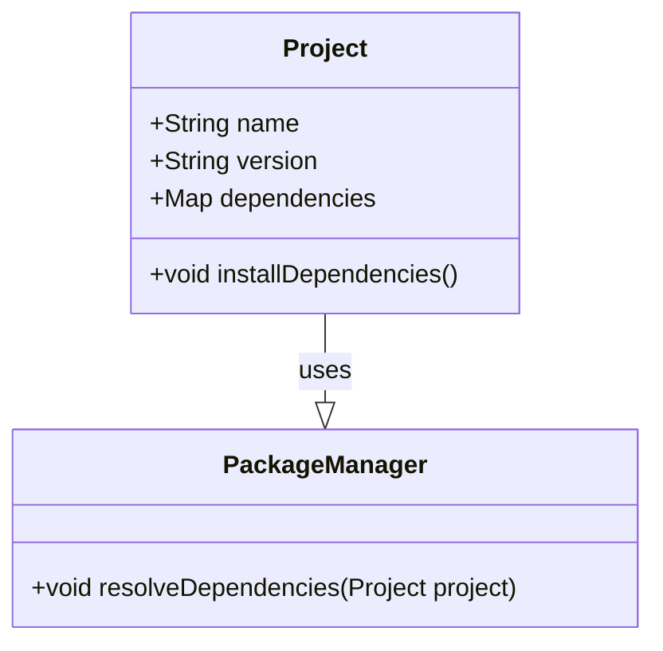

## Introduction

In the complex landscape of software development, managing dependencies efficiently is crucial for ensuring that applications build, test, and deploy correctly. **Dependency Management Automation** is a design pattern that automates the handling of application dependencies within a DevOps and CI/CD framework. It addresses the challenges of version conflicts, transitive dependencies, and ensures that the required libraries are available in the correct versions.

## Architectural Approaches

Dependency Management Automation involves several architectural strategies:

1. **Package Managers**: Tools like Maven (Java), SBT (Scala), npm (JavaScript), and pip (Python) help automate the retrieval and updating of dependencies.

2. **Declarative Dependency Files**: Using files like `pom.xml`, `build.gradle`, `package.json`, or `requirements.txt` to declare dependencies, allowing automation tools to handle these efficiently.

3. **Semantic Versioning and Lock Files**: Ensuring compatibility and repeatability by using semantic versioning and lock files like `package-lock.json` or `yarn.lock`.

4. **Continuous Integration Pipelines**: Integrating dependency management tasks directly into CI pipelines using tools such as Jenkins, CircleCI, or GitHub Actions to automate checking, installing, and updating dependencies.

## Best Practices

- **Version Pinning**: Use specific versions instead of wildcard versions to prevent unexpected changes.
- **Regular Updates**: Regularly review and update dependencies to incorporate bug fixes and enhancements.
- **Security Scans**: Use tools like Snyk or OWASP Dependency-Check to detect vulnerabilities in dependencies.
- **Isolation**: Use Docker containers or virtual environments to isolate dependencies per application to avoid conflicts.

## Example Code

Here's a simple example of how a `package.json` file is used in a Node.js project to automate dependency management:

```json
{
  "name": "my-node-project",
  "version": "1.0.0",
  "dependencies": {
    "express": "^4.17.1",
    "dotenv": "^10.0.0"
  },
  "scripts": {
    "start": "node index.js"
  }
}
```

In a CI/CD pipeline, this would be installed automatically using:

```bash
npm install
```

## Diagrams

### UML Class Diagram



## Related Patterns

- **Continuous Integration**: Close relationship with CI practices by integrating dependency checks into automated builds.
- **Infrastructure as Code**: Managing dependencies as code complements IaC by ensuring environments are reproducible and consistent.
- **Immutable Infrastructure**: Automate dependencies in the build process to ensure immutability in deployed containers.

## Additional Resources

- [Managing Dependencies with Maven](https://maven.apache.org/guides/introduction/introduction-to-dependency-mechanism.html)
- [Using npm and Yarn as Package Managers](https://docs.npmjs.com/)
- [Dependency Management Best Practices](https://medium.com/)
- [CI/CD and Automation Tools](https://www.jenkins.io/)

## Summary

Dependency Management Automation is a critical pattern in modern software development, supporting DevOps and CI/CD practices with efficient, automated handling of project dependencies. Adhering to best practices such as version pinning and regular updates, along with leveraging automation tools, helps maintain project health and security, and reduces deployment failures due to dependency issues.
