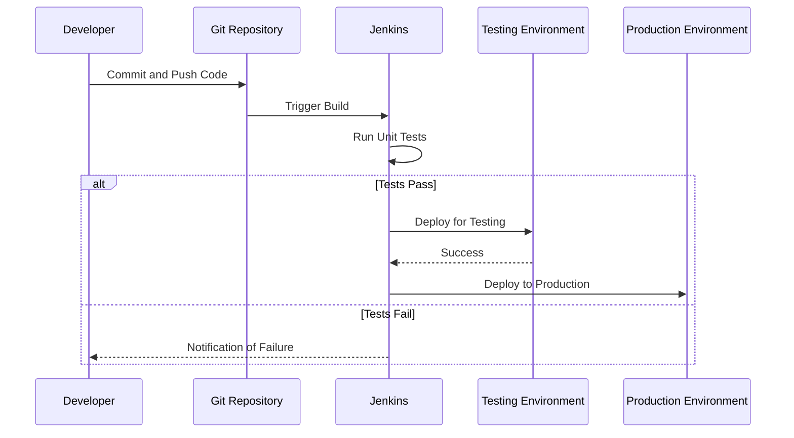

## Release Management: Enhancing Software Deployment Efficiency

Release Management in cloud computing plays a critical role in managing, planning, scheduling, and controlling a software build through different stages and environments, including testing and deploying software releases. Its goal is to ensure that releases are delivered seamlessly and on time, providing faster and more reliable updates to any application.

### Overview of Release Management

Release Management is quintessential in DevOps and agile practices, as it integrates development, operations, and quality assurance to foster a cohesive environment for continuous integration and continuous delivery (CI/CD). This pattern ensures that applications are always in a state ready for deployment, thereby enabling rapid delivery cycles and incorporation of continuous feedback loops.

### Key Concepts and Components

1. **Version Control:** Utilize systems like Git or SVN to manage changes in source code, which is crucial for tracking releases.

2. **Build Automation:** Tools such as Jenkins, CircleCI, or Azure Pipelines are employed to automate the building of code, reducing manual errors and speeding up the process.

3. **Continuous Integration (CI):** Integrate code changes into a shared repository regularly, and automatically testing the changes.

4. **Continuous Deployment (CD):** Automate the deployment of applications into production, ensuring quick and reliable releases.

5. **Environment Management:** Create consistent configurations across all environments (development, test, production) for versioned releases.

6. **Approval Gates:** Implement manual or automated checks that releases must pass through before moving to the next stage, ensuring quality control.

### Architectural Patterns

- **Microservices Architecture:** Break down applications into smaller, manageable pieces that can be independently deployed, which aligns well with release management practices.

- **Blue/Green Deployments:** Have two identical environments (blue and green) where only one is live (usually green), and the other environment is used for deploying and testing new releases.

- **Canary Releases:** Gradually release changes to a small subset of users before rolling them out to the entire infrastructure, allowing for testing with minimal impact.

### Example Code Snippet

Here's an example of a Jenkinsfile for CI/CD pipeline:

```groovy
pipeline {
    agent any
    stages {
        stage('Build') {
            steps {
                echo 'Building...'
                sh 'mvn -B clean compile'
            }
        }
        stage('Test') {
            steps {
                echo 'Testing...'
                sh 'mvn clean test'
            }
        }
        stage('Deploy') {
            steps {
                echo 'Deploying...'
                sh 'ansible-playbook -i inventory/prod deploy.yml'
            }
        }
    }
}
```

### Diagrams

#### Example Sequence Diagram:



### Related Patterns

- **Infrastructure as Code (IaC):** Automate environment setup to ensure consistency through tools like Terraform or CloudFormation.

- **Feature Flags:** Enable toggling features on and off to control which features are released.

### Additional Resources

- *The Phoenix Project* by Gene Kim for understanding DevOps culture.
- [Continuous Delivery: Reliable Software Releases through Build, Test, and Deployment Automation](https://www.amazon.com/Continuous-Delivery-Deployment-Automation-Addison-Wesley/dp/0321601912) by Jez Humble and David Farley.
- Jenkins [Official Documentation](https://www.jenkins.io/doc/).

### Summary

Release Management is instrumental in the modern software delivery lifecycle, enhancing efficiency and collaboration across departments. By ensuring robust and automated CI/CD pipelines, adopting patterns like microservices, and managing environments effectively, enterprises can accelerate their deployment frequency while maintaining high quality in their releases.
