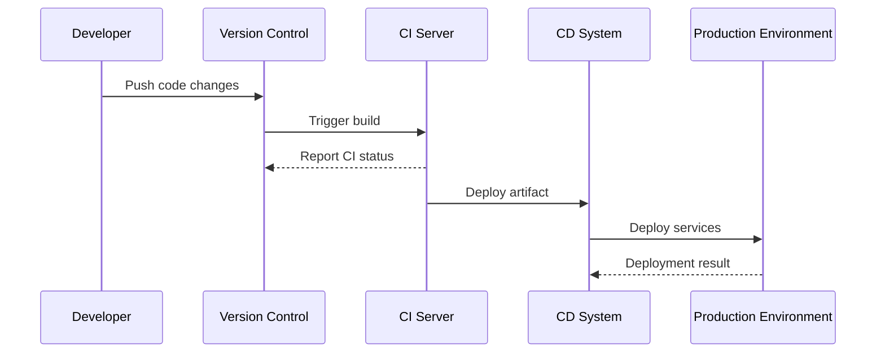

Cloud-Native CI/CD tools are pivotal in orchestrating seamless integration and deployment processes for cloud-based applications. These tools are specifically designed to operate within cloud environments, leveraging cloud-native architectures to enhance the scalability, reliability, and efficiency of software delivery pipelines.

## Design Patterns in Cloud-Native CI/CD

Cloud-Native CI/CD tools utilize several key design patterns tailored to optimize performance and flexibility:

### 1. **Pipeline as Code**

Emphasizing automation, the "Pipeline as Code" pattern involves defining CI/CD workflows through code, usually through configuration files in version control systems. This approach ensures versioned, reviewable, and reusable CI/CD processes.

### 2. **Event-Driven Workflows**

This pattern triggers actions based on specific events, such as code commits or pull requests. By responding to events, CI/CD systems can dynamically start builds, tests, or deployments, thereby improving efficiency and resource allocation.

### 3. **Immutable Infrastructure**

Ensuring that infrastructure components are not modified post-deployment, this pattern boosts reliability and predictability. Each deployment represents a fresh instance, mitigating drift and configuration discrepancies in environments.

## Architectural Approaches

Cloud-native CI/CD tools are architecturally designed to function closely with cloud services, offering several approaches:

- **Microservices Architecture**: Decomposing CI/CD functions into smaller, independent services allows for enhanced scalability and maintenance.
  
- **Serverless Operations**: Utilizing serverless frameworks to execute CI/CD tasks provides cost efficiency and reduces operational overhead by provisioning resources on-demand.

- **Containerization**: Often leveraging Docker or Kubernetes, these tools package CI/CD processes into containers to ensure consistency across development, testing, and production environments.

## Best Practices

Adopting cloud-native CI/CD practices enables teams to optimize their development workflows:

- **Decouple Deployment from Release**: Separate the act of deploying code to environments from exposing new functionality to users. Feature flags and blue-green deployments facilitate this separation.

- **Leverage Distributed Caching**: Speed up processes by caching dependencies and build artifacts across distributed nodes, reducing redundancy and build times.

- **Implement Auto-Scaling Pipelines**: Adjust pipeline resource allocation based on workload demands to manage costs effectively while ensuring high availability.

## Example Code

Here's an example of a CI/CD pipeline configuration using YAML for a cloud-native CI/CD tool like Jenkins X:

```yaml
buildPack: "maven"
pipelineConfig:
  pipelines:
    release:
      pipeline:
        stages:
          - name: build
            steps:
              - command: "mvn clean install"
          - name: deploy
            steps:
              - command: "kubectl apply -f deployment.yaml"
```

This YAML snippet illustrates how a Maven build process can be automated and deployed on Kubernetes.

## Diagrams

Below is sequence diagram illustrating a simple CI/CD workflow:



## Related Patterns

- **Continuous Testing**: Integrates automated testing into the CI/CD pipeline, ensuring quality at every stage of the development lifecycle.
- **Infrastructure as Code (IaC)**: Manages infrastructure through code definition, allowing for consistent environment setup and teardown.

## Additional Resources

- [The Twelve-Factor App](https://12factor.net/)
- [Kubernetes CI/CD using Jenkins](https://kubernetes.io/docs/tutorials/)
- [AWS CodePipeline](https://aws.amazon.com/codepipeline/)

## Summary

Cloud-Native CI/CD tools are crucial in optimizing and accelerating software delivery in cloud environments. By adopting patterns such as "Pipeline as Code" and architectures like microservices and serverless, organizations can achieve greater reliability, scalability, and efficiency. Embracing best practices like decoupling deployment from release and leveraging distributed caching further enhances these processes, aligning with modern cloud-native computing paradigms.
