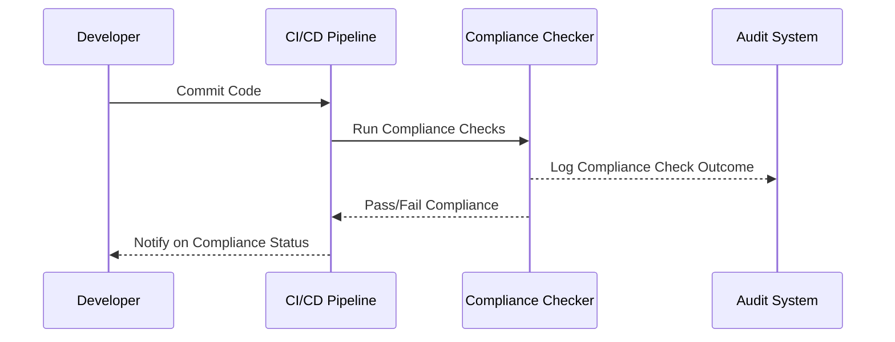

## Overview

As organizations increasingly adopt CI/CD practices to accelerate software delivery, compliance with industry-specific regulatory standards becomes essential. The "Compliance in Pipelines" pattern ensures adherence to regulations like GDPR or HIPAA by embedding compliance checks directly within the CI/CD pipeline. This approach reduces the risk of non-compliance and enhances the security posture of the application by leveraging automation.

## Architectural Approach

The architectural approach to incorporating compliance into pipelines involves several critical components:

1. **Policy Definition**: Define the compliance policies that need to be enforced. For instance, data residency requirements, encryption standards, and user consent for data handling.

2. **Automated Checks**: Implement automated scripts and tools that can conduct compliance checks during each stage of the pipeline. This includes static code analysis, vulnerability assessment, and data handling audits.

3. **Audit Trail**: Maintain a comprehensive audit trail of all pipeline activities to ensure traceability and transparency. This is critical for post-mortem analyses and regulatory audits.

4. **Integration with External Tools**: Integrate with specialized tools, such as Open Policy Agent (OPA) or HashiCorp Sentinel, for advanced policy management and compliance as code methodologies.

5. **Alerting and Reporting**: Implement an alerting mechanism to notify teams of compliance violations. Generate regular compliance reports to provide visibility into compliance status.

## Best Practices

- **Shift-Left Compliance**: Integrate compliance checks early in the development lifecycle to catch violations before they propagate downstream.
  
- **Continuous Monitoring**: Continuously monitor compliance metrics to ensure ongoing adherence to policies.

- **Regular Policy Updates**: Regularly update compliance policies to reflect evolving regulations and ensure that automated checks remain relevant.

- **Training and Awareness**: Educate development and operations teams on compliance requirements and the implications of non-compliance.

## Example Code

Leveraging tools like Open Policy Agent (OPA), you can write compliance policies as follows:

```rego
package compliance

allow {
    input.requested_action == "deploy"
    input.environment == "production"
    is_encrypted(input.application_metadata.data_transit_protocol)
}

is_encrypted(protocol) {
    protocol == "https"
}
```

This Rego policy ensures that only applications using HTTPS for data transmission can be deployed to the production environment.

## Diagrams

Below is sequence diagram illustrating how compliance checks fit within a CI/CD pipeline:



## Related Patterns

- **Security as Code**: Incorporating security policies within the codebase just like compliance policies.
- **Immutable Infrastructure**: Ensures that infrastructure changes comply with predefined standards.
- **Blue-Green Deployment**: Provides an opportunity to test compliance against a live environment before full-scale deployment.

## Additional Resources

- [Open Policy Agent Documentation](https://www.openpolicyagent.org/docs/latest/)
- [HashiCorp Sentinel](https://www.hashicorp.com/sentinel)
- [DevOps Compliance Automation Guide](https://example.com)

## Summary

The "Compliance in Pipelines" pattern is essential for organizations aiming to embed regulatory adherence directly within their CI/CD processes. By leveraging automated checks, thorough policy management, and continuous monitoring, teams can significantly reduce compliance risks, improve audit readiness, and ensure secure and compliant software delivery.
