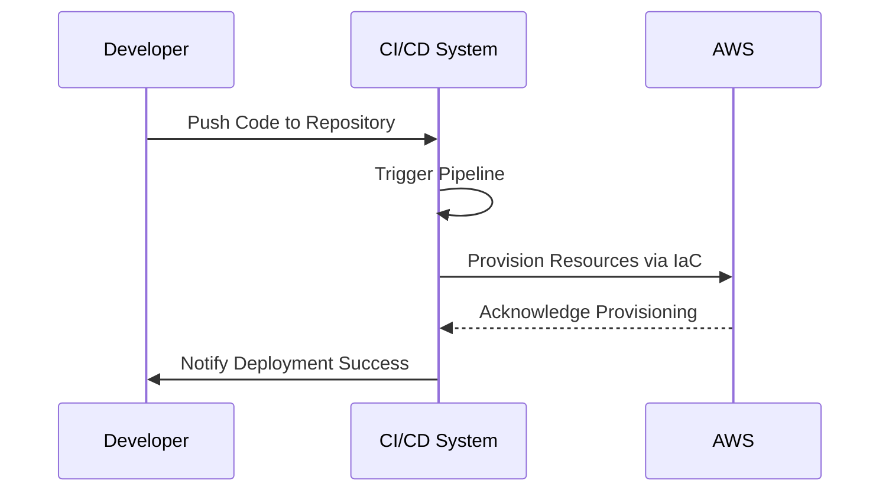

## Introduction

The **Dynamic Environments Creation** pattern emphasizes the automated provisioning and management of cloud-based environments. This pattern is essential in modern DevOps practices where Continuous Integration and Continuous Deployment (CI/CD) pipelines require environments that can be quickly created, modified, and decommissioned based on current needs. This agility is crucial for supporting rapid development cycles, testing, and deployment of new features without incurring heavy costs or resource bottlenecks.

## Design Pattern Overview

### Key Considerations

- **Automation:** Leverage tools and scripts to automate environment creation, reducing human error and manual effort.
- **Scalability:** Provision environments that can scale with demand, ensuring resources are efficiently used and costs are managed.
- **Reproducibility:** Use Infrastructure as Code (IaC) to ensure environments are consistent and reproducible across different stages of development.

### Architectural Approach

1. **Infrastructure as Code (IaC):** Employ tools like Terraform, AWS CloudFormation, or Azure Resource Manager to script the provisioning of infrastructure, ensuring configurations are version-controlled and easily reproducible.

2. **Immutable Infrastructure:** Use containers and immutable system images (e.g., with Docker or VMs) to ensure that environments remain consistent and predictable, minimizing configuration drift.

3. **Orchestration:** Implement orchestration tools such as Kubernetes to manage deployment, scaling, and operations of application containers across clusters of hosts.

### Paradigms

- **DevOps Paradigm:** Facilitate a collaborative culture between development and operations teams by enabling continuous delivery and integration processes.
- **Cloud-Native Computing:** Leverage cloud-native technologies and practices to build and run scalable applications in modern, dynamic environments.

## Best Practices

1. **Version Control for Infrastructure:** Store code that defines your infrastructure in a version control system to help track changes, roll back when necessary, and collaborate more efficiently.

2. **Environment Isolation:** Ensure that environments are isolated to prevent interference and enable simultaneous development, testing, and deployment activities.

3. **Automated Testing:** Integrate automated testing into the CI/CD pipeline to validate changes in isolated environments before production deployment.

4. **Security and Compliance:** Incorporate security checks and compliance verification in the environment provisioning process to mitigate risks.

## Example Code

Below is a basic example using Terraform to create an AWS EC2 instance:

```hcl
provider "aws" {
  region = "us-west-2"
}

resource "aws_instance" "example" {
  ami           = "ami-2757f631"
  instance_type = "t2.micro"

  tags = {
    Name = "example-instance"
  }
}
```

This piece of Infrastructure as Code (IaC) initializes an AWS EC2 instance in the specified region.

## Diagrams

### Dynamic Environment Creation Process



## Related Patterns and Practices

- **Infrastructure as Code (IaC):** A crucial underpinning of dynamic environments that ensures consistency and version-control of infrastructure configurations.
- **Immutable Infrastructure:** Creating images that do not change to maintain environment consistency.
- **Blue-Green Deployment:** Use alongside to lessen downtime and risk during deployments by switching traffic to a new environment while the old one is updated.

## Additional Resources

- [Terraform Documentation](https://www.terraform.io/docs/index.html)
- [AWS CloudFormation Documentation](https://docs.aws.amazon.com/cloudformation/index.html)
- [Azure Resource Manager Documentation](https://docs.microsoft.com/en-us/azure/azure-resource-manager/)
- [Kubernetes Documentation](https://kubernetes.io/docs/home/)

## Summary

The Dynamic Environments Creation pattern is a critical practice in modern cloud computing, providing a way for organizations to automate and streamline their environment provisioning processes. By adopting Infrastructure as Code, leveraging cloud-native approaches, and integrating with CI/CD pipelines, organizations can enhance agility, reduce costs, and increase the efficiency of their software development lifecycle. This pattern, when implemented effectively, supports rapid development, ensures consistent environments, and improves overall software quality.
